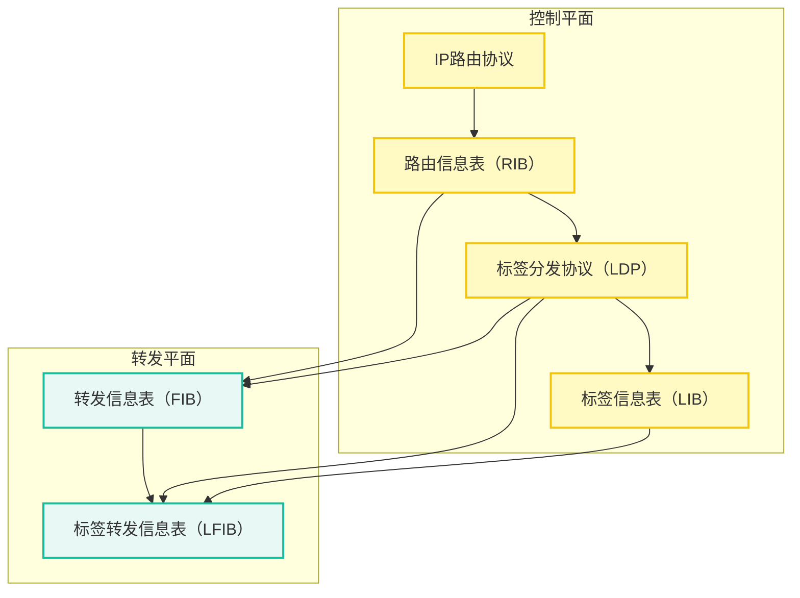
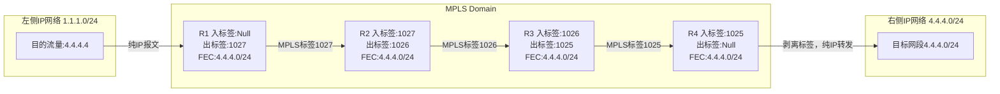

MPLS 基本概念

1. MPLS位于2层和3层之间
2. 通过数据链路层和网络层之间增加的额外MPLS头部，实现MPLS的快速转发。
3. MPLS域
	1. 一系列运行MPLS的网络设备构成了一个MPLS域
	2. LSR：运行了MPLS的路由器叫做LSR
	3. LER：位于网络边缘的路由器 edge
	4. 核心LSR：位于区域内部的为核心LSR（所有接口都运行MPLS）
4. 流量方向分类
	1. 入站LSR：压入MPLS头部
	2. 中转LSR：只看MPLS头部，对报文进行例如**标签置换**操作，然后进行转发
	3. 出站LSR：移除MPLS头部，还原回IP网络。
5. FEC 转发等价类（forwarding equivalent class）
	1. 是数据流，这类数据流会被以同样的方式处理。
	2. 可以基于多种方式划分，最常见是目标网段。还有其他的如IP优先级等
	3. 数据属于哪个LSP，由数据进入MPLS域时的入站LSR决定
	4. MPLS标签通常和FEC相对应。必须有某种机制使网络中的LSR获得关于某FEC的标签信息。
6. LSP 标签交换路径（label switched path）——隧道
	1. 标签报文穿越MPLS网络时走的路径
	2. 同一个FEC报文通常采用相同的LSP穿越MPLS域。对于同一个FEC（比如同一个目标网段），MPLS LSR总以相同的标签转发。
	3. 可以静态指定配置，也可以动态计算
7. MPLS 标签——可以有多个标签
	1. label：20bit——类比目标IP地址
		1. 标签空间，只有本地意义，20bit
			1. 特殊标签：0-15
			2. 静态LSP，静态CR-LSP：16-1024
			3. 动态信令协议，如LDP，RSVP-TE，MP-BGP：1025-2^20 -1
	2. EXP：用于CoS，长度3bit。
	3. S：栈底位：表示是最后一个标签。1bit
	4. TTL：8bit
8. LSR对标签的操作
	1. push压入
	2. swap交换：域内转发的时候，根据标签转发表，用下一跳的标签，替换报文的栈顶标签。
	3. pop弹出：去掉MPLS标签。

---
MPLS 转发

1. 过程
	1. 数据轨道相应的FEC
	2. 按照提前规划好的LSP转发
2. 对于整个MPLS域，LSP是FECC进入和离开的路径，对于单台LSR，需要建立标签转发表，用标签来标识FEC，并绑定相应的标签处理和转发行为。
3. 体系结构：
	1. 控制平面
		1. 标签信息表LIB：有LDP标签分发协议分配
	2. 转发平面
		1. FIB，LFIB
	![[数通基础-MPLS VPN学习笔记#MPLS体系结构]]
4. LSP 建立原则
	1. 网络层协议为IP协议时，FEC路由必须存在于LSR的IP路由表中。否则FEC不生效
	2. FEC数据被发到LSR时，必须携带正确的标签。
	![[数通基础-MPLS VPN学习笔记#LSP建立原则]]
	3. 对某一FEC，设备上存在进(In)标签和出(Out)标签，分别表示该FEC的数据接收时和发送时所携带的标签。
	4. 4.4.4.0/24绑定入标签和出标签，入标签一定要等于上一跳的出标签。这样只需要看标签，而不用看IP。
5. MPLS标签转发
	1. FTN(FEC to NHLFE)
		1. 只在ingress路由器 存在
		2. 当LSR收到IP报文，LSR会查看FIB，如果FIB中非0，则执行隧道转发
		3. 包括：tunnel id，FEC到NHLFE映射信息。
	2. NHLFE（next hop label forwarding entry）
		1. 在ingress路由器和transit路由器中存在
		2. 包括：tunnel id，下一跳
	3. ILM
6. 静态LSP
7. 动态LSP
	1. 使用LDP协议

### MPLS体系结构

### LSP建立原则

