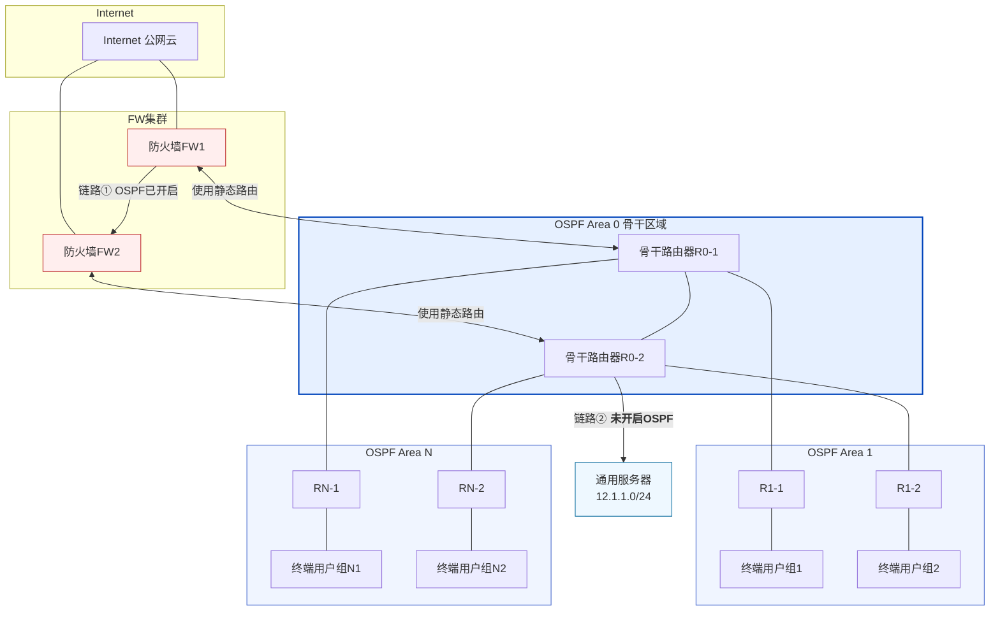

## 外部路由使用场景

1. 情况1： 注意上图中未开启OSPF的骨干路由器，未开启OSPF时，这个通用服务器的路由网段不会宣告到下面的拓扑中。
2. 情况2： 注意上图中骨干路由器和防火墙集群时通过静态路由链接的，防火墙上方的所有网段之后静态路由配置到骨干路由器中。这样也不会通过OSPF协议通告到下方的路由器中。

## 外部路由引入相关概念

1. 路由器类型：ASBR 自治系统边界路由器
2. LSA类型：5类LSA-ASE LSA（AS external），AS外部路由，将域外路由在OSPF网络所有区域（除了[[数通基础-OSPF学习笔记07#stub区域]]和[[数通基础-OSPF学习笔记07#NSSA区域]]）内泛洪。

## 5类LSA——ASE LSA外部LSA报文组成

ASBR生成，用于描述AS外部的路由。——泛洪到整个

1. LSA头部
	1. link state type: 5 ASE
	2. link state id: 外部路由的目的网络地址
	3. advertise router id: 宣告LSA的router id
	4. E：0表示metric-type-1，1表示metric-type-2
	5. metric：到目的网络的度量
	6. network mask：外部路由的目的网络掩码

## 4类LSA——ASBR Summery LSA，ASBR

 ABR生成，用于描述ASBR的路由信息
 
 1. LSA头部
	1. link state type: 4 ASBR summery
	2. link state id: ASBR router id
	3. advertise router id: 宣告LSA的router id（ABR router id）
	4. metric：到目的网络的度量
	5. network mask：外部路由的目的网络掩码