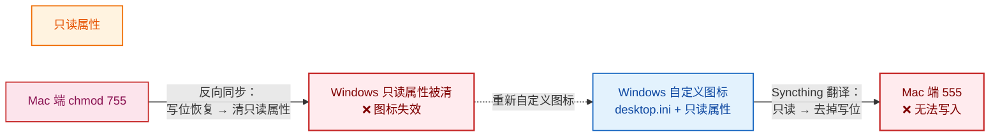

#### 一、问题背景

我的 workspace 目录用 Syncthing 在 Mac 和 Windows 之间双向同步。之前在 Windows 端给一批项目文件夹自定义了图标，之后某天在 Mac 上发现：**所有同步过来的顶层文件夹权限都变成了 555（`r-xr-xr-x`），无法写入**，往里面新建文件直接报 `Permission denied`，而所有子目录都是正常的 755。

初步统计：23 个顶层文件夹为 555，子目录全部 755——问题精准地只发生在"换过图标的那批文件夹"上。

#### 二、核心概念：两套不兼容的权限体系

排查前先理清 Windows 权限的三层结构，这是理解整个问题的钥匙：

| 机制 | 来源 | 图标自定义是否影响 | 与 Unix rwx 的关系 |
| --- | --- | --- | --- |
| NTFS ACL | 真正的权限系统（属性→安全选项卡） | ❌ 完全不碰 | 无直接映射 |
| DOS 属性（只读/隐藏/系统/存档） | FAT 时代的 4 个标志位 | ✅ 设置**只读属性** | Syncthing 映射：只读 ↔ 去掉写位 |
| Unix mode（rwx） | POSIX 系统 | — | Mac 端真实生效 |

三个关键事实：

1. **Windows 上真正的"权限"是 NTFS ACL**，图标自定义根本不改它。它改的是 DOS 属性里的"只读"标志位——两者是完全不同的东西
2. **目录的只读属性在 Windows 内部被写入用途忽略**（微软官方文档明确说明），它只是 Explorer 的自定义标记；但**文件的只读属性是真实生效的**
3. Syncthing 跨系统同步时没有 ACL ↔ Unix 的映射能力，只做了一条粗糙的翻译规则：**只读属性 ↔ 去掉写权限位**，于是目录变 555、文件变 444

#### 三、排查过程

| 步骤 | 操作 | 发现 | 结论 |
|------|------|------|------|
| 1 | `find . -maxdepth 1 -type d` + `stat` | 23 个顶层文件夹 555，子目录全部 755 | 问题只在顶层、只在换过图标的文件夹 |
| 2 | `find . -maxdepth 2 -iname "desktop.ini"` | **555 文件夹里全部有 desktop.ini，一一对应** | Windows 图标自定义的痕迹，锁定嫌疑 |
| 3 | 查 `~/Library/Application Support/Syncthing/config.xml` | `ignorePerms="false"` | 权限元数据确实在被同步，翻译链路成立 |
| 4 | Mac 端 `chmod 755` 修复 | Windows 端图标**全部恢复默认** | 证实反向同步：元数据变更会传回 Windows |
| 5 | 开启"忽略权限" + `attrib +r` 置位 | 图标恢复、Mac 保持 755 | ✅ **最终解决** |

#### 四、根因分析

**1. Windows 自定义图标到底做了什么**

在 Windows 上自定义文件夹图标时，Explorer 做两件事：

- 在文件夹内写入 `desktop.ini`（记录图标路径等自定义信息）
- 给**文件夹本身**设置**只读属性**

微软文档明确说明：文件夹必须带只读或系统属性，Explorer 才会解析 desktop.ini 显示自定义图标。所以只读属性被清，图标就失效——哪怕 desktop.ini 还躺在那里。

**2. 为什么微软用"只读位"做自定义标记**

历史包袱 + 性能考虑。FAT 时代文件只有只读/隐藏/系统/存档几个属性位，没有多余的元数据空间；而目录的"只读"位本来就没有意义（不允许写入的目录等于废了）。于是从 Win9x 起 Explorer 把这个空置的位回收利用，当作"此文件夹已自定义，请解析 desktop.ini"的标记。收益是性能：Explorer 渲染每个目录都要判断有无自定义图标，读一个属性位远比在目录里搜索 desktop.ini 是否存在快。

这个设计在 Windows 内部完全自洽，但跨系统翻译时就炸了。

**3. 完整的故障循环**



危害全部落在接收端：Windows 本机对目录只读属性无感、使用正常；Mac 上 555 却是真实生效的 Unix 权限。而 Mac 一旦 chmod，又反向清掉 Windows 的图标标记——**修复动作本身就是新一轮破坏**，必须先切断同步链路再动手。

#### 五、修复方案

**修复顺序很重要，先切断链路、再修两端状态：**

**第 1 步：Mac 端开启"忽略权限"**

打开 Syncthing Web UI（`http://127.0.0.1:8384`）→ 编辑 workspace 文件夹 → 高级 → 勾选**忽略权限（Ignore Permissions）**。这是官方推荐的跨平台共享做法：Mac 端不再接收/推送权限元数据，新文件按本地 umask（一般 755/644）创建。只需在 Mac 端设置。

> 若顺序反过来先在 Windows 改图标，555 会在开启忽略权限之前再同步过来一次。

**第 2 步：Windows 端恢复图标（无需重新自定义）**

desktop.ini 都还在，只需把只读属性置回去，刷新资源管理器图标即恢复。在同步目录下用 cmd 批量执行：

```cmd
for /d %d in (*) do attrib +r "%d"
```

只作用于文件夹本身，不碰内部文件。

**两个坑务必避开：**

- **属性对话框勾选只读时**，弹出的"确认属性更改"必须选**"仅将更改应用于此文件夹"**。选了递归选项会把所有文件也标只读——文件的只读是真实生效的，同步到 Mac 全变 444，比原问题更糟
- 属性框里只读显示"半选"（方块）是"未指定"的意思，不代表文件是只读

**可选清理：** 在 `.stignore` 中加一行 `desktop.ini`，避免这些 Windows 元数据文件同步到 Mac。

#### 六、经验总结

1. **跨平台同步先评估权限模型差异**：NTFS ACL、DOS 属性、Unix mode 三套体系互不兼容，Syncthing 的属性翻译注定有损，混合系统共享应默认考虑"忽略权限"
2. **Windows 的"只读"在不同对象上含义完全不同**：文件=真实只读，目录=Explorer 自定义标记、系统写入时忽略——同一位，两种语义
3. **双向同步环境里，修复动作会传播**：本地看似无害的 chmod，会作为元数据变更同步回去改掉对端状态。修复前先想清楚链路，必要时先断链
4. **desktop.ini 是自定义的完整凭证**：图标丢失≠desktop.ini 被删，往往只是只读/系统属性丢了，`attrib +r` 即可救回
5. **修复顺序**：先切断同步通道（忽略权限），再分别修两端状态，避免修复本身触发新问题

这次排查最大的收获是理解了**"同一个标志位在不同系统语境下语义完全不同"**——Windows 拿目录只读位当自定义标记是内部自洽的历史设计，但任何跨系统的朴素翻译都会把这种隐含语义放大成真实故障。
