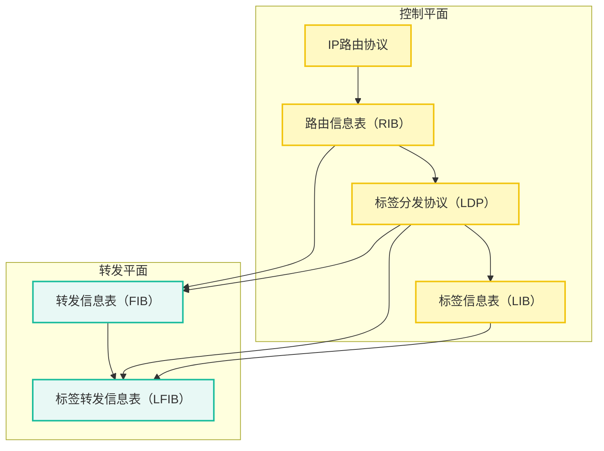
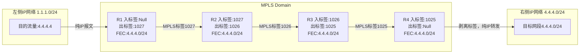
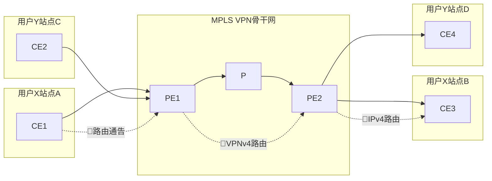
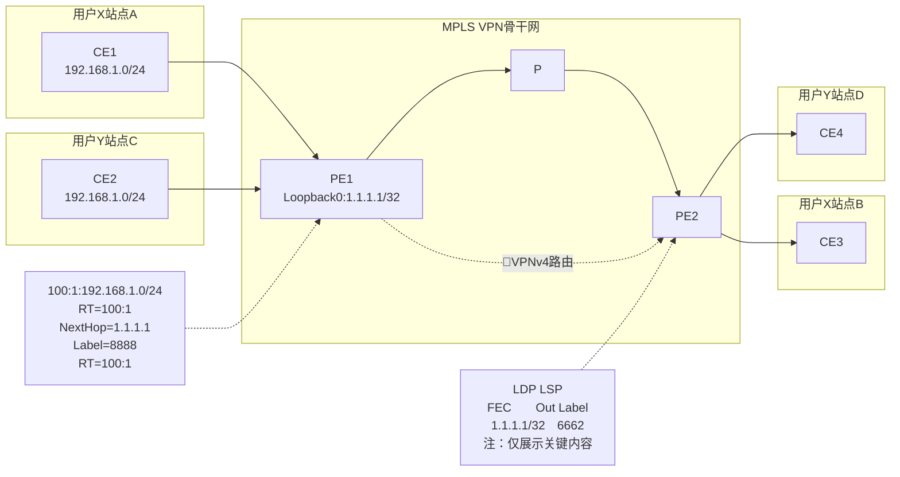
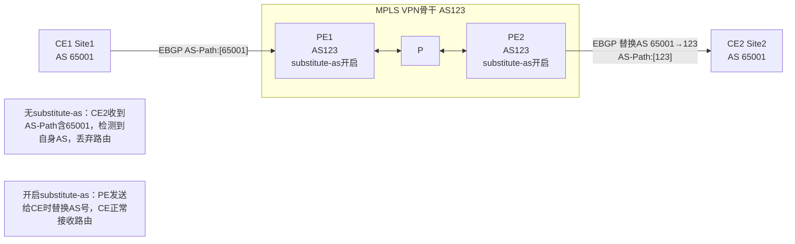
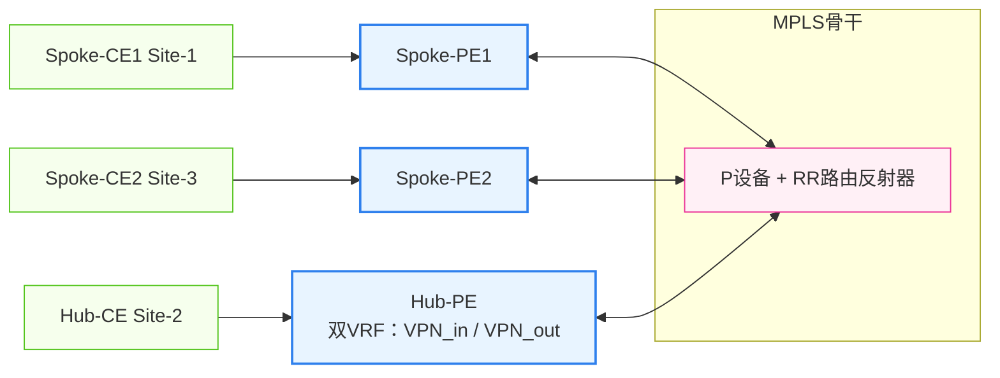
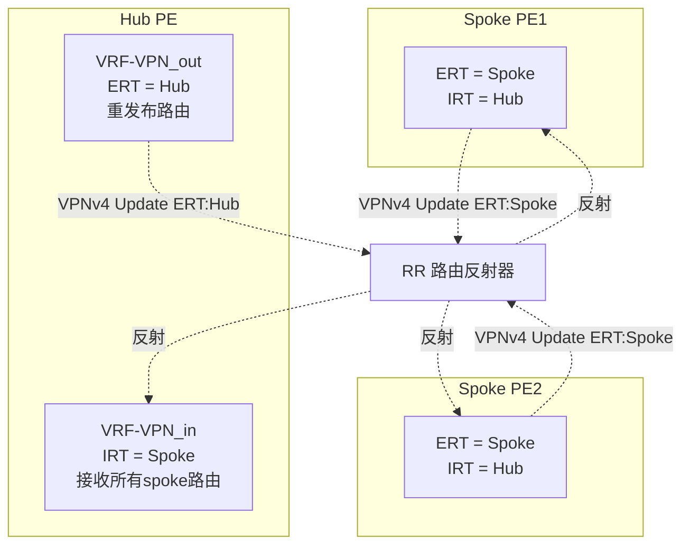
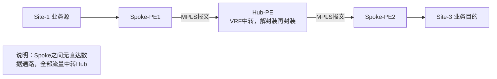
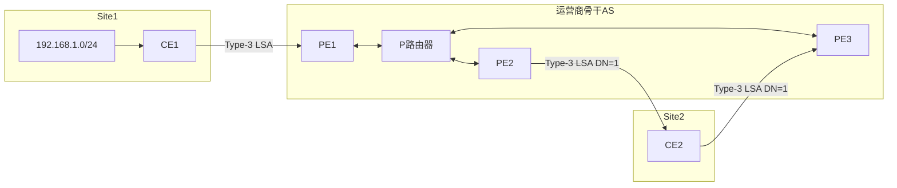

MPLS 基本概念

1. MPLS位于2层和3层之间
2. 通过数据链路层和网络层之间增加的额外MPLS头部，实现MPLS的快速转发。
3. MPLS域
	1. 一系列运行MPLS的网络设备构成了一个MPLS域
	2. LSR：运行了MPLS的路由器叫做LSR
	3. LER：位于网络边缘的路由器 edge
	4. 核心LSR：位于区域内部的为核心LSR（所有接口都运行MPLS）
4. 流量方向分类
	1. 入站LSR：压入MPLS头部
	2. 中转LSR：只看MPLS头部，对报文进行例如**标签置换**操作，然后进行转发
	3. 出站LSR：移除MPLS头部，还原回IP网络。
5. FEC 转发等价类（forwarding equivalent class）
	1. 是数据流，这类数据流会被以同样的方式处理。
	2. 可以基于多种方式划分，最常见是目标网段。还有其他的如IP优先级等
	3. 数据属于哪个LSP，由数据进入MPLS域时的入站LSR决定
	4. MPLS标签通常和FEC相对应。必须有某种机制使网络中的LSR获得关于某FEC的标签信息。
6. LSP 标签交换路径（label switched path）——隧道
	1. 标签报文穿越MPLS网络时走的路径
	2. 同一个FEC报文通常采用相同的LSP穿越MPLS域。对于同一个FEC（比如同一个目标网段），MPLS LSR总以相同的标签转发。
	3. 可以静态指定配置，也可以动态计算
7. MPLS 标签——可以有多个标签
	1. label：20bit——类比目标IP地址
		1. 标签空间，只有本地意义，20bit
			1. 特殊标签：0-15
			2. 静态LSP，静态CR-LSP：16-1024
			3. 动态信令协议，如LDP，RSVP-TE，MP-BGP：1025-2^20 -1
	2. EXP：用于CoS，长度3bit。
	3. S：栈底位：表示是最后一个标签。1bit
	4. TTL：8bit
8. LSR对标签的操作
	1. push压入
	2. swap交换：域内转发的时候，根据标签转发表，用下一跳的标签，替换报文的栈顶标签。
	3. pop弹出：去掉MPLS标签。

---
MPLS 转发

1. 过程
	1. 数据轨道相应的FEC
	2. 按照提前规划好的LSP转发
2. 对于整个MPLS域，LSP是FECC进入和离开的路径，对于单台LSR，需要建立标签转发表，用标签来标识FEC，并绑定相应的标签处理和转发行为。
3. 体系结构：
	1. 控制平面
		1. 标签信息表LIB：有LDP标签分发协议分配
	2. 转发平面
		1. FIB，LFIB
	![[数通基础-MPLS VPN学习笔记#MPLS体系结构]]
4. LSP 建立原则
	1. 网络层协议为IP协议时，FEC路由必须存在于LSR的IP路由表中。否则FEC不生效
	2. FEC数据被发到LSR时，必须携带正确的标签。
	![[数通基础-MPLS VPN学习笔记#LSP建立原则]]
	3. 对某一FEC，设备上存在进(In)标签和出(Out)标签，分别表示该FEC的数据接收时和发送时所携带的标签。
	4. 4.4.4.0/24绑定入标签和出标签，入标签一定要等于上一跳的出标签。这样只需要看标签，而不用看IP。
5. MPLS标签转发
	1. FTN(FEC to NHLFE)
		1. 只在ingress路由器 存在
		2. 当LSR收到IP报文，LSR会查看FIB，如果FIB中非0，则执行隧道转发
		3. 包括：tunnel id，FEC到NHLFE映射信息。
	2. NHLFE（next hop label forwarding entry）
		1. 在ingress路由器和transit路由器中存在
		2. 包括：tunnel id，出接口，下一跳，出标签，标签操作类型
	3. ILM（incoming label map）
		1. 在transit和egress路由器中存在
		2. 包括：tunnel id，入标签，入接口，标签操作类型
6. 静态LSP
7. 动态LSP
	1. 使用LDP协议

---
MPLS-VPN

1. 常见组网：
	1. intranet：一个闭合VPN中的所有用户形成的闭合用户群，同一VPN站点都可以互访，不同站点间不能互访
	2. Extranet：一个闭合VPN用户希望把站点内部分资源给外部用户访问
	3. Hub&Spoke：在VPN中设置中心访问控制设备，其他用户的互访都得通过中心站点访问
2. 控制平面——路由转发
	1. VRF
		1. CE到PE之间通过VRF实例区分不同VPN的路由
		2. 路由还是普通的标准协议路由
	2. RD
		1. 在PE上获取路由后，打上RD标签，让PE到PE之间能够区分不同的路由
		2. 加上RD标签后，标准v4路由转变为VPNv4路由，全局唯一
	3. MP-BGP
		1. 使用对等体直接传路由，但是有以下特性
		2. PE和PE之间使用MP-BGP来处理VPNv4路由（普通BGP-4无法处理）
		3. BGP-4的多协议出口
		4. 采用AFI 地址族来区分，支持v4，VPNv4，v6路由
		5. 增加两种路径属性
			1. MP_REACH_NLRI
			2. MP_UNREACH_NLRI
		6. 增加32位BGP扩展团体属性 RT
			1. PE学到v4路由后，添加ERT，转化为VPNv4路由发出
			2. PE收到VPNv4路由后，通过IRT匹配ERT，确认是否接收
		7. ![[数通基础-MPLS VPN学习笔记#MP-BGP路由转发]]
	>此时CE之间都获取路由，但是这个路由不会在PE和P中保留，只是传给了CE和后面的末端设备。中间还是无法转发，需要通过标签来控制PE到PE的数据转发
	
3. 数据平面——标签转发
	1. 双层标签
		1. 外层标签（公网标签）——用于PE-P-PE的数据转发
			1. PE和P运行LDP 分配
			2. **要注意这里查找的FEC位PE的loo0地址，因为只要传到PE后，这个标签就pop掉，区分CE是用内层标签。**
			3. 数据包传到PE的时候其实已经没有外层标签了，只有内层标签。
		2. 内层标签——用于PE区分站点
			1. 路由通告时直接分配
	![[数通基础-MPLS VPN学习笔记#MP-BGP 数据转发]]
4. 实验
	![[Pasted image 20260814161827.png]]
	1. PE-CE配置
		1. PE起VPN实例，使能ipv4-family；配置RD、IRT、ERT
			1. ip vpn-instance VPN-A(name)
			2. ipv4-family
			3. q
			4. route-distinguisher 100:1 
			5. vpn-target 100:1 export-excommunity
			6. vpn-target 100:1 import-excommunity
		2. VPN实例绑定到和CE连接的端口，并且重新配置IP地址。
			1. int g 0/0/0
			2. ip binding vpn-instance VPN-A
			3. i a 192.168.1.1 24
		3. OSPF：**PE起新OSPF进程**，绑定端口绑定过的实例——实现端口-OSPF进程-VPN实例绑定。CE起OSPF，发布路由。
			1. ospf 2(新建) router-id 1.1.1.1 vpn-instance VPN-A
			2. net x.x.x.x x.x.x.x
			3. net 192.168.1.0 0.0.0.255
		4. IS-IS：**PE起新IS-IS进程**，绑定端口绑定过的实例——实现端口-IS-IS进程-VPN实例绑定。CE起IS-IS，发布路由。
			1. isis 2(新建) vpn-instance VPN-A
			2. net xx.xxxx.xxxx.xxxx.xxxx.00
			3. int g 0/0/0
			4. isis enable
		5. 静态路由：PE1指定VPN配置静态路由。MP-BGP直接引入静态路由。
			1. ip route-static vpn-instance VPN-A 172.16.0.0（内部网段） 24 192.168.1.2(CE 接口地址)
		6. BGP：只能使用EBGP，因为AS不同。PE上BGP可以使用vpn-instance子视图接收/发布路由。CE上直接起EBGP正常import/network
			1. bgp 100
			2. ipv4-family vpn-instance VPN-A
			3. peer 192.168.1.2 as-number 65000
			4. as替换
				1. 若两边CE-PE都为EBGP且AS号一样，需要在出口方向上的vpn实例中配置peer x.x.x.x as-absititude，替换as号，不然会因为as-path防环而丢弃。此时最先的as号会被替换成egress PE所在的as号。
				![[数通基础-MPLS VPN学习笔记#特殊场景下的BGP配置——AS号替换]]
				2. SoO——路由替换场景下避免环路的机制
					1. 场景：同一个CE的AS中有两台CE，都连接到同一台PE上。此时，因为as-path源as被替换，如果路由从CE1回传到CE2，则无法通过as-path探测环路。
					2. SoO配置：PE配置，在两台CE的peer中添加SoO字段，标注源RD。
	2. PE1-P-PE2配置
		1. PE1-P-PE2为公网，单独起OSPF互通loopback地址。
		2. 全局开启mpls
			1. mpls lsr-id x.x.x.x
			2. mpls
			3. q
			4. mpls ldp
			5. q
		3. 公网接口开启mpls
			1. int g 0/0/0
			2. mpls
			3. mpls ldp
			4. 公网IGP中的路由全都创建ldp标签
		4. MP-BGP配置
			1. PE-PE开IBGP/EBGP peer
				1. 不管是IBGP还是EBGP都要指定loopback地址作为peer
				2. IBGP
					1. peer建立之后，自动能够使用next-hop-local
				3. EBGP
					1. peer建立之后，需要增加next-hop-local
					2. 增加max ttl 255
				4. 针对PE的peer，需要打开vpnv4，才可以处理VPNv4路由。
					1. ipv4-family vpnv4
					2. peer x.x.x.x enable
				5. 针对所有VPN实例，引入路由（若CE-PE为EBGP无需引入）
					1. ipv4-family vpn-instance xxx
					2. import xxx route-policy xxx
					3. 两边都是OSPF的时候，因为是BGP引入，OSPF会将所有引入的路由都作为5类LSA通告。如果站点之间想要保留OSPF的信息，需要使用扩展团体属性
					![[数通基础-MPLS VPN学习笔记#BGP扩展团体属性]]
					4. 使用扩展团体属性的时候，可能会出现3类LSA路由环路
					![[数通基础-MPLS VPN学习笔记#使用扩展团体属性时 3类LSA环路问题]]
					5. 可能出现5类或者7类环路
				6. **注意：** 引入路由后，BGP内层标签创建完成，随update报文发出。对端收到后更新路由表。转发的时候对端设备作为ingress设备，打上内层标签，以下一跳（IBGP邻居的loopback地址）查找FEC，用外层标签送到egress设备，此时已经没有外层标签，使用内层标签查找到VPN实例发送出去。
				![[Pasted image 20260815233708.png]]
			3. PE将对端IBGP学到的路由引入PE-CE的路由中
				1. 此时两端的CE设备获取到对端路由，此时路由完备两端CE通。
5. MPLS-VPN的组网
	1. intranet
		1. 一个VPN中的用户形成闭合用户群
	2. extranet
		1. 一个VPN中的用户可以将部分站点中的网络资源给其他VPN用户访问
	3. hub-spoke组网
		1. 分点互访时，需要从总点绕行（路由和转发都要绕）
		2. hub点位CE和PE之间必须要两条虚拟或者物理的链路
		3. ![[数通基础-MPLS VPN学习笔记#hub-spoke组网]]
		4. hub-spoke组网方式
			1. 方式一：hub-CE和PE之间，spoke-CE与PE之间都使用EBGP
				1. hub-CE和PE的out-vpn方向必须配置allow-as-loop，不然从vpn-in进入的路由从out-vpn中回来会被丢弃。
			2. 方式二：hub-CE和PE之间，spoke-CE与PE之间都使用IGP
				1. vpn-in和vpn-out使用不同IGP进程，vpn-out将vpn-in的路由引入
			3. 方式三：hub-CE和PE之间使用EBGP，spoke-CE与PE之间使用IGP
				1. 同上
			4. 注意：没有hub-CE和PE之间使用IGP，
	4. MCE 组网
		1. CE设备可以开启多实例，此时PE使用子接口/物理接口/逻辑接口承载多实例。PE上需要将接口帮到对应的VPN实例。
	5. 跨域组网
		1. PE-P-PE之间跨AS，需要使用跨域组网
		2. 有三种配置方式
			1. 

---

### MPLS体系结构

### LSP建立原则

### MP-BGP路由转发

| 步骤  | 关键行为                            | 核心变化                    |
| --- | ------------------------------- | ----------------------- |
| ①   | PE‑CE之间学习客户IPv4私网路由             | 普通IPv4路由                |
| ②   | 路由存入PE的VPN‑instance路由表          | VRF内IPv4路由              |
| ③   | 引入MP‑BGP，**加上RD**               | 生成12字节VPNv4前缀(RD+IPv4)  |
| ④   | MP‑IBGP Update传递VPNv4路由，携带RT、标签 | 公网传递VPNv4，RT作为BGP扩展团体属性 |
| ⑤   | PE2根据RT过滤导入VRF，**剥离RD**         | 还原出原始IPv4路由             |
| ⑥   | 发给CE设备                          | CE收到普通IPv4路由，CE看不到RD/RT |

### MP-BGP 数据转发

### 特殊场景下的BGP配置——AS号替换

### hub-spoke组网

#### 组网拓扑

#### 控制平面 RT & VPNv4 路由发布交互

#### 数据平面：Spoke‑1 访问 Spoke‑3，强制经过 Hub 中转

### BGP扩展团体属性

为了保留OSPF属性，BGP新增扩展团体属性
1. domain id：用来标识域——是否属于同一个路由域，如果是的话，就不会统一变成5类LSA处理方式进行。
2. route type：包含OSPF的信息
	1. Area-ID：OSPF区域号
	2. route-type：lsa类型

| Domain‑ID与本地是否相同 | Route‑Type | PE生成的OSPF LSA类型 |
| ---- | ---- | ---- |
| 是 | 1、2、3 | 3 |
| 是 | 5、7 | 5、7 |
| 否 | 1、2、3、5、7 | 5、7 |

### 使用扩展团体属性时 3类LSA环路问题
