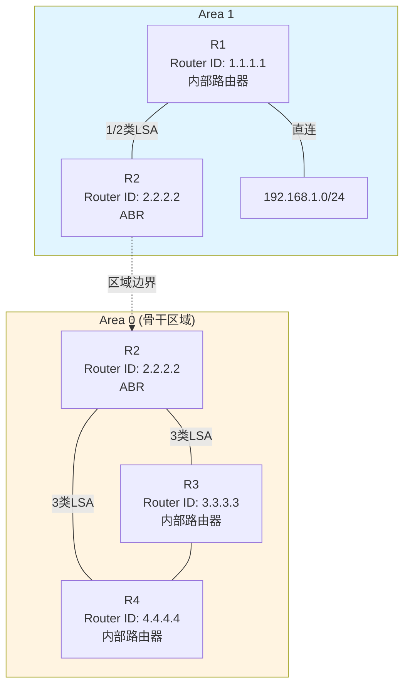
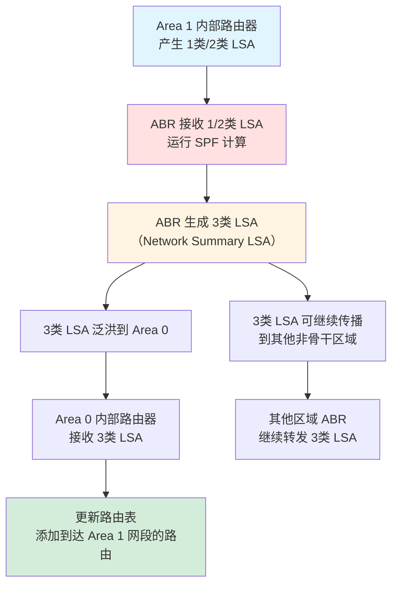

## LSA基本概念

- LSA是路由计算的依据
- LSU报文可以携带多种不同类型的LSA
- 各种LSA拥有相同报文头部。
	- IP header | OSPF header | LSU payload
		- LSU payload = LSA header + payload
			- LSA header
				- LS age：LSA生存时间（秒），每1800秒泛洪一次LSA
				- **LS type：LSA类型**
				- **link state id：不同类型的LSA对此字段定义不一样**
				- **advertising router：产生该LSA的路由器router id**
				- LS seq num：LSA每次有新实例产生时，序列号就会增加（就是一个版本号，有更新后，以大seq为准）
			- payload
				- 每种类别都不同
## 常见LSA的类型

| 类型    | 名称                           | 描述                                                                                                                        |
| ----- | ---------------------------- | ------------------------------------------------------------------------------------------------------------------------- |
| 1     | 路由器LSA（Router LSA）           | 每个设备都会产生，描述了设备的链路状态和开销，该LSA只能在接口所属的区域内泛洪                                                                                  |
| 2     | 网络LSA（Network LSA）           | 由DR产生，描述该DR所接入的MA网络中所有与之形成邻接关系的路由器，以及DR自己。该LSA只能在接口所属区域内泛洪                                                                |
| 3     | 网络汇总LSA（Network Summary LSA） | 由ABR产生，描述区域内某个网段的路由，该类LSA主要用于区域间路由的传递                                                                                     |
| 4     | ASBR汇总LSA（ASBR Summary LSA）  | 由ABR产生，描述到ASBR的路由，通告给除ASBR所在区域的其他相关区域。                                                                                    |
| 5     | AS外部LSA（AS External LSA）     | 由ASBR产生，用于描述到达OSPF域外的路由                                                                                                   |
| 7（不学） | 非完全末梢区域LSA（NSSA LSA）         | 由ASBR产生，用于描述到达OSPF域外的路由。NSSA LSA与AS外部LSA功能类似，但是泛洪范围不同。NSSA LSA只能在始发的NSSA内泛洪，并且不能直接进入Area0。NSSA的ABR会将7类LSA转换成5类LSA注入到Area0 |

**查看路由器获得的所有LSA（自己产生的所有LSA）（分类查询）：** dis ospf lsdb router|network|summery|asbr|ase (self-originate)

1. 1类LSA——router LSA（TransNet网络等，以太网广播型网络）
	- 只在区域内部传递
	- 每台OSPF路由器都会产生，他**描述了直连口的信息**
	- 包含链路类型：P2P，TransNet，StubNet，Vlink
	1. 包内容
		1. LSA header
			1. LS type： router
			2. link state ID：本机router ID
			3. advertising router：产生该LSA的路由器router id（本机router ID）
		2. payload（广播型，只有拓扑信息，没有路由信息）
			1. link ID： 见下表
			2. link data：见下表
			3. link type：见下表
			4. metric：x度量
			5. V（virtual link）： 若产生此LSA的路由器为虚链接的端点，则置位
			6. E（external）： 若产生此LSA的路由器为ASBR，则置位
			7. B（border）： 若产生次LSA的路由器为ABR，则置位
			8. links：link数量
	2. 关键记忆点：
		1. 对于一个网络来说要**描述清楚直连口**需要描述清楚以下信息
			1. header：我的邻居路由器（router ID）
			2. 我的信息（router ID）
			3. 我的邻居路由器，link type=p2p，link id=router ID，link data=通告这个LSA的接口地址
			4. 如果我是广播型网络（link type=transnet），我的DR是谁（link id -> router ID），link data=通告这个LSA的接口地址
			5. 接口路由是多少？link type=stubnet，link ID=网段，link data=掩码
			6. 度量值多少？（metric）

| Link Type                                              | Link ID                    | Link Data                |            |
| ------------------------------------------------------ | -------------------------- | ------------------------ | ---------- |
| Point-to-Point (P2P)：描述一个从本路由器到邻居路由器之间的点到点链路，属于拓扑信息    | 邻居路由器的Router ID            | 宣告该Router LSA的路由器接口的IP地址 | 拓扑信息       |
| TransNet：描述一个从本路由器到一个Transit网段（例如MA或者NBMA网段）的连接，属于拓扑信息 | DR的接口IP地址                  | 宣告该Router LSA的路由器接口的IP地址 | 拓扑信息       |
| StubNet：描述一个从本路由器到一个Stub网段（例如Loopback接口）的连接，属于网段信息     | 宣告该Router LSA的路由器接口的网络IP地址 | 该Stub网络的网络掩码             | 路由信息（接口路由） |

2. 2类LSA——network LSA（TransNet网络，DR生成）
	- 由DR产生，描述本网段的链路状态，在所属的区域内传播
	1. LSA header
		1. LS type： network
		2. link state ID：DR接口IP地址
		3. advertising router：产生该LSA的路由器router id（本机router ID）
	2. payload
		1. network mask：MA网络的子网掩码
		2. attached router：连接到该MA网络的所有路由器（包括DR）router id。
3. 3类LSA——network summery LSA
	- 3类LSA主要是解决区域间路由问题，以下是设立区域的原因。
	1. 单区域存在的问题
		1. 当网络越大，LSDB越臃肿，路由计算越困难
		2. 当网络越大，网络变动通告越慢
		3. 单区域设计导致OSPF无法做**路由汇总**。
	2. 路由器类别
		1. 区域边缘路由器（ABR，Area Border Router）：区域边缘的路由器，既有骨干口，又有非骨干口
		2. 骨干路由器（BR，Backbone Router）：area 0路由器
		3. 内部路由器（IR，Internal Router）：非骨干区域非区域边缘路由器的路由器
	3. 3类LSA传输过程

**网络拓扑示例：**



**3类LSA传输流程：**



**传输过程说明：**
1. Area 1 内部的路由器（如 R1）产生 1类和 2类 LSA，描述区域内的拓扑和网段信息
2. ABR（R2）接收到这些 LSA 后，通过 SPF 算法计算出到达各网段的路由
3. ABR 将这些路由信息封装成 **3类 LSA（Network Summary LSA）**
4. 3类 LSA 只在区域间传递，不会泛洪回原区域
5. Area 0 中的路由器收到 3类 LSA 后，学习到到达 Area 1 网段的路由
6. 3类 LSA 可以继续由其他 ABR 转发到更多的非骨干区域

**关键特点：**
- 3类 LSA 由 **ABR 产生**，只有 ABR 才能产生 3类 LSA
- 3类 LSA 描述的是**网段路由信息**，而非拓扑信息
- 3类 LSA 可以在**非骨干区域之间**通过 Area 0 传递
- 3类 LSA 传递到某个区域后，该区域的 ABR 会继续生成新的 3类 LSA 传递到其他区域（**默认不开启路由过滤，会形成次优路由**）

**查看 3类 LSA 的命令：**
```bash
# 查看所有 3类 LSA
dis ospf lsdb summary

# 查看特定网段的 3类 LSA
dis ospf lsdb summary 192.168.1.0
```