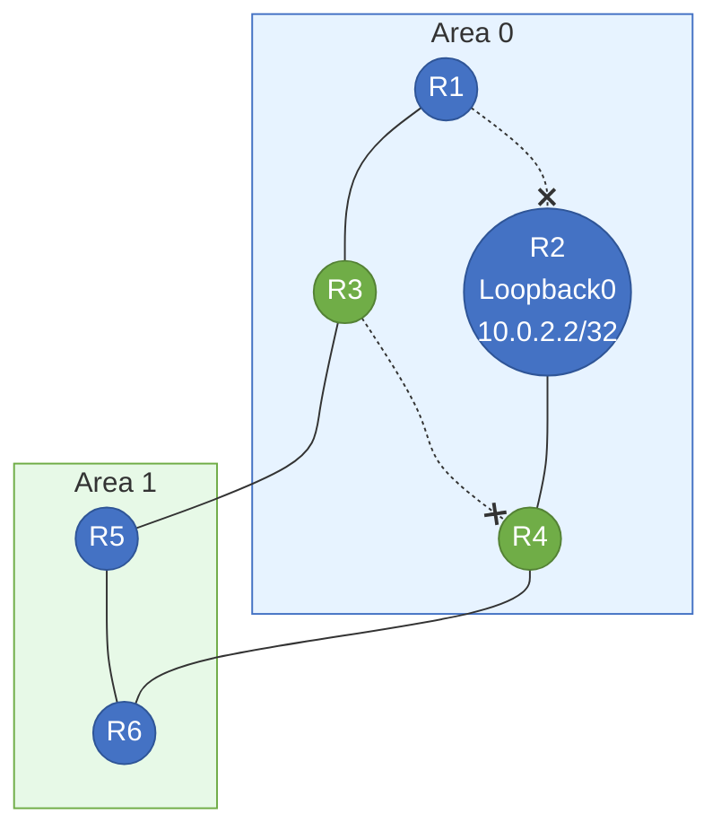

# 区域间防环机制

1. 要求OSPF非骨干区域只能和骨干区域相连——杜绝多个区域成环
	1. 非骨干区域只能和骨干区域相连，形成**类似**星型组网（并不是真正的星型组网，因此还存在环路可能）
	2. 只有非骨干区域和骨干区域链接的路由器才能作为ABR，才能产生和转发3类LSA。这样3类LSA在非骨干区域相连的路由器之间开环。
2. 要求 ABR不往回发3类LSA
3. ABR的非骨干口收到3类LSA时，不能参与路由计算
	1. 看下方拓扑，当R3 area1接口收到3类LSA，不再参与路由计算，也就是不再转发回 area0。这样

4. 

