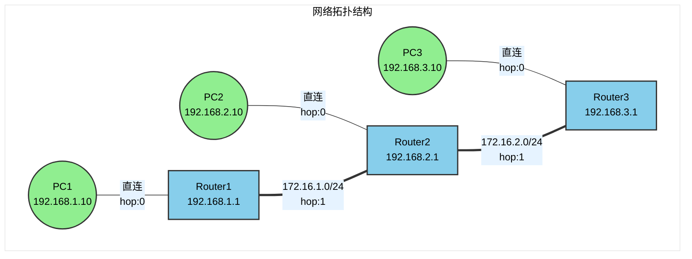
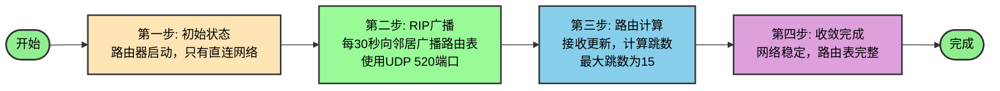
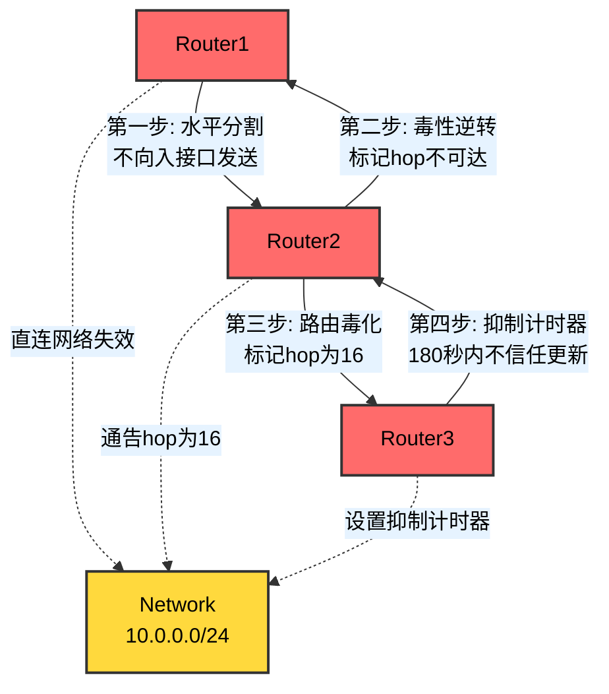

## RIP协议拓扑图

### 基础网络拓扑

### RIP路由信息交换

RIP基于**路由表通告**来自动泛洪路由信息。

### 路由表变化详解

```mermaid
%%{init: {'theme': 'base', 'themeVariables': { 'primaryColor': '#fff', 'primaryTextColor': '#000', 'primaryBorderColor': '#333', 'lineColor': '#333', 'secondaryColor': '#e6f3ff', 'tertiaryColor': '#fff'}}}%%
graph TB
    subgraph Initial["第一步: 初始状态"]
        I_R1["Router1路由表:<br/>• 192.168.1.0/24 (直连, hop:0)<br/>• 172.16.1.0/24 (直连, hop:0)"]
        I_R2["Router2路由表:<br/>• 192.168.2.0/24 (直连, hop:0)<br/>• 172.16.1.0/24 (直连, hop:0)<br/>• 172.16.2.0/24 (直连, hop:0)"]
        I_R3["Router3路由表:<br/>• 192.168.3.0/24 (直连, hop:0)<br/>• 172.16.2.0/24 (直连, hop:0)"]
    end

    subgraph Update["第二步: RIP广播 (每30秒)"]
        U1["Router1 → Router2<br/>UDP:520<br/>包含: 192.168.1.0/24"]
        U2["Router2 → Router1<br/>UDP:520<br/>包含: 192.168.2.0/24, 172.16.2.0/24"]
        U3["Router2 → Router3<br/>UDP:520<br/>包含: 192.168.2.0/24, 172.16.1.0/24"]
    end

    subgraph Complete["第三步: 路由学习完成"]
        C_R1["Router1路由表:<br/>• 192.168.1.0/24 (直连, 0)<br/>• 172.16.1.0/24 (直连, 0)<br/>• 192.168.2.0/24 (R2, 1)<br/>• 172.16.2.0/24 (R2, 1)<br/>• 192.168.3.0/24 (R2, 2)"]
        C_R2["Router2路由表:<br/>• 192.168.2.0/24 (直连, 0)<br/>• 172.16.1.0/24 (直连, 0)<br/>• 172.16.2.0/24 (直连, 0)<br/>• 192.168.1.0/24 (R1, 1)<br/>• 192.168.3.0/24 (R3, 1)"]
        C_R3["Router3路由表:<br/>• 192.168.3.0/24 (直连, 0)<br/>• 172.16.2.0/24 (直连, 0)<br/>• 192.168.2.0/24 (R2, 1)<br/>• 172.16.1.0/24 (R2, 1)<br/>• 192.168.1.0/24 (R2, 2)"]
    end

    Initial --> Update
    Update --> Complete

    style I_R1 fill:#FFE4B5,stroke:#333
    style I_R2 fill:#FFE4B5,stroke:#333
    style I_R3 fill:#FFE4B5,stroke:#333
    style U1 fill:#98FB98,stroke:#333
    style U2 fill:#98FB98,stroke:#333
    style U3 fill:#98FB98,stroke:#333
    style C_R1 fill:#DDA0DD,stroke:#333
    style C_R2 fill:#DDA0DD,stroke:#333
    style C_R3 fill:#DDA0DD,stroke:#333
```

### RIP防环机制

## RIP协议核心概念

### 工作原理

1. **路由表初始化**: 路由器启动时，只包含直连网络
2. **路由广播**: 每30秒向邻居广播完整路由表
3. **路由计算**: 使用跳数作为度量，最大15跳，16跳表示不可达
4. **收敛时间**: 网络稳定时间较长，不适合大型网络

### 关键特性

| 特性 | 说明 |
|------|------|
| **度量** | 跳数(Hop Count)，最大15 |
| **更新周期** | 30秒 |
| **端口** | UDP 520 |
| **版本** | RIPv1(有类), RIPv2(无类, 支持VLSM) |
| **防环机制** | 水平分割、毒性逆转、路由毒化、抑制计时器 |

### RIP v1 vs RIPv2

| 特性 | RIPv1 | RIPv2 |
|------|-------|-------|
| 地址类型 | 有类路由 | 无类路由(VLSM) |
| 认证 | 不支持 | 明文/MD5认证 |
| 更新方式 | 广播(255.255.255.255) | 组播(224.0.0.9) |
| 路由标记 | 不支持 | 支持 |
| 下一跳 | 不支持 | 支持 |

### RIP缺陷
1. 开销计算方式：一条百兆线路，一条千兆路径。若百兆跳数少，则会选择百兆路径。这样选出来的是瓷釉路径。
2. 开销上线和收敛方式的缺陷：收敛方式通过递归收敛，速度慢因此有上限（16跳），不适合网络较大场景。