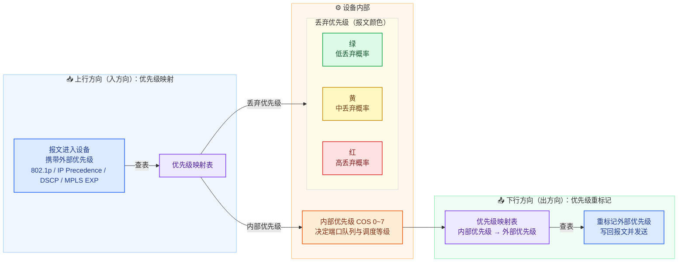

# QoS原理

## 简单流分类

```mermaid
flowchart LR
    subgraph IN["📥 上行方向（入方向）：优先级映射"]
        direction TB
        EP["报文进入设备<br/>携带外部优先级<br/>802.1p / IP Precedence / DSCP / MPLS EXP"]:::ext
        M1["优先级映射表"]:::map
        EP -->|查表| M1
    end

    subgraph CORE["⚙️ 设备内部"]
        direction TB
        INTP["内部优先级 COS 0~7<br/>决定端口队列与调度等级"]:::int
        subgraph DPC["丢弃优先级（报文颜色）"]
            direction LR
            G["绿<br/>低丢弃概率"]:::green
            Y["黄<br/>中丢弃概率"]:::yellow
            R["红<br/>高丢弃概率"]:::red
        end
    end

    subgraph OUT["📤 下行方向（出方向）：优先级重标记"]
        direction TB
        M2["优先级映射表<br/>内部优先级 → 外部优先级"]:::map
        RP["重标记外部优先级<br/>写回报文并发送"]:::ext
        M2 -->|查表| RP
    end

    M1 -->|内部优先级| INTP
    M1 -->|丢弃优先级| DPC
    INTP --> M2

    classDef ext fill:#DBEAFE,stroke:#2563EB,stroke-width:1.5px,color:#1E3A8A
    classDef map fill:#EDE9FE,stroke:#7C3AED,stroke-width:1.5px,color:#4C1D95
    classDef int fill:#FFEDD5,stroke:#EA580C,stroke-width:1.5px,color:#7C2D12
    classDef green fill:#DCFCE7,stroke:#16A34A,stroke-width:1.5px,color:#14532D
    classDef yellow fill:#FEF9C3,stroke:#CA8A04,stroke-width:1.5px,color:#713F12
    classDef red fill:#FEE2E2,stroke:#DC2626,stroke-width:1.5px,color:#7F1D1D

    style IN fill:#F0F7FF,stroke:#93C5FD
    style CORE fill:#FFF7ED,stroke:#FDBA74
    style OUT fill:#F0FDF4,stroke:#86EFAC
    style DPC fill:#FEFCE8,stroke:#D9D9D9
```

## 外部优先级 - vlan报文

