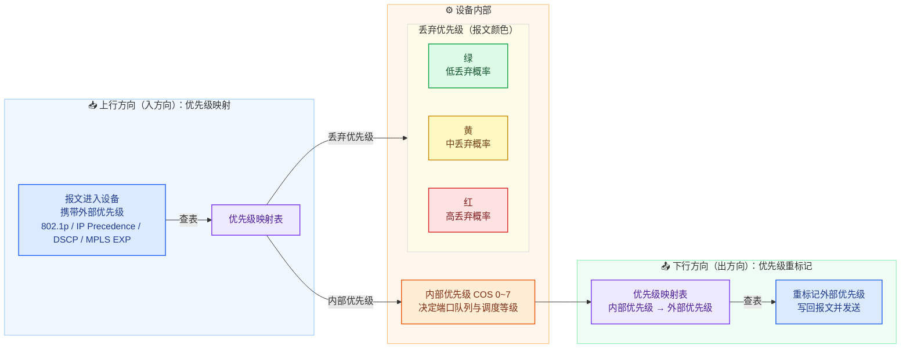
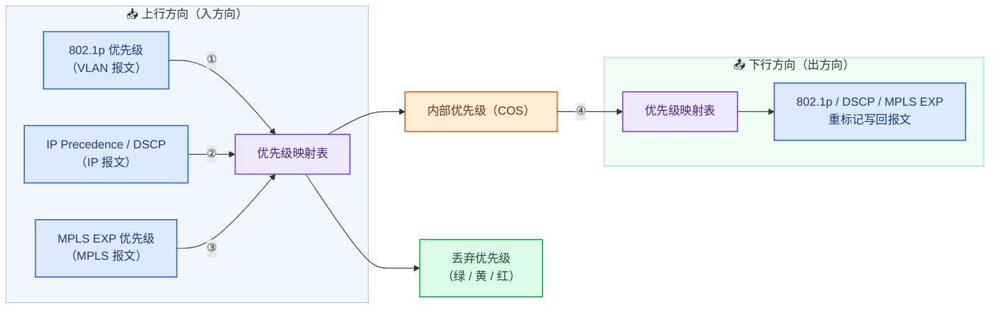

# QoS原理

## 简单流分类

| 报文类型 | 优先级字段 | 位数 | 取值范围 | 字段位置 |
| --- | --- | --- | --- | --- |
| 二层 VLAN 报文（802.1Q） | 802.1p（CoS） | 3 bit | 0~7 | VLAN Tag 中的 TCI 字段（16 bit = PCP 3 bit + DEI 1 bit + VID 12 bit）的最高 3 bit，位于 TPID（0x8100）之后、紧跟源 MAC 地址 |
| 三层 IPv4 报文 | IP Precedence | 3 bit | 0~7 | IP 头部 ToS 字段（8 bit）的最高 3 bit |
| 三层 IPv4 报文 | DSCP | 6 bit | 0~63 | IP 头部 ToS 字段（8 bit）的高 6 bit，剩余低 2 bit 为 ECN |
| MPLS 报文 | EXP（TC，Traffic Class） | 3 bit | 0~7 | MPLS 标签（32 bit = Label 20 bit + EXP 3 bit + S 1 bit + TTL 8 bit）中，位于 Label 之后、S 位（栈底标志）之前 |

**四种优先级映射关系**

| 序号 | 映射关系 | 方向 | 缺省映射说明 |
| --- | --- | --- | --- |
| ① | 802.1p → 内部优先级 + 丢弃优先级 | 上行（入方向） | 等值映射，如 802.1p=5 → COS=5（队列 5），丢弃优先级=绿 |
| ② | IP Precedence / DSCP → 内部优先级 + 丢弃优先级 | 上行（入方向） | IP Precedence 等值映射；DSCP 每 8 个值一段：0~7→BE、8~15→AF1、16~23→AF2、24~31→AF3、32~39→AF4、40~47→EF、48~55→CS6、56~63→CS7，丢弃优先级=绿 |
| ③ | MPLS EXP → 内部优先级 + 丢弃优先级 | 上行（入方向） | 等值映射，如 EXP=5 → COS=5，丢弃优先级=绿 |
| ④ | 内部优先级 → 外部优先级（重标记） | 下行（出方向） | COS → 802.1p / EXP 等值映射；COS → DSCP 按 PHB 缺省值：BE→0、AF1→10、AF2→18、AF3→26、AF4→34、EF→46、CS6→48、CS7→56 |

**缺省优先级映射对照表**

| 内部优先级（队列） | 服务等级 | ① 802.1p → 内部 | ② DSCP → 内部 | ③ EXP → 内部 | ①②③ 缺省着色 | ④ 内部 → 802.1p | ④ 内部 → DSCP | ④ 内部 → EXP |
| --- | --- | --- | --- | --- | --- | --- | --- | --- |
| 0 | BE | 0 | 0~7 | 0 | 绿 | 0 | 0 | 0 |
| 1 | AF1 | 1 | 8~15 | 1 | 绿 | 1 | 10（黄 12 / 红 14） | 1 |
| 2 | AF2 | 2 | 16~23 | 2 | 绿 | 2 | 18（黄 20 / 红 22） | 2 |
| 3 | AF3 | 3 | 24~31 | 3 | 绿 | 3 | 26（黄 28 / 红 30） | 3 |
| 4 | AF4 | 4 | 32~39 | 4 | 绿 | 4 | 34（黄 36 / 红 38） | 4 |
| 5 | EF | 5 | 40~47 | 5 | 绿 | 5 | 46 | 5 |
| 6 | CS6 | 6 | 48~55 | 6 | 绿 | 6 | 48 | 6 |
| 7 | CS7 | 7 | 56~63 | 7 | 绿 | 7 | 56 | 7 |

*①②③ 列为「该外部优先级值 → 左侧内部优先级」，④ 列为「左侧内部优先级 → 该外部优先级值」；IP Precedence 与 802.1p / EXP 一样按等值映射。着色（标记丢弃优先级）在上行优先级映射时与内部优先级同步完成，并非 remark 之后才进行，缺省均为绿；下行 remark 时按报文已携带的颜色查 ④ 列取值——AF 类 DSCP 随颜色变化，802.1p / EXP 不随颜色变化。*

## 差分服务模型

通过报文的QoS信息打标（着色）告诉设备应该要用什么整流级别。

**PHB（Per-Hop Behavior，逐跳行为）类型**

| PHB 类型 | 全称 | 中文含义 | DSCP 值（十进制 / 二进制） | 特点与典型应用 | 设备动作 |
| --------------- | -------------------- | ---- | ----------------------------------------------------------------------------------- | -------------------------------------------------------- | --- |
| BE（Default PHB） | Best Effort | 尽力而为 | 0 / 000000（即 CS0） | 缺省 PHB，不提供任何 QoS 保障，报文尽力发送；普通上网流量 | 进入缺省队列尽力发送，不承诺带宽与时延；拥塞时直接尾部丢弃 |
| CS | Class Selector | 类选择码 | CSn：DSCP = 8n，即 xxx000（CS1=8、CS2=16 … CS6=48、CS7=56） | DSCP 高 3 bit 与 IP Precedence 兼容；CS6 / CS7 常用于路由协议等网络控制报文 | 按服务等级映射到对应队列调度转发，仅保证高等级不劣于低等级；CS6 / CS7 协议报文优先处理 |
| EF | Expedited Forwarding | 加速转发 | 46 / 101110 | 低时延、低抖动、低丢包且带宽受限；语音等实时业务 | 进入严格优先队列优先发送，仅承诺速率内流量获得低时延保障，超出承诺速率的部分直接丢弃 |
| AF | Assured Forwarding | 确保转发 | AFxy：DSCP = 8x + 2y；AF1x = 10/12/14，AF2x = 18/20/22，AF3x = 26/28/30，AF4x = 34/36/38 | 提供带宽保证并允许约定范围内的突发；x 越大服务等级越高，y 越大丢弃优先级越高（绿 → 黄 → 红） | 承诺带宽内保证转发并允许突发；超额流量降色（重标记为黄 / 红），拥塞时按丢弃优先级差异化丢弃（配合 WRED） |

设备查看映射情况：
	1. acl 3000
	2. rule 5 permit ip dscp ? -> 输出dscp值和名称映射
	3. dis qos map-table

# 复杂流分类

1. 过程
	1. 创建复杂流——traffic-classifier
	2. 配置流行为——traffic-behavior
	3. 配置流量策略——traffic-policy
	4. 应用流量策略——int xxx\n traffic-policy xxx inbound/outbound
2. DS域
	1. 出口DS边界设备进行复杂流分类，打标
	2. DS域内根据标进行简单流分类

# 实验

![[8038dc4de214b80bd77ca76b89856f97.png]]

在AR2做MQC策略，分别为不同的流量打上标签，并观察dscp-exp映射。
没有MQC的AR3，差分服务域内为0，无标签：
![[f2177ad4a6278f920b2c39bc84f26335.png]]

打上MQC后的AR3，访问后看到打上EF标签
![[f289ecfa3b7b46bb0e096520e587765c.png]]

打上MQC的AR4，访问后看到打上AF11标签
![[deaccca6a576e625822805f1dd08e8f1.png]]

打上MQC的AR5，看到IP和mpls之间的dscp与exp标签转换
![[a6f0dad1d9161fb48b20f991ed28c376.png]]
![[b54e1f6fd749787a171fa5f51f59834d.png]]

# 流量监管和流量整形

1. 流量监管
	1. 概念
		1. 接口流量入方向
		2. 对进入设备的流量进行监控，确保没有滥用流量资源
	2. 令牌桶
		1. 每个报文从令牌桶中领取同样大小的令牌，若不能领取到，则丢包（流量监管）或缓存（流量整形）
		2. CIR：承诺信息速率
		3. CBS：承诺突发速率
		4. 单桶（C桶）单速双色标记法：不允许突发速率-超出桶内令牌数量标记红色丢弃，反之标记绿色转发
		5. 双桶（C桶E桶）单速三色标记法：C桶内标记为绿色转发，C E桶之间标记为黄色转发，大于E桶标记为红色丢包，但是两个桶都会扣减
		6. 双桶（P桶C桶）双速三色标标记法：P桶外丢弃，如果大于C桶小于P桶，直接P桶全量扣减转发，如果小于C桶，则直接扣减C桶
	3. car命令
		1. 基于接口的监管
			1. int g x/x/x
			2. qos car cir xx cbs xx pir xx pbs xx green pass yellow pass red discard 
		2. 基于类的监管
2. 流量整形
	![[Pasted image 20260912181059.png]]
	1. 令牌桶
		1. 队列流量整形：缓存队列中先进先出，出队列再令牌桶中领取令牌，可以发送则标记绿色发出，没有空间则标记红色返回缓存队列
		2. 接口流量整形：每个接口中可能有很多队列，
	2. 接口gts命令：
		1. int g x/x/x
		2. qos gts cir 整形最大速率 cbs 令牌桶大小
	3. 队列gts命令
		1. 创建队列模板，配置队列整形
			1. 前面打的dscp标签可以根据dscp-lp表映射到不同的队列。在DS域出接口中生效。
			2. 配置设计思路：创建qos queue-profile，在接口中引用队列模板
			3. 命令
				1. qos queue-profile name
				2. queue 开始index to 最后index gts cir xxx
			4. 基于mqc的流量整形
				1. classifier
				2. behavior
					1. gts cir（绝对流量） | pct（接口流量百分比）
3. 拥塞避免
	1. 监控资源情况，当拥塞加剧的时候主动丢弃部分报文，防止拥塞加剧导致拥塞。
	2. 技术类型
		1. 策略1：传统方式，尾丢弃
			1. 缺陷1：TCP全局同步问题，在拥塞时，滑动窗口会同步缩小，之后再慢慢扩大，反复震荡。再震荡的过程中导致带宽利用率不满
			2. 缺陷2：无差别丢弃，在拥塞时不识别关键或者非关键帧
		2. 策略2：早期随机检测（RED）
			1. 随机丢弃报文，低门限内不丢弃，低门限到高门限之间线性概率丢弃，高门限以上尾丢弃
			2. 缺陷：无差别丢弃，在拥塞时不识别关键或者非关键帧
		3. 策略3：加权随机先期检测（WRED）
			1. 不同优先级的报文设置不同的丢弃概率策略，实现不同流量区分丢弃
			![[Pasted image 20260913092518.png]]
			2. 避免全局丢弃，不同的流量滑动窗口不一样。
			3. 基于权重，实现了不同流量的区分丢弃
		4. WRED命令
			1. drop-profile [drop-profile-name]
			2. wred[dscp|ip-precedence] 
			3. dscp [dscp-value] low-limit [low-limit-percentage] high-limit [high-limit-percentage] discard-percentage [discard-percentage] //配置基于DSCP优先级的WRED参数
			4. ip-precedence [ip-precedence-value] low-limit [low-limit-percentage]high-limit [high-limit-percentage] discard-percentage [discard-percentage]//(可选)配置基于IP优先级的WRED参数
			5. qos queue-profile [queue-profile-name] //进入队列模板视图queue [queue-index]drop-profile [drop-profile-name]//在队列模板中为指定队列绑定去弃模板
			6. interface [interface-type interface-num] //进入接口视图
			7. qos queue-profile [queue-profile-name]//在接口下应用队列模板
		5. MQC命令实现WRED