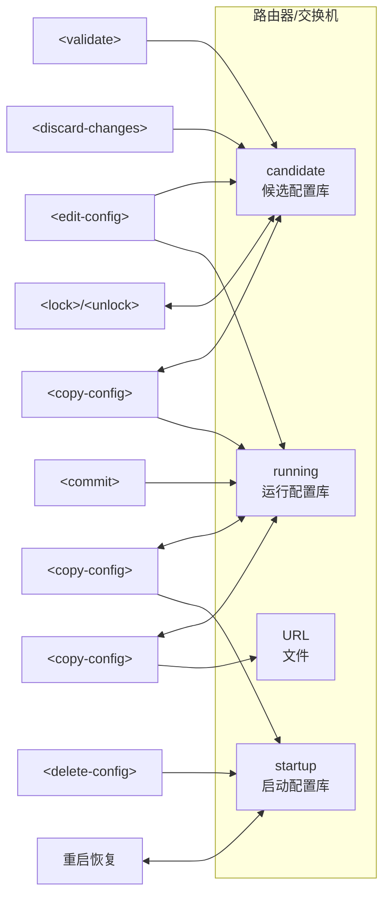
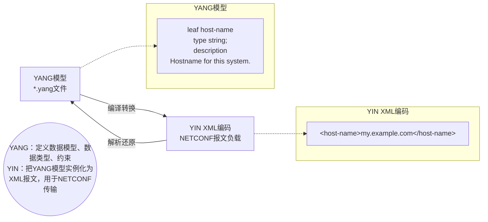

## NETCONF - 网络配置协议

1. 有状态，支持事务机制和回滚
2. NETCONF三个对象
	1. NETCONF 客户端
	2. NETCONF服务器
	3. NETCONF消息
2. 协议框架
	1. 安全传输层
		1. 底层为SSH安全传输
	2. 消息层
		1. rpc（remote procedure call）
		2. rpc reply
		3. ***notification***
	3. 操作层——定义了基本的操作类型
		![[数通高级-网络配置自动化#操作层类型]]
	4. 内容层——xml配置数据，依赖于各厂商的配置。主流模型有schema模型，YANG模型等
		1. config&status config
		2. ***notification***
3. 操作对象
	1. 操作对象有三个配置库，操作层和操作对象的对应关系如下
	![[数通高级-网络配置自动化#操作对象]]
4. YANG模型和YIN模型
	1. YANG模型是节点的描述，用于控制节点数据结构的声明（比如将某字段声明为string类型）；YIN模型是xml，表示具体节点内容（比如这个string节点的内容是com.simon.www）。YANG模型的数据将用来约束YIN模型的内容。
	2. YANG模型
		1. 模块/子模块
			1. 版本
			2. 命名空间
			3. 机构信息
			4. 文件描述
			5. 修订信息
			6. etc.
		2. leaf node
			1. 这个字段只能出现一个值，并且它内部不能有子字段。
			2. 用 leaf xxx定义
		3. leaf-list node
			1. 这个字段可以出现很多个值，这个字段内部不能有子字段。
			2. 用leaf-list xxx定义
		4. list Nodes
			1. 这个字段类似于小结构体，里面可以定义多个子字段。
			2. 使用list xxx定义。
			3. 子字段可以用leaf/leaf-node定义
		5. container
			1. 这个字段高于list nodes，能够定义多个子字段或者list nodes或者container
			2. 使用container xxx定义
		6. group
			1. 这个字段可以定义一个复用集合，在container中可以直接调用复用集合来调用其中的声明，不需要再重写
			2. 声明时使用group xxx
			3. 调用时使用uses xxx
		7. config
			1. config是一个标志位，代表现在声明的字段是否可以配置
			2. config ture代表是配置数据
			3. config false代表不是配置数据，即状态数据。如cpu利用率就是一个config false的数据
		8. 数据类型
			1. typedef可以定义扩展数据类型

## restconf

1. 无状态，不支持事务和回滚
2. 是一种web应用，基于http协议（CRUD）
3. netconf和restconf可以共享YANG文件
4. 数据编码格式支持xml和json
5. 协议框架
	1. 传输层+消息层
		1. HTTP/HTTPS+TCP
	2. 操作层
		1. GET，POST，PUT，PATCH，DELETE等
	3. 内容层
		1. XML/JSON数据
6. 操作对应
	1. GET：获取当前的配置
	2. POST：只能新增配置
	3. PUT：覆盖配置
	4. PATCH：部分新增或覆盖

## Telemetry

1. 监控信息
	1. 管理平面数据：CPU利用率，设备温度，风扇转速，内存情况
	2. 控制平面数据：BGP邻居，MPLS邻居，路由信息
	3. 数据平面数据：端口入方向流量，出方向流量
2. 远程从虚拟或物理设备上采集数据的技术
	1. SNMP：拉模式采样，5分钟一次，采样频率过慢
	2. telemtry使用推模式/拉模式，提供了更实时/更高速的数据采集功能。

---
## 附件
### 操作层类型

NETCONF定义了一系列操作：

| 场景分类  | 操作                  | 功能描述                                |
| ----- | ------------------- | ----------------------------------- |
| 查询数据  | `<get-config>`      | 查询配置数据                              |
| 查询数据  | `<get>`             | 查询设备当前运行的配置和状态数据                    |
| 编辑数据  | `<edit-config>`     | 修改，创建，删除配置数据                        |
| 备份/恢复 | `<copy-config>`     | 导出配置，或用一套配置数据整体替换另一套配置数据            |
| 备份/恢复 | `<delete-config>`   | 删除配置数据集，清空startup **删库**            |
| 锁定/解锁 | `<lock>`            | 加锁，独占配置数据集的修改权                      |
| 锁定/解锁 | `<unlock>`          | 解锁，放弃对配置数据集修改权的独占                   |
| 事务操作  | `<commit>`          | 提交`<candidate>`数据集中的配置数据成为当前运行的配置数据 |
| 事务操作  | `<cancel‑commit>`   | 放弃配置提交试运行                           |
| 事务操作  | `<discard‑changes>` | 放弃`<candidate>`中还未提交的配置数据           |
| 事务操作  | `<validate>`        | 检查指定配置数据的语法语义是否正确                   |
| 会话操作  | `<close‑session>`   | 正常地结束本NETCONF会话                     |
| 会话操作  | `<kill‑session>`    | 强制结束其他的NETCONF会话，需管理员权限             |

### 操作对象

### YANG模型和YIN模型的转化

