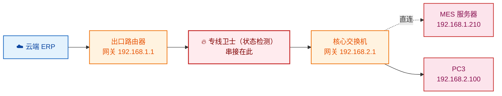

## 背景

某制造企业内网部署了 ERP、MES 等核心业务系统，服务器与办公终端分属不同网段。为满足等保与安全纳管要求，企业在网络出口串接了一台**华三专线卫士**（一台具备状态检测能力的安全网关设备，可联云集中纳管）。

设备上线后出现一个诡异现象：**状态检测防火墙功能一打开，内网主机就访问不了公司的 ERP/MES 服务器**；一关闭又恢复正常。问题反复，影响生产业务，需要尽快定位。

## 故障现象

- 专线卫士的**状态检测防火墙开启**时，内网主机与 ERP/MES 服务器之间**会话建立失败**（业务不通）；
- 状态检测防火墙**关闭**时，业务恢复正常；
- 故障稳定复现，且只影响特定访问路径。

## 网络拓扑与故障分析

### 原始拓扑

关键点：**专线卫士被串接在"出口路由器"与"核心交换机"之间**，处于内网横向流量的必经之路上。

### 根因：数据来回路径不一致
业务访问的报文来回走了两条不同的路：

- **去程（PC3 → MES 的 SYN）**：PC3 的网关在核心交换机，而核心交换机与 MES 服务器**直连**，所以 SYN 包直接被送到 MES 服务器，**没有经过专线卫士**。
- **回程（MES → PC3 的 ACK）**：MES 服务器的网关在出口路由器，回程 ACK 会经出口路由器转发，**从而经过专线卫士**。

**状态检测防火墙的工作原理**决定了它必须先看到一个会话的首包（如 TCP 的 SYN），才能为该会话建立状态表项，后续报文凭状态表放行。本案中：
1. 去程 SYN 绕过了防火墙，防火墙**从未收到过 SYN**，自然没有建立对应会话表；
2. 回程 ACK 单独到达防火墙，防火墙查不到匹配的会话表，将其判定为**"无状态的非法报文"直接丢弃**；
3. 于是 TCP 三次握手永远完成不了，业务会话建立失败。

这就解释了为什么"一开状态检测就不通、一关就恢复"——关闭状态检测后，防火墙不再依据会话表过滤，回程 ACK 得以放行，业务恢复。

## 解决方案

理论上，消除"来回路径不一致"有两条路：
1. 把网关统一收拢到核心交换机，让来回路径都走同一处；
2. 调整专线卫士的部署位置，让它不再卡在内网横向路径上。

该客户内网结构已固化、不便改动，因此采用**方案二：把专线卫士从"出口路由器与核心交换机之间"移到"出口路由器的外侧"**（即出口路由器与云端之间）。

### 调整后的拓扑

调整后的效果：
- 专线卫士只承担**南北向（内网 ↔ 云端）**的安全检测，不再串在内网**东西向（主机 ↔ 服务器）**的路径上，内网来回路径不一致的问题对它不再有影响；
- 由于 DHCP 服务位于出口路由器，专线卫士的**联云口连接到出口路由器**以获取 IP 地址，从而实现**联云集中纳管**，满足远程运维需求。

## 验证与结果

- 状态检测防火墙保持开启，内网主机访问 ERP/MES 服务器恢复正常，业务不再中断；
- 专线卫士对联云流量正常生效，且可被云端平台远程纳管；
- 故障未再复现。

## 技术价值与总结

- **状态检测防火墙是"认会话、不认单包"的**：它必须先看到会话首包建立状态表，否则会把后续报文当非法报文丢弃。这是理解一切"开了防火墙就不通"类故障的钥匙。
- **串接安全设备最怕"来回路径不一致"**：只要去程和回程不是同一条路、且只有一侧经过状态检测设备，就必然出现"首包丢失 → 会话建不起来 → 回程被丢"的死循环。
- **部署位置比策略调整更重要**：本案没有在防火墙上打补丁放行，而是从拓扑层面把设备挪出内网横向路径，一劳永逸。安全设备的串接位置在方案设计阶段就必须结合"业务流量来回路径"一起评估，否则上线后极易踩到这类坑。

> 一句话总结：**状态检测防火墙只对"完整经过自己"的会话有效；部署在来回路径不一致的位置，等于让它只看到"半截会话"，必然丢包。**
