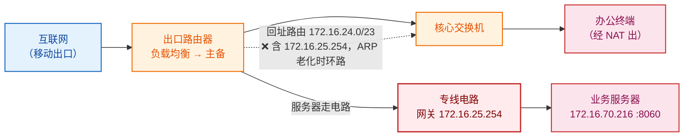
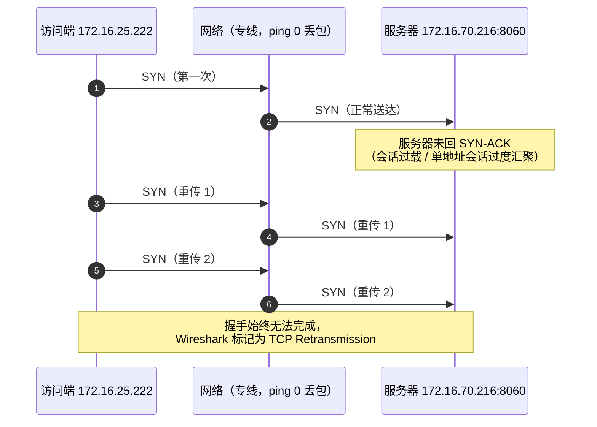
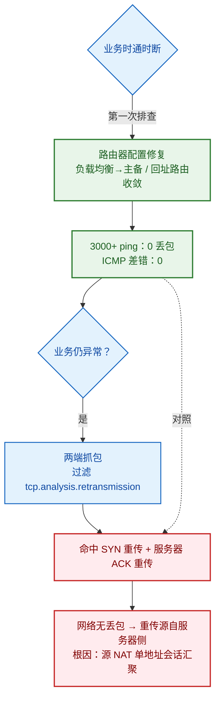

## 背景

某制造企业的一个业务组近期整体搬迁至新网络。新网络出口部署一台**华三出口路由器**，上行挂两条链路：一条**移动出口**用于互联网访问，一条**点对点专线（电路）**用于访问对端业务服务器，电路网关为 `172.16.25.254`。内网核心交换机下挂办公终端，业务服务器在电路对端（典型如 `172.16.70.216`，业务端口 TCP 8060），终端与服务器分属不同网段。

搬迁上线后出现一个让人头疼的现象：**业务访问时断时续，会话经常建不起来**。由于这是搬迁后唯一明显改动的部分，最初怀疑是路由器配置或专线质量问题。事实上，搬迁后新网络为了让终端访问新的服务器地址段，在出口侧**新增了源地址转换（NAT）**——这个"唯一变了"的因素，后来成了破案的关键线索。

## 故障现象

- 终端经专线访问对端业务服务器（`172.16.70.216:8060`）时，**连接经常建立失败**，业务表现为卡顿、超时；
- 故障**间歇性**出现，没有固定复现规律；
- 客户第一反应怀疑专线链路质量。

## 排查过程

本次故障分两次排查，恰好代表两种思路的对比：**第一次从网络层下手，修好了能看到的配置问题；第二次抓包才发现，剩下的锅并不在网络层。**

### 第一次排查：先修网络层的两处隐患

登录出口路由器，发现两处与设计不符、且会引发间歇性故障的配置：

**问题一：WAN 口工作在负载均衡模式，与设计逻辑不符。** 设计要求"互联网走移动出口、服务器走电路"互不干扰，但负载均衡会让流量在两条链路间分担，去往服务器的报文有可能被甩到移动出口上，是典型的"能 ping 通但业务不通"类成因。**处置**：改为**主备模式**——互联网只走移动出口，服务器只走电路。

**问题二：回址路由掩码过宽，与电路直连地址重叠，存在路由环路隐患。** 出口路由器原本有一条回指核心交换机的路由 `172.16.24.0/23`，而**电路地址 `172.16.25.254` 恰好落在这段 /23 范围内**（`172.16.24.0` ～ `172.16.25.255`）。正常情况下直连路由优先级更高，环路被掩盖；但**一旦 ARP 老化、直连路由瞬间断开**，这条更宽的 /23 路由就会"兜底"接管，把去往 `172.16.25.254` 的报文错误地指回核心交换机，形成**瞬态路由环路**，表现为偶发丢包。这类"超网覆盖直连地址"的配置极具迷惑性——平时看似正常，只在 ARP 老化这一很窄的时间窗口内发作。**处置**：将回址路由由 `172.16.24.0/23` **收敛为 `172.16.24.0/24`**，使电路地址落在回址路由范围之外，彻底消除环路。



**第一次验证：3000 余个 ping 包零丢包。** 两处配置修复后，从本端电路直接 ping 对端，连续 **3000 余个包零丢包**。为进一步佐证，在 Wireshark 中按 ICMP 差错报文做过滤（目标不可达 type 3 / 重定向 type 5 / 超时 type 11 / 参数错误 type 12，且 IP 为 `172.16.25.254`），**匹配数为 0**——这段时间内去往电路网关的方向上没有任何路由层差错，不存在黑洞、重定向或 TTL 超时环路。

按理说网络层隐患已清除、ping 也证明专线本身不丢包，业务应该恢复了。**但试用观察期间，业务异常依旧。** 这说明：网络是"通"的，问题出在更上层。

### 第二次排查：抓包锁定 TCP 重传

既然 ping 都不丢包，问题大概率不在 IP 转发层，而在传输层/应用层。于是两端抓包（其中一轮在"路由器上方"抓取，共采集约 **145 万个报文**），重点分析业务流。

在 Wireshark 中针对业务访问源 `172.16.25.222` 直接过滤重传：

```
ip.addr == 172.16.25.222 && tcp.analysis.retransmission
```

抓包结果一出来，方向就清晰了——在约 145 万个报文里，命中的 TCP 重传虽然占比极低（约 0.0%），但**条条都是关键证据**，且全部集中在 `172.16.25.222` 与服务器 `172.16.70.216:8060` 的会话上：

| # | 方向 | 报文（Info） | 含义 |
| --- | --- | --- | --- |
| 1 | 服务器 → 访问端 | `[TCP Retransmission] 8060 → 53896 [ACK]` | **服务器侧重传**：服务器发出的 ACK 没被确认，被迫重发 |
| 2-13 | 访问端 → 服务器 | `[TCP Retransmission] [源端口] → 8060 [SYN]` | **SYN 重传**：连发 SYN 拿不到 SYN-ACK，三次握手建不起来 |

最关键的是第 2～13 条：访问端用不同源端口（`52579`、`63327`、`63387` 等）反复向服务器的 `8060` 端口发起 SYN，**每一条都因收不到 SYN-ACK 而重传**，时间戳从约 `139s` 一直散落到 `1013s`——这是典型的"**服务器对新连接不响应**"特征。Wireshark 专家信息（Expert Info）也明确标注 `This frame is a (suspected) retransmission`。



这一步是整个排查的转折点：**抓到了"重传"，但重传不等于网络丢包**。

## 根因分析：服务器重传 vs 网络侧丢包

本案最值得提炼的一点：**TCP 重传不等于网络丢包**。很多人一看到重传就断定"网络在丢包"，本案恰恰是反驳这种直觉的经典案例。判断重传到底由哪一侧引起，必须结合网络层的独立证据做交叉验证。

| 证据 | 结果 | 指向 |
| --- | --- | --- |
| 连续 ping 3000+ 包 | **丢包 0%** | 网络层端到端健康 |
| ICMP 差错过滤（type 3/5/11/12，对 `172.16.25.254`） | **命中 0 条** | 无环路、无黑洞、无重定向 |
| Wireshark 重传过滤（对 `172.16.25.222`） | 命中一批 SYN/ACK 重传 | 服务器未正常响应 |

**逻辑闭环**：如果重传是网络侧丢包引起的，那么同一条链路、同一段时间，ping 也必然丢包，ICMP 也会出现目标不可达或超时；但**本案 ping 干干净净、ICMP 差错为零**，说明报文在网络中是被完整送达的。报文送得到、送得准，却仍出现 TCP 重传，只可能是**收端（服务器侧）没有正常响应**——要么没回 SYN-ACK，要么没回 ACK，触发对端重传。

进一步分析服务器为何应答不过来，给出两种假设：

1. **服务器性能扛不住**：可能性低。这组业务是整体搬迁、服务器原封不动迁过来，负载没有变化，排除。
2. **搬迁后新增的源 NAT 导致单地址会话过度集中**：可能性高，也是搬迁中**唯一真正发生变化**的因素。源 NAT 把大量终端汇总成同一个接口地址（抓包中的访问源 `172.16.25.222` 即是这样一个被多终端共用的转换后地址）去访问服务器，服务器（或中间 NAT 会话表）面对来自单一 IP 的海量会话，处理/响应异常，于是出现大量 SYN 重传。这与现场记录的"源地址转换后接口地址同一个地址会话过多"完全吻合。

> 换句话说：本案的 TCP 重传，是**服务器/会话侧问题在抓包里的"症状"，而不是网络丢包的"证据"**。需要说明的是，"NAT 单地址会话汇聚"是基于现场条件的最可能推断，受限于客户决策，未做最终验证（见下文）。

## 解决方案

根因明确后，处理思路就清晰了：**消除诱因——去掉或改造搬迁后新增的源 NAT**，避免把大量终端会话塌缩到单一接口地址。

| 方案 | 做法 | 状态 |
| --- | --- | --- |
| 推荐：引入路由，取消源 NAT | 在服务器一侧回指终端网段路由，终端以真实源 IP 直连服务器，单地址会话集中问题自然消失 | 客户暂不打算在总部引入路由，未实施测试 |
| 折中：优化 NAT / 会话限制 | 调大 NAT 会话表、对单 IP 会话数做限速/隔离、扩大转换地址池，缓解会话集中 | 作为备选 |

本案的交付价值主要在**诊断**而非改动：在不动服务器、不动业务的前提下，用 ping 与抓包两类客观证据，把故障从"疑似专线问题"干净利落地剥离到"服务器侧响应异常"，并进一步收敛到"搬迁新增 NAT"这一唯一变量上，为后续整改指明方向，避免在网络设备上继续盲目"背锅"。



## 技术价值与总结

- **TCP 重传 ≠ 网络丢包**：重传只是"没按时收到确认"的症状，原因可能在网络，也可能在终端/服务器。必须用 ping 丢包率、ICMP 差错报文等独立证据交叉验证，才能判断该往哪一侧查。
- **"3000 包零丢包 + ICMP 差错过滤命中 0"是排除网络层的一组硬证据**：前者说明连通性与丢包没问题，后者说明没有路由环路（超时）、黑洞（不可达）或重定向。两者结合，可以把"网络"从嫌疑名单里彻底划掉——这是给网络"做不在场证明"最直接的手段。
- **路由环路会被直连路由掩盖，具有偶发性**：`172.16.24.0/23` 包含电路地址这类"超网覆盖直连地址"的配置错误，平时看似正常，只在 ARP 老化、直连路由短暂消失的窗口内触发丢包。配置收敛时，**静态路由的掩码范围必须与所有直连/业务地址逐一核对**。
- **负载均衡要匹配业务流向**：互联网与专线分流必须与设计一致，负载均衡把服务器流量误分发到互联网出口，是典型的"能 ping 通但业务不通"类故障。
- **搬迁/割接类故障，优先盯"变了什么"**：本案搬迁后唯一变化就是新增了源 NAT，服务器性能、专线质量都没变。锁定"唯一变量"往往能最快逼近根因；NAT 把多源汇总成单地址，是会话集中型故障的常见诱因。

> 一句话总结：**先用 ping 和 ICMP 差错过滤把网络层洗清白，再用重传过滤把问题钉在服务器侧——抓包定位重传，本质是用网络层的"清白"反证出服务器侧的"嫌疑"。**
