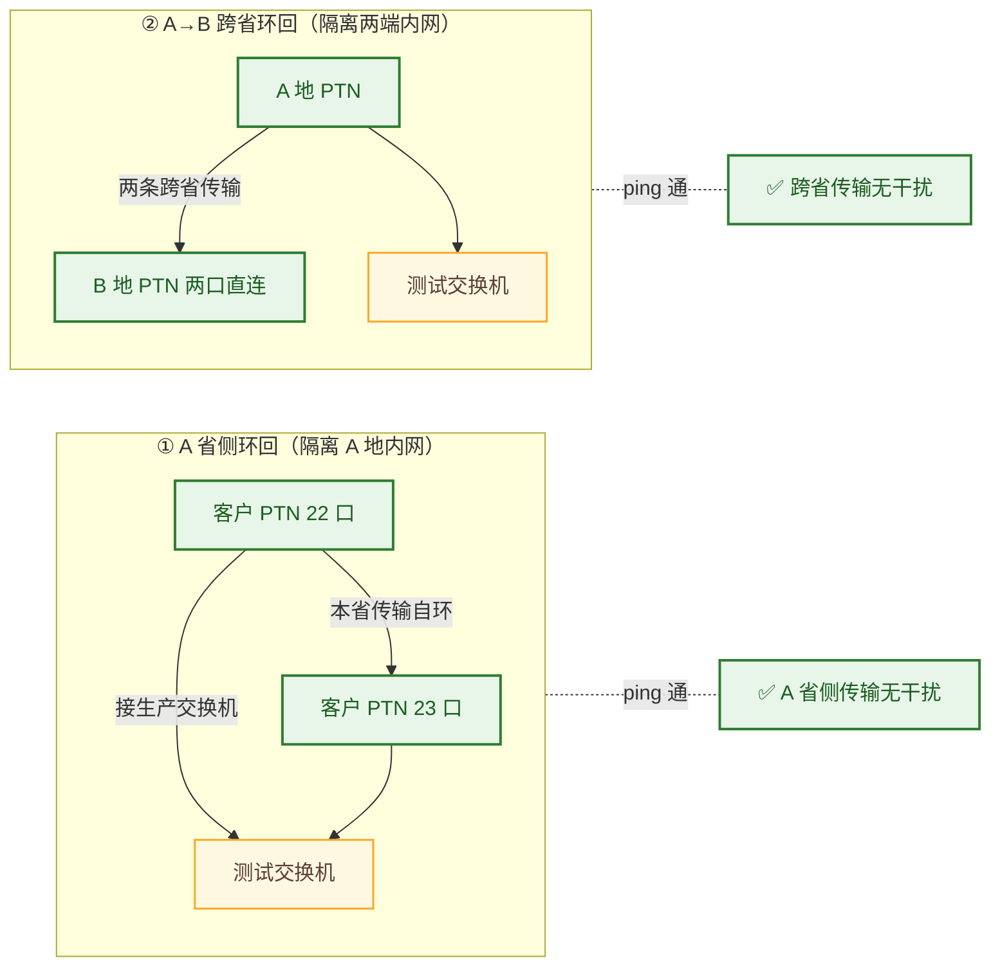

## 背景

某大型制造企业在 A 地（总部）与 B 地（分支）之间部署了**跨省双跨二层专线**：两条运营商 PTN 线路（运营商甲、运营商乙）互为主备，两端核心交换机通过 PTN 二层透传组成一个二层域，并运行 MSTP 防环。其中 A 地核心交换机配置为根桥（BID=4096）并开启根保护，其余交换机 BID 均为默认 32768。

客户反馈：**在 A 地核心交换机开启 MSTP 根保护后，A 到 B 的双跨电路出现 ping 不通的现象**，且两条线路表现矛盾，怀疑是其中一条运营商传输线路存在问题。

## 故障现象

- **开 MSTP 时**：运营商乙线路可正常通信，运营商甲线路无法通信；
- **关 MSTP 时**：运营商甲线路恢复通信；
- A 地核心交换机 BID=4096（应为根桥），但其直连 B 地的端口角色却是**指定端口（DESI）、状态 discarding**——与"根桥直连对端应为 ROOT 口"的预期不符；
- 客户据此推测是运营商甲传输线路的问题，要求传输专业在传输侧抓包排查。

## 排查过程

### 业务拓扑

### 第一步：分析端口角色，发现"根桥端口角色反转"
A 地核心是 BID 最小的根桥，其直连 B 地的端口理应是 ROOT 口，实际却是 **DESI / discarding**。`DESI 口持续 discarding` 通常只有三种成因：
1. 收到了自己发出的 BPDU（自环）——本场景单口接线路、不可能成环，排除；
2. **根保护生效**：收到了更优的 BPDU；
3. 环路保护生效：超时收不到 BPDU——客户未开启，排除。

初步怀疑是第 2 点（根保护），但 `display stp abnormal-interface` 又无输出，无法直接坐实，需要进一步证据。

### 第二步：探查 B 地内网，发现生成树协议混用
B 地核心接内网的 1/0/9 是 ROOT 口，**根路径开销为 20300**——这个非典型开销提示 B 地内网可能存在 **RSTP 与 MSTP 混用**。经 B 地网管确认，内网确有一台交换机运行 RSTP。多厂商、RSTP/MSTP 混用环境下协议兼容性差，初步判断根因在 B 地内网。但因 B 地内网交换机无管理地址、无法远程登录，不能立刻坐实，需先排除传输线路。

### 第三步：双线路抓包比对，区分"透传"与"过滤"
在两条 PTN 线路上分别抓 BPDU 报文：

| 线路 | send | receive | 结论 |
|---|---|---|---|
| 运营商乙（开 MSTP 时通） | 有 | **无** | 该线路**过滤了 BPDU**，把 A、B 两棵生成树隔离成两个独立域，互不干扰 → 通信正常 |
| 运营商甲（开 MSTP 时不通） | 有 | **有** | 该线路**透传了 BPDU**，两端生成树被强行捏到一棵；又因根桥选举异常，导致 DESI 口 discarding |

关键细节：运营商甲线路上**收到的 BPDU，其根桥地址是 B 地内网的 MAC**，而非更优的外部 BID——说明**传输线路里并没有插入更高优先级的设备**，报文来自 B 地内网。这就从抓包层面排除了"传输线路有更高优先级交换机干扰"的可能。

### 第四步：分层环回测试，给出"传输无故障"的铁证
客户仍要求更有说服力的证据证明传输线路无问题。于是采用**分层环回测试**（颗粒度由高到低、逐层隔离客户内网）：

- **A 省侧环回**：在 A 地客户 PTN 上开一条本省传输（如 22 口↔23 口），22 口接客户生产交换机、23 口接测试交换机，两端能 ping 通 → **A 省侧传输线路无干扰**；
- **跨省环回**：开两条 A→B 的跨省传输线路，把 B 地 PTN 的两个接口直接对接，配合测试交换机，两端能 ping 通、端口状态正常 → **跨省传输线路无干扰**；
- （B 地侧无需单独环回：开启根桥保护的交换机必须接入传输线路测试，B 地单独环回无意义。）

环回测试全程端口状态正常、ping 通，**用传输侧的自环证明把客户内网完全隔离后链路无故障**。客户接受该结果，确认传输线路无问题。

## 根因分析

**根因：B 地内网多厂商交换机 RSTP/MSTP 混用，导致跨省二层域的生成树根桥选举异常。**

- 运营商乙线路过滤 BPDU，两端各成一棵树，互不干扰 → 正常；
- 运营商甲线路透传 BPDU，把两端强行并入一棵树，但 B 地内网 RSTP/MSTP 兼容性问题导致选举结果异常，使 A 地根桥直连口角色反转为 DESI 并 discarding → 该线路不通；
- 关闭 MSTP 后不存在生成树选举，自然恢复。

也就是说，**故障的本质不在传输线路，而在两端生成树协议通过透传线路"撞"在一起后的选举冲突**。

## 解决方案

1. **统一两端生成树协议**：B 地内网将混用的 RSTP 设备统一到 MSTP（或统一协议版本与厂商行为），消除选举兼容性隐患。
2. **防止跨域生成树串联**：在跨省 PTN 二层透传线路上，按需选择"过滤 BPDU（两段独立生成树）"或"透传 BPDU（统一一棵树，但必须保证两端协议一致、根桥规划明确）"，二者不可混用。
3. **保留分层环回测试法**：作为集客专线"证明传输无故障"的标准动作，在争议场景下用最小代价给出闭环证据。

## 技术价值与总结

- **"一主一备线路表现矛盾"先查生成树透传策略**：两条线路一条通一条不通，往往不是线路本身好坏，而是**一条过滤 BPDU、一条透传 BPDU**，导致两端生成树被"强行合并"后选举异常。
- **抓包看"根桥 MAC 归属"可快速排除传输侧干扰**：收到的 BPDU 根桥地址若为对端内网 MAC，即可证明传输线路没有插入更高优先级设备。
- **分层环回是"自证清白"的利器**：当客户内网复杂、不接受推理结论时，用逐层环回把内网隔离掉，以"传输自环可通"给出无法辩驳的证据，本案把排障周期从 **10 个工作日压缩到 1.5 个**。

> 一句话总结：**双跨专线一通一不通，先看两条线路对 BPDU 是过滤还是透传；要证明传输无故障，分层环回比逐段抓包高效得多。**
