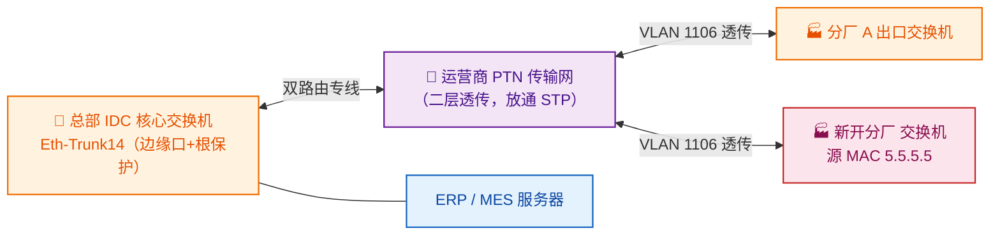

## 背景

某家电制造企业拥有一个总部核心机房（IDC）与多个分厂，ERP、MES 等核心业务系统集中部署在总部，各分厂通过运营商** MSTP/PTN 专线**与总部组成二层互联，分厂终端与总部服务器处于同一套生成树（STP/MSTP）域内。整网为运营商 AAA 级政企业务，分厂到总部均为**双路由**承载，要求高可用。

近期企业对跨厂区互联进行了两次标准化割接，目标是将运营商传输侧 PTN 端口统一为同一模式（行业内俗称"A 类型"，即三地借助运营商链路互通的标准端口模式）。然而两次割接先后引发了网络中断：

- **第一次（约 1 小时中断）**：新开分厂点位上线，端口模式切换叠加新交换机接入，触发分厂内网 MSTP 动荡，最终靠在总部关闭 MSTP 协议才恢复业务。
- **第二次（约 5 分钟中断）**：在已整改的基础上，再次将 PTN 端口由 trunk 改为 access 时，业务再次全阻。

两次中断都在"看似无害"的端口模式调整中发生，客户对"改个端口为何会断网"提出强烈疑问，要求运营商联合设备厂家深入定位根因。本文以定位最彻底的第二次故障为主线展开。

## 故障现象

- 割接窗口内，总部与各分厂之间的**数字电路业务全部阻断**（分厂无法访问总部 ERP/MES，厂区间互通中断）；
- 故障自端口变更起算，历时约 5 分钟后**自行恢复**，无需人工干预；
- 运营商传输侧无光路告警、无链路 down 告警，PTN 专线本身"看起来是通的"；
- 故障稳定可复现：只要在 PTN 上对该端口做模式切换，总部核心交换机的汇聚口就会出现异常。

## 网络拓扑与故障分析

### 原始拓扑



关键点：运营商的 PTN 是一条**透明的二层通道**——它把分厂交换机和总部核心交换机"接"在同一个广播域里，**STP/BPDU 报文会被原样透传**（这一点在事后通过传输实验测试得到证实）。因此分厂侧任何生成树动荡，都会沿着专线直达总部核心。

### 排查过程：用网元操作日志锁定"扳机"

故障恢复后，运维团队在客户现场联合设备厂家（华为 400）开展定位，三条证据链互相印证。

**证据一：总部核心交换机的 logbuffer。** 故障时刻的日志显示，核心交换机的汇聚口 `Eth-Trunk14` 被配置为**边缘端口（edged-port）**，并且在故障时刻因为收到了一个 BPDU 报文，该端口状态变为 **discarding**。

**证据二：核心交换机诊断模式抓包。** 进入核心交换机诊断模式查看故障时刻的 BPDU 包，能看到报文的**源 MAC 地址指向新开分厂的交换机**（5.5.5.5）。

**证据三：运营商传输网元操作日志（syslog）。** 调取割接窗口内 PTN 网元的 NETCONF 操作日志，可以看到对故障端口（`GigabitEthernet13/0/9`）的连续下发，时间戳与故障窗口精确吻合：

| 时间 | 网元操作（NETCONF） | 含义 |
| --- | --- | --- |
| 14:52:15 | `merge GE13/0/9 linkType=access, pvid=1106` | 端口由 trunk 改为 access（割接动作） |
| 14:56:45 | （核心交换机 Eth-Trunk14 恢复 forwarding） | 业务自行恢复 |
| 14:58:22 | `merge GE13/0/9 linkType=trunk, pvid=1` | 端口回退为 trunk |
| 14:59:29 | `merge GE13/0/9 linkType=access, pvid=1106` | 再次改为 access（继续割接） |

把三条证据对齐，可以得到一个自洽的因果链。

### 故障机理

```mermaid
flowchart TD
    A["1. 运维在 PTN 下发<br/>trunk → access（端口模式切换）"] --> B["2. 端口启停抖动（link flap）"]
    B --> C["3. 新开分厂交换机端口<br/>转为 DESI（指定状态）"]
    C --> D["4. 分厂交换机向外发送 BPDU"]
    D --> E["5. BPDU 经 PTN 二层透传<br/>直达总部核心"]
    E --> F["6. 核心 Eth-Trunk14 是边缘口<br/>且开启了根保护（Root Protection）"]
    F --> G["7. 边缘口收到 BPDU<br/>被强制置为 discarding"]
    G --> H["❌ 总部↔分厂业务全阻"]
    H --> I["8. STP 重新收敛<br/>discarding→learning→forwarding"]
    I --> J["✅ 约 5 分钟后业务自行恢复"]

    classDef trig fill:#fff3e0,stroke:#ef6c00,color:#e65100
    classDef bad fill:#ffebee,stroke:#c62828,color:#7f0000
    classDef ok fill:#e8f5e9,stroke:#2e7d32,color:#1b5e20
    class A:::trig class B:::trig class C:::trig
    class H:::bad class G:::bad
    class J:::ok
```

为什么"改个端口"会断网？根因在于客户侧生成树与运营商透传的二层专线之间的相互作用：

1. **端口模式切换引发链路抖动。** 在 PTN 上把端口从 trunk 改为 access，端口会经历一次物理/逻辑层的启停（link flap）。这本身就是割接的正常代价，单独看不会断业务。
2. **抖动让分厂交换机端口进入指定状态。** 新开分厂的交换机与总部核心相连的端口，因对端启停而重新参与生成树计算，转换为 **DESI（Designated，指定端口）** 状态后开始向外发送 BPDU。
3. **BPDU 被运营商专线原样透传。** PTN 是二层透明通道，实验测试确认 STP 报文是放通的，分厂发出的 BPDU 一路直达总部核心交换机的 `Eth-Trunk14`。
4. **根保护 + 边缘端口 = 一触即 discarding。** 总部核心交换机的 `Eth-Trunk14` 被配置为**边缘端口**并开启了**根保护（Root Protection）**。根保护的设计意图是"防止外部接入一台优先级更高的交换机抢走根桥身份"，因此**无论收到的 BPDU 优先级如何**，边缘口一旦收到 BPDU 就会被强制转入 discarding，以保护现有根桥拓扑。
5. **业务随 STP 收敛而中断与恢复。** Eth-Trunk14 进入 discarding 后，总部与分厂间流量中断；经过生成树重新收敛（discarding → learning → forwarding），约 5 分钟后端口恢复转发，业务自行恢复——这与"无需人工干预即恢复"的现象完全吻合。

一句话：**运营商 PTN 把分厂的 BPDU 透传给了总部一台"开了根保护的边缘交换机"，触发了一次本不该发生的生成树收敛。**

## 根因分析

把现象层层剥开后，根因可以归结为一条专线隐患：

> **客户侧的生成树域，跨越了运营商透传的二层专线；专线两端的 STP 行为互不可控，任何一端的端口抖动都会被另一端的根保护"放大"成业务中断。**

具体而言有三个叠加因素，缺一不可：

- **运营商 PTN 是二层透传通道，放通 STP/BPDU。** 这是专线的设计特性，并非缺陷，但它使得分厂与总部实际上处于同一个生成树域，物理上相隔数公里的两台交换机在 STP 看来"直连"。
- **总部核心交换机的 Eth-Trunk14 是边缘口且开了根保护。** 根保护对"来自边缘的 BPDU"零容忍，本意是防私接设备，但在专线透传场景下，分厂的合法 BPDU 也被当成了"威胁"。
- **端口模式切换等割接动作会引发链路抖动。** trunk↔access 切换、新点位接入、尾纤插拔，都会让对端交换机端口重新计算 STP 并发送 BPDU，成为触发根保护的"扳机"。

值得注意的是，这类故障**运营商传输侧看不到任何告警**——光路是好的、链路是 up 的、带宽是通的，问题完全潜伏在客户的二层协议层。这也是为什么前几次报告"看起来都没问题"，客户却反复中断：根因不在传输，而在传输与客户网的"接缝"上。

## 解决方案

针对"根因"与"可靠性短板"，整改从协议层、安全层、承载层三个维度展开。

### 一、协议层：消除 STP 与专线的相互干扰

- **总部 IDC 侧：在 `Eth-Trunk14` 端口禁用 STP（stp disable）。** 既然运营商组网已是树形结构、不存在物理环路，核心汇聚口就不再需要参与生成树计算，从根上杜绝"收到 BPDU → discarding"的链路。这是见效最快、风险最低的一刀。
- **分厂侧：维持现状。** 分厂内部交换机组网规模庞大，贸然整改反而会引发生成树动荡，建议按设备集成商评估择期处理；分厂出口交换机的现有配置保持不变。

### 二、安全层：部署专线卫士，纳管出口安全

结合等保与安全纳管需求，企业在出口部署**华为专线卫士**（一台具备状态检测、联云集中纳管能力的安全网关），承载以下能力：

- **流量管控 QoS**：视频会议/远程桌面保障高优先级，文件传输/邮件降级，DHCP 统一在核心交换机做策略；
- **安全防护**：攻击防护、黑白名单、反病毒 AV、IPS 入侵防护，并对接 IPSec/SSL VPN 与 SDN 做二次认证；
- **日志与内容检测**：日志保留 ≥90 天，HTTPS 加密流量解密检测、URL/DNS/文件过滤，配套 SD 卡/硬盘扩展存储；
- **平滑迁移**：从原有 USG6530 防火墙导出策略，先迁一台、验证无异常后再下架旧设备并同步第二台，避免策略割接引入二次故障。

> 部署位置提示：状态检测类设备切忌串在"来回路径不一致"的内网横向路径上（详见同系列《某制造企业专线卫士会话不通》一案），应串接在出口的南北向路径上。

### 三、承载层：5G 无线备份，补齐"双路由仍不够"的可靠性短板

双路由专线虽然能抵御单路中断，但本案证明：**两路专线同时受同一个 PTN 网元的割接影响时，仍会双双失效。** 为此引入 **5G 无线备份**作为最后防线：

```mermaid
flowchart LR
    classDef prim fill:#e8f5e9,stroke:#2e7d32,stroke-width:2px,color:#1b5e20
    classDef bak fill:#e3f2fd,stroke:#1565c0,stroke-width:1.5px,color:#0d47a1
    classDef l3 fill:#fff3e0,stroke:#ef6c00,stroke-width:1.5px,color:#e65100

    BR["分厂出口交换机"]:::l3
    IDC["总部 IDC 核心交换机"]:::l3

    BR ==>|"有线主用（双路由聚合）<br/>路由优先级最高"| IDC
    BR -.->|"5G 无线备用<br/>CPE→基站→无线核心网"| GRE["GRE 隧道"]
    GRE -.-> IDC

    BR ---|"BFD + 静态路由<br/>毫秒级探测联动"| CTRL{"主备切换"}

    class BR,CTRL,IDC:::l3
    linkStyle 0 stroke:#2e7d32,stroke-width:3px
    linkStyle 1 stroke:#1565c0
    linkStyle 2 stroke:#1565c0
```

工作原理：

- **主用有线**：分厂到总部走双路由聚合的有线专线，路由优先级最高，正常情况下业务全部走有线；
- **备用 5G 无线**：分厂交换机经 CPE 接入 5G 基站，经无线核心网到达总部核心交换机，两端之间起 **GRE 隧道**打通二层/三层互联；
- **切换控制**：通过 **BFD + 静态路由**实现毫秒级链路探测，当有线双路由均不可用（如本案般的割接窗口）时，路由自动收敛至 5G 无线，保障业务连续性。

### 四、流程层：割接合规与变更窗口

- 常规业务割接需提前至少 3 个工作日通知客户，紧急割接提前至少 1 个工作日，**获客户书面同意后方可实施**；
- 割接前核对端口、VLAN、IP 等预配置，现场联调完成后由客户签字确认测试结果；
- 故障申告后每 30 分钟向客户同步进展，3 个工作日内出具书面故障报告。

## 验证与结果

- 在总部核心 `Eth-Trunk14` 禁用 STP 后，分厂端口抖动与 BPDU 不再触发 discarding，后续同类割接未再出现业务中断；
- 专线卫士联云纳管正常，状态检测防火墙在出口对南北向流量生效，策略平滑迁移无二次故障；
- 5G 无线备份链路在有线割接/中断时自动接管，业务可靠性从"双路由"升级为"双路由 + 无线"三重保障；
- 故障未再复现，客户对根因的疑问（传输是否透传、改端口为何触发 STP）获得闭环解释。

## 技术价值与总结

- **透传的二层专线，会让两端的 STP 域"合二为一"。** 运营商 PTN/MSTP 专线默认放通 STP/BPDU，物理上隔离的分厂和总部在生成树看来是直连的。任何一端的 STP 动荡都会沿专线传导到另一端——这是所有"跨专线 STP 故障"的总根源。
- **根保护是双刃剑。** 它能防私接设备抢根桥，但只要边缘口收到 BPDU 就强制 discarding，完全不分"敌我"。在专线透传场景下，分厂的合法 BPDU 同样会触发它，把正常的协议交互放大成业务中断。
- **"运营商无告警"不代表"没问题"。** 本案传输侧光路、链路、带宽全程正常，故障潜伏在客户二层协议与专线的接缝处。排查这类故障必须跨域拉取证据：客户侧 logbuffer + 诊断抓包，运营商侧网元操作日志（syslog/NETCONF），三者在时间轴上对齐才能定位"扳机"。
- **双路由防的是"单路中断"，防不了"同源割接"。** 当两条专线都经过同一网元、同一割接窗口时，双路由会同时失效。补齐最后防线的是异构承载的 5G 无线备份 + BFD 毫秒级切换。

