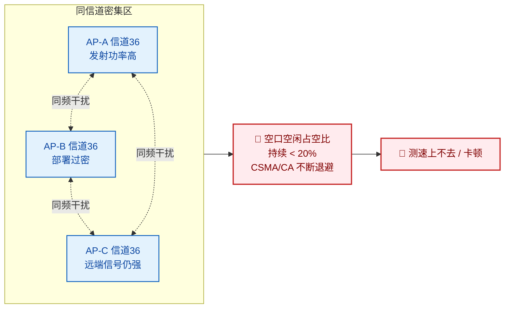
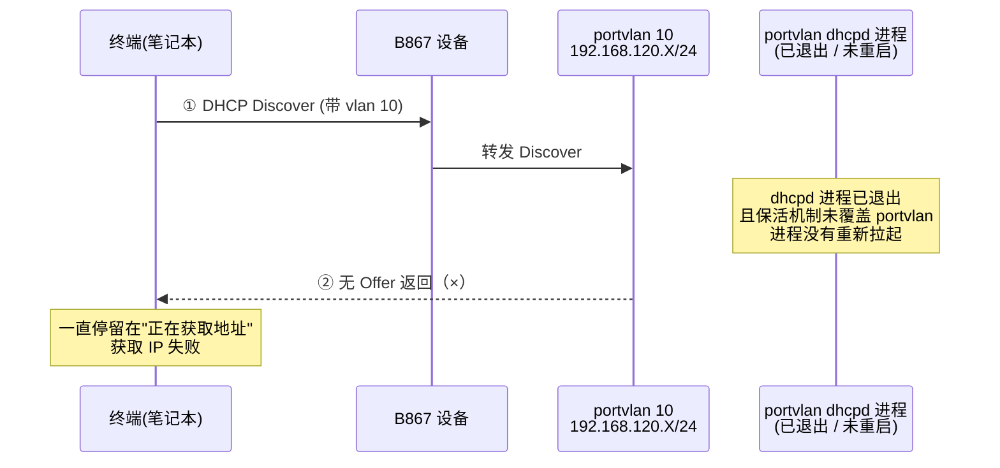
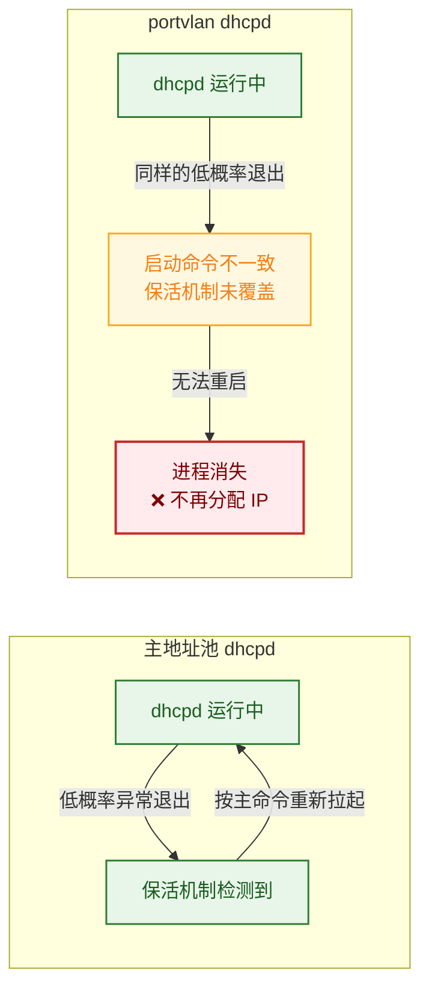
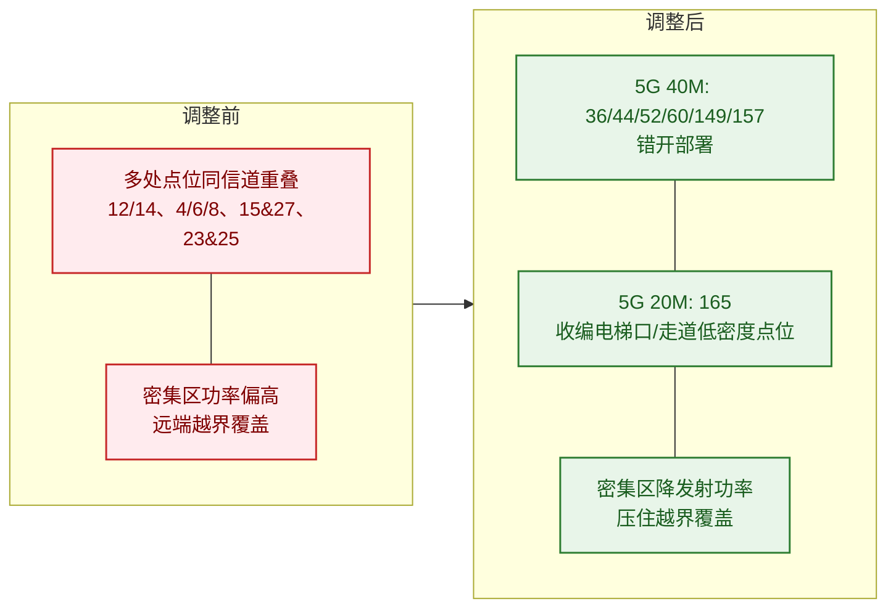

## 背景

某科技企业在自有办公大楼内部署了一套以 **B867** 为核心接入设备的无线组网（FTTR/Wi-Fi 覆盖方案），由某运营商提供专线与代维。整网通过运营商的 NCE（网络云引擎）平台做集中管理与射频监控，对外发布两类 SSID：供员工使用的**办公 Wi-Fi** 与供来宾使用的**访客 Wi-Fi**。

设备上线一段时间后，同一个 B867 局点先后爆出两类性质完全不同的故障：

- **办公 Wi-Fi 速率慢**——用户反映"上网卡、测速上不去"，且有明显的时间规律（上班时间集中）；
- **访客 Wi-Fi 无法获取 IP**——访客终端连上 SSID 后一直拿不到地址，无法上网。

两类故障一个是**射频/空口侧**的体验问题，一个是**协议/进程侧**的功能失效，下文分别展开排查。

## 故障现象

### 子问题一：办公 Wi-Fi 速率慢

- 办公区用户连接办公 SSID 时，普遍反映**用网体验差、测速上不去**；
- 故障呈**上班时间集中爆发**的特点，非工作时段明显缓解；
- 单台终端重连、重启网卡均无改善，说明问题不在终端侧。

### 子问题二：访客 Wi-Fi 无法获取 IP

- 一台 B867 设备下，用户连接访客 SSID 后**始终无法获取 IP 地址**，卡在"正在获取地址"；
- 该 SSID 的地址应从设备 `portvlan 10` 下的地址池 `192.168.120.X/24` 分配；
- 已排除终端与上层链路问题，需要从设备侧定位 DHCP 流程。

## 排查过程

### 一、速率慢：从"空口占空比"一路追到"同频干扰"

#### 1. NCE 看"空口空闲占空比"——上班时间持续低于 20%

通过 NCE 平台调取 Wi-Fi 相关参数，发现**上班时间段空口空闲占空比（Air Interface Idle Duty Cycle）持续偏低，长期低于 20%**。空口空闲占空比反映的是信道上"无人占用、可供发送"的时间比例，这个值长期低于 20%，意味着空口几乎被"占满"了——要么有大量业务流量，要么有大量非业务占用（如干扰）。结合"测速上不去"的现象，怀疑方向指向**空口被干扰/抢占**。

#### 2. 看干扰信息——上班时段存在较强 Wi-Fi 干扰

继续在 NCE 上分析 Wi-Fi 干扰信息，确认**上班时段存在较强的 Wi-Fi 干扰**，且干扰曲线与空口占空比异常的时间高度吻合。

#### 3. 一键式日志定位干扰来源——组网内"同频干扰"

调取设备一键式日志（One-Click Diagnosis），确认上述干扰**主要来自组网内部、即本局点 AP 之间的同频干扰**，而非外部邻区。进一步排查邻居（Neighbor）信息：组网内多个 AP 工作在相同信道、且互相可见，彼此把对方的射频当成噪声，导致 CSMA/CA 机制不断退避，空口有效吞吐被严重压缩——这正是"测速上不去"的直接原因。

#### 4. 现场点位复盘——部署过密 + 远端 AP 信号仍很强

结合现场点位图发现两个加剧因素：

- **部分区域设备部署密集**，同信道 AP 间距过近；
- **远处设备的信号强度也很大**，即覆盖"越界"——某台 AP 在很远的位置仍能以较高强度被同信道 AP 收到，从而对更大范围内的同信道设备造成干扰。

对报障终端所连 AP 逐一核查，确认这些 AP 同样存在"空口占空比低 + 干扰大"的现象，与全局结论一致。

**结论**：速率慢的根因是**组网内 Wi-Fi 同频干扰**，叠加"部署过密 + 发射功率偏高导致远端越界覆盖"，造成空口空闲占空比长期低于 20%，有效吞吐被压缩。

### 二、无法获取 IP：从 DHCP 抓包一路追到"dhcpd 进程消失"

#### 1. 配置侧——地址本应来自 portvlan 10 地址池

分析 B867 的配置：访客终端连接的 SSID 业务应从 `portvlan 10` 下的地址池获取 IP，该网段为 `192.168.120.X/24`。配置本身正确，地址池容量充足，不是规划问题。

#### 2. 抓包侧——Discover 发出去了，但收不到 Offer

在设备侧做 web 抓包，发现终端发出 **DHCP Discover** 报文后**始终收不到 DHCP Offer**，且确认报文已正确带上 `vlan 10` 的标签。也就是说："请求是发出去了的，但服务端没有人应答。" 问题锁定在 DHCP 服务端（设备侧）。

#### 3. 一键式日志——根本没有 192.168.120.X 的分配记录

查看一键式日志中的 `dhcp_debug` log，**完全找不到 `portvlan` 网段 `192.168.120.X` 的地址分配记录**——不是"分发了但失败"，而是**从未进入过分配流程**，进一步印证 DHCP 服务端在这一侧根本没在工作。

#### 4. 进程信息——portvlan 对应的 dhcpd 进程不存在

查看一键式日志中的进程信息，关键线索出现：

- **主地址池对应的 dhcpd 进程：正常运行**；
- **portvlan 对应的 dhcpd 进程：不存在**（已经消失）。

设备上 DHCP 服务由开源的 `dhcpd` 进程承担，按设计每个地址池会拉起一个独立的 dhcpd 进程。主地址池的 dhcpd 还在，但 portvlan 的那个 dhcpd 已经没了——所以 Discover 进了设备却无人应答。

#### 5. 代码流程对比——保活机制对 portvlan 进程"不生效"

进一步分析代码流程，对比"主地址池 dhcpd"与"portvlan 拉起的 dhcpd"的处理差异，找到了根因机制：

- 开源的 `dhcpd` 进程**本身存在低概率异常退出**的事件；
- 为此设备侧做了**进程保活（keepalive）机制**：主地址池的 dhcpd 退出后会被检测到并重新拉起；
- 但 `portvlan` 拉起 dhcpd 时**启动命令与主地址池不一致**，导致保活机制**没有把这种启动方式纳入覆盖范围**；
- 于是 portvlan 的 dhcpd 一旦遇到那个低概率退出事件退出后，**没有人重新拉起它**，进程就此"消失"，新终端再也拿不到该网段的 IP。

**结论**：无法获取 IP 的根因是 **portvlan 拉起的 dhcpd 进程退出后，因启动命令与主地址池不一致、未被保活机制覆盖而无法重启**，导致该网段 DHCP 服务长期"空转"，终端只发得出 Discover、收不到 Offer。

## 根因分析

两类故障的根因可分别归纳为：

| 维度 | 速率慢 | 无法获取 IP |
|---|---|---|
| 故障层级 | 射频 / 空口侧 | 协议 / 进程侧 |
| 直接现象 | 空口空闲占空比 < 20%，测速上不去 | DHCP Discover 发出但无 Offer，拿不到 IP |
| 根本原因 | 组网内 AP **同频干扰**，叠加部署过密、发射功率偏高造成远端越界覆盖 | `portvlan` 拉起的 `dhcpd` 进程退出后，**保活机制未覆盖**（启动命令不一致），进程无法重启 |
| 触发规律 | 上班时间集中（终端与流量密集时段） | dhcpd 低概率退出后持续存在，新接入终端即受影响 |

本质上，一个是**物理层规划问题**（信道/功率没规划好），一个是**软件可靠性问题**（保活机制存在覆盖盲区），都需要从设计层面系统修复，而不能只做单点救火。

## 解决方案

### 一、速率慢：整体重划信道 + 密集区降功率

针对办公区 AP 的实际布放点位，**采集现场点位图、对全组网 Wi-Fi 信道做整体规划**，错开同频信道、降低组网内干扰；对**部署密集的区域额外降低设备发射功率**，收窄覆盖范围，消除远端越界干扰。

5G 信道规划方案（结合现场 26 个点位）：

- **40MHz 频宽**采用 `36 / 44 / 52 / 60 / 149 / 157` 共 6 个非重叠信道错开部署；
- **20MHz 频宽**采用 `165`——`165` 仅支持 20M 频宽，前期未使用；现场 `22 / 24 / 26` 号点位使用人数较少（位于电梯口、走道），将其调整到 `165`，从而把宝贵的高带宽信道让给真正的办公点位；
- `8 ~ 17` 号点位因物理位置限制**无法完全错开**，其中 `13` 号与 `16` 号点位距离较近，统一使用 `157` 信道，并**持续观察**实际干扰情况。

调整前后的对比要点：

- **调整前**：存在多处点位信道重叠（如 12/14、4/6/8、15 与 27、23 与 25 等点位同信道），密集区互相可见、干扰明显；
- **调整后**：办公点位信道基本错开，高带宽信道优先保障办公区，边缘/低密度点位收敛到 20M 的 165 信道，密集区配合降功率压住越界覆盖。

### 二、无法获取 IP：先规避、再补丁根治

针对 dhcpd 进程消失的问题，采取"短期规避 + 长期根治"两步：

1. **规避手段（快速恢复业务）**：在设备 `portvlan` 配置界面，**先禁用 DHCP 服务器，再重新启用 DHCP 服务器**。这一操作会强制重新拉起 portvlan 的 dhcpd 进程，已退出消失的进程随之恢复，地址分配立即生效。适用于等待补丁期间的应急恢复。

2. **补丁根治（消除复发可能）**：发布补丁版本，**适配 `portvlan` 拉起的 dhcpd 进程的保活机制**，使其与主地址池 dhcpd 一样被纳入保活覆盖范围，进程一旦退出即可被检测并自动重新拉起，从根本上避免再次出现"进程消失、无法分配 IP"的情况。

> 补丁版本号：**V500R24C00SPC110**（基于原版本 V500R024C00SPC100）。

## 验证与结果

- **速率慢**：信道整体重划、密集区降功率后，NCE 监测显示上班时段空口空闲占空比回升至正常水平，办公点位信道基本错开，用户测速与用网体验恢复正常；
- **无法获取 IP**：禁用/重启用 DHCP 规避手段立即恢复了业务；补丁版本上线后，portvlan dhcpd 进程具备保活能力，进程异常退出可自动拉起，未再出现拿不到 IP 的复现；
- 边缘点位（13/16 号等）按计划纳入持续观察，干扰指标保持稳定。

## 技术价值与总结

- **"测速慢"先看空口占空比**：空口空闲占空比是判断 Wi-Fi 体验类故障的核心指标，长期低于 20% 通常意味着空口被严重占用，下一步就要区分是"业务流量打满"还是"干扰打满"——本案通过一键式日志与邻居信息，定位为**组网内同频干扰**。
- **同频干扰的解法是"规划"而非"堆设备"**：AP 不是越密越好。部署过密 + 发射功率偏高，会让远端 AP 仍以高强度被同信道邻居收到，反而扩大干扰面。解决靠**整体信道规划 + 密集区主动降功率**，必要时把低密度点位收敛到 20M 信道（如 165）把高带宽信道让给主力办公区。
- **DHCP"发了 Discover 收不到 Offer"，先查服务端进程**：抓包确认报文已带正确 vlan 却无人应答时，应立即排查设备侧 dhcpd 进程是否存活、`dhcp_debug` 是否有该网段分配记录，而不是纠结终端配置。
- **保活机制最怕"启动方式不一致"**：本案的精华在于根因——同一个保活设计，因为主地址池与 portvlan 拉起 dhcpd 的**启动命令不一致**，导致保活只覆盖了一半。这是分布式/多实例系统中很典型的一类可靠性盲区：**凡是按不同方式拉起的同类实例，都要逐一验证保活/监控是否覆盖到位**，否则低概率退出事件一旦命中，就是"进程消失、业务静默失效"的疑难故障。

> 一句话总结：**Wi-Fi 慢要看"空口占空比"找干扰、查信道；DHCP 不通要抓 DORA、查进程存活——前者靠射频规划治本，后者靠补齐保活机制的覆盖盲区治本。**
