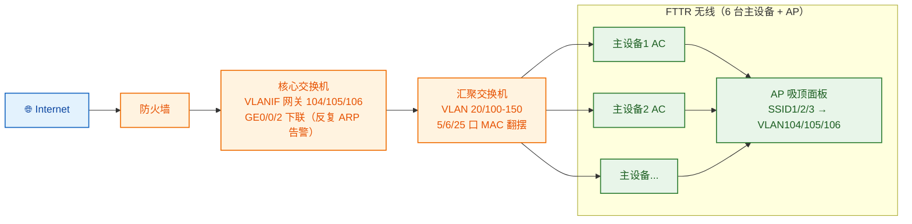

## 背景

某零售企业门店采用 FTTR（光纤入室）全光无线方案：6 台 FTTR 主设备（兼具 AC 与汇聚功能，下文称"主设备"）下挂多台 AP 吸顶面板，经汇聚交换机、核心交换机、防火墙上联互联网。无线侧划分 3 个 SSID，分别绑定 VLAN 104 / 105 / 106 做业务隔离，VLANIF 网关统一终结在核心交换机上。

上线后门店反馈无线体验不稳定：**2.4G/5G 终端间歇性丢包，严重时丢包率约 10%，轻时又几乎不丢**，故障无规律、难复现。

## 故障现象

- 无线终端间歇性丢包，严重时约 10%，时好时坏；
- 汇聚交换机 `dis logbuffer` 发现 **MAC 地址翻摆（flapping）**，集中在 5 口、6 口、25 口之间；
- 核心交换机 2 口（下联汇聚交换机）反复触发 **ARP 攻击告警**；
- 我方 FTTR 设备下电后，MAC 翻摆告警与 ARP 告警同时消失，重新上电后复现。

## 排查过程

### 网络拓扑


### 第一步：从日志锁定异常接口与现象
汇聚交换机日志显示 MAC 地址在 5 口、6 口、25 口之间反复翻摆。翻摆的 MAC 以 `3cc7` 开头，经核对**并非 FTTR 主/从网关设备，也非其下挂终端的 MAC**；据驻场 IT 介绍，`3cc7` 段是接入交换机的 MAC 以及部分 VLANIF 接口的 MAC——也就是说，**翻摆的是网络设备自身的地址**，这通常意味着同一个二层域内存在环路，设备地址在多个端口间被反复学习、抢占。

同时核心交换机日志（节选）显示，下联汇聚的 `GigabitEthernet0/0/2` 反复触发自动端口防御：

```
%%01SECE/4/PORT_ATTACK_OCCUR: Auto port-defend started.
  (SourceAttackInterface=GigabitEthernet0/0/2, AttackProtocol=ARP-REQUEST)
```
该告警在 4 月 30 日、5 月 3 日、5 月 4 日、5 月 6 日多次出现，且伴随 MSTP 将该口反复置为 forwarding、接口频繁 down/up——典型的**二层震荡 + ARP 风暴**特征。

### 第二步：用"下电"验证环路来源
为确认异常源，将我方 FTTR 设备整体下电：**MAC 翻摆告警与 ARP 攻击告警立刻全部消失**；重新上电后告警再次出现。这一对照实验直接证明：**环路/风暴的源头与 FTTR 设备及其接线方式强相关**，而非核心/汇聚交换机自身故障。

### 第三步：定位翻摆 MAC 的真实归属，锁定 FTTO 主设备软件 bug
起初驻场 IT 推测 `3cc7` 段翻摆 MAC 是"接入交换机的 MAC"。但结合"我方设备下电后告警全部消失"这一关键现象，重新核对 `3cc7` 段地址的归属：它并非接入交换机，而是**华为 FTTO 主设备自身上方 VLANIF 接口的 MAC**。

由此定位到真实机理——**华为 FTTO 主设备在多并行桥接场景下存在软件 bug**：
- 6 台 FTTO 主设备以并行桥接方式旁挂在汇聚交换机上，当主设备做二层桥接转发时，**报文的源 MAC 被替换为主设备自身 VLANIF 接口的 MAC（`3cc7` 段）**，而非终端真实 MAC；
- 多台主设备各自从不同的上行端口，把同一个/各自的 VLANIF MAC 发往汇聚交换机；
- 汇聚交换机因此看到同一 VLANIF MAC 在 5/6/25 等多个端口之间**反复学习、互相抢占** → MAC 翻摆告警；
- 翻摆使转发表不断震荡，叠加异常的 ARP 行为 → 核心交换机下联口反复触发 `ARP-REQUEST` 防御告警，无线终端表现为间歇性丢包，丢包率随翻摆强度波动。

也就是说，**这并非真正的二层物理环路，而是 FTTO 主设备软件在并行桥接时"源 MAC 改写"导致的 MAC 翻摆**——这也是为什么只有把"我方设备"下电，告警才会消失。

## 根因分析

**根因：华为 FTTO 主设备在多并行桥接场景下的软件 bug——桥接转发时源 MAC 被改写为自身 VLANIF 的 MAC，导致中间交换机 MAC 翻摆。**

- 翻摆的 `3cc7` 段 MAC 实为 FTTO 主设备 VLANIF 接口的 MAC，而非接入交换机或终端；
- 多台主设备并行桥接时各自用 VLANIF MAC 从不同上行端口发出报文，汇聚交换机据此把这些 MAC 在多端口间反复学习 → MAC 翻摆；
- 翻摆震荡转发表并引发 ARP 异常，触发核心交换机下联口的 `ARP-REQUEST` 防御告警与间歇性丢包；
- "我方设备下电后告警消失"正是因为去掉了翻摆 MAC 的产生源头，进一步印证根因在 FTTO 主设备侧软件，而非物理环路或外部攻击。

## 解决方案

1. **推动厂商修复 / 固件升级**：根因为 FTTO 主设备并行桥接时源 MAC 改写的软件缺陷，需向华为提工单推动修复版本，并在修复版本发布后对在网主设备统一升级。
2. **规避多并行桥接组网**：在补丁落地前，调整组网避免多台 FTTO 主设备以并行桥接方式旁挂同一汇聚交换机；按报告思路，可改为将主设备直接接入核心交换机进行对比验证，缩小并行桥接的暴露面。
3. **临时缓解**：对发生翻摆的端口配合 MAC 学习限制、ARP 抑制等手段降低翻摆对业务的影响（治标）。
4. **接入侧规范**：在汇聚交换机面向 AP/接入设备的端口开启 MSTP 边缘端口并配合 BPDU 保护，作为通用防环兜底，避免与该 bug 叠加放大。
5. **长效机制**：把"FTTO 主设备并行桥接存在源 MAC 改写隐患"纳入选型与组网规范，新店部署时规避该场景，并在验收阶段加入 MAC 翻摆专项观察。

## 技术价值与总结

- **翻摆 MAC 的"真实归属"比"现象本身"更关键**：本案驻场 IT 一度把 `3cc7` 段误判为接入交换机 MAC；若不重新核对归属、不结合"下电即消失"，很容易误定为二层环路去拆线、加生成树，南辕北辙。
- **"下电对照"是定位故障源的高效手段**：把怀疑设备整体下电看告警是否消失，能快速锁定翻摆 MAC 的产生源头，比逐链路抓包更直接。
- **并行桥接是 MAC 翻摆的高发场景**：多台设备旁挂做二层桥接时，一旦出现"源 MAC 被改写为设备自身 VLANIF MAC"的软件缺陷，就会在中间交换机上表现为多端口 MAC 翻摆，排查时应优先核实设备桥接转发行为，而非默认归因为物理环路。

> 一句话总结：**MAC 翻摆别急着定性"环路"——先核对翻摆 MAC 的真实归属，再用"下电对照"锁定源头；FTTO/FTTR 主设备并行桥接场景下，源 MAC 被改写为 VLANIF MAC 的软件 bug 是典型元凶。**
