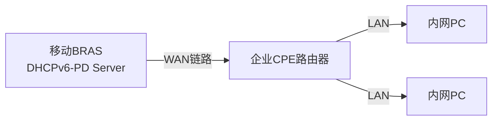

V6互联网专线不再是DHCP直接分发，而是使用ND+PD的方式下发。

## ND SLAAC

ND（Neighbor Discovery）基于 **ICMPv6**，整套包含 5 类报文：**RS、RA、NS、NA、Redirect**

SLAAC 是**依托 ND 实现的地址分配方案**，不是独立协议；DAD 由 NS/NA 实现。

## 1. 报文分工（精简，区分角色）

### RS 路由器请求（终端 → 链路本地组播 FF02::2）

触发：终端刚上电、网卡启用 IPv6

作用：**寻找网关**

报文含义：这条链路上有路由器吗？请下发网段信息。

### RA 路由器通告（路由器 → 链路本地组播 FF02::1）

触发：周期性主动发送 / 收到 RS 后应答

作用：网关对外广播自己，携带关键数据：

1. IPv6 网段前缀（如 2001:db8:1::/64）
2. A/O 标志位（控制终端寻址方式）

> 华为默认 `ipv6 nd ra halt`：路由器不发 RA；接 PC 必须 `undo ipv6 nd ra halt`

> ⚠️ RS/RA：**终端 ↔ 路由器专属**

### NS 邻居请求（任意节点发送）

作用两个：

① DAD 重复地址检测

② IPv6 地址解析 MAC（替代 ARP 请求）

### NA 邻居通告（应答 NS）

作用两个：

① DAD 检测时：宣告 “这个地址被我占用了”

② 二层解析：告知对方「某 IPv6 对应的 MAC 地址」

> ⚠️ NS/NA：**所有 IPv6 节点通用（路由器↔路由器、PC↔路由器都要用）**

## 2. DAD 重复地址检测（使用 NS+NA）

节点配置 / 生成一个 IPv6 地址后**必须执行**

流程：

1. 源地址：::（未分配地址），目标：被检测的 IPv6 地址
2. 发送 NS
3. 收到 NA → 地址冲突，禁止使用
4. 无回应 → 地址可用

适用：FE80 链路本地地址、静态 IPv6、SLAAC 生成地址。

## 3. SLAAC 无状态自动配置 完整流程（串联全部机制）

条件：RA 报文中 **A 位置 1**

1. PC 网卡启用 IPv6，自动生成 FE80 链路本地地址
2. PC 发送 RS：寻找网关
3. 路由器回复 RA，下发网段前缀 `2001:db8:1::/64`
4. PC：前缀 + EUI-64（MAC 转换）拼接出完整全球 IPv6 地址
5. PC 对新地址执行 **DAD（NS 报文）**
    
    ✅无冲突 → 地址生效
6. PC 想要通信时，发送 NS 查询网关 FE80 对应的 MAC；网关回复 NA

## 4. RA 标志位（考点，区分 3 种 IPv6 地址分配模式）

- **A 位 (Autonomous)**：1 = 允许 SLAAC 自动生成地址
- **O 位 (Other)**：1 = 需要 DHCPv6 获取 DNS、域名等附加信息

组合：

1. A=1,O=0 → **纯 SLAAC**，不需要 DHCPv6
2. A=0,O=1 → 仅 DHCPv6（有状态，IA-NA 分配地址）
3. A=1,O=1 → SLAAC 生成地址 + DHCPv6 拿 DNS

## 5. 最重要分界线（杜绝混淆）

1. RS/RA：找网关、下发网段前缀 → **服务于 SLAAC**
2. NS/NA：地址冲突检测、IP→MAC 解析 → **基础通信必需**
3. DAD：只是 NS/NA 的一种使用场景，**不是独立报文**
4. SLAAC：一套地址获取流程，**依赖 RS+RA+DAD**

## 6. 最简记忆对照表

表格

|组件|角色|参与者|
|---|---|---|
|RS|终端询问有无网关|PC → 路由器|
|RA|路由器推送网段参数|路由器 → PC|
|NS|查询 MAC / 检测地址冲突|任意节点之间|
|NA|回应 NS|任意节点之间|
|DAD|冲突检测逻辑|基于 NS/NA 实现|
|SLAAC|自动获取地址整套流程|RS+RA+DAD 联合完成|

## 补充实战区分（你实验会用到）

路由器互联链路（OSPFv3 邻居）：

只需要 NS/NA（解析 FE80 的 MAC）；**不需要 RS/RA**，保持默认 `ipv6 nd ra halt`。

路由器接 PC：

放开 RA，`undo ipv6 nd ra halt`，PC 才能完成 SLAAC 获取地址。

> 额外提醒：OSPFv3 邻居建立依靠 FE80，转发流量依赖 ND 的 NS/NA；就算关闭 RA，OSPFv3 邻居正常 UP。

# 移动 IPv6 专线：ND+PD 完整机制（精简，结合运营商真实组网）

## 先分清两个角色，不要混淆

- **PD = DHCPv6 IA-PD（前缀委派）**：**给路由器分配一整段公网网段**（不是单个 IP）
- **ND（RS/RA）**：两套作用
    
    1. WAN 侧：CPE 通过 RA 找到运营商 BRAS 网关
    2. LAN 侧：CPE 下发 RA，内网 PC 通过**SLAAC**自动获取 IPv6
    

> 通俗一句话：**PD 负责拿网段，ND 负责把网段下发给内网终端**

## 组网拓扑

plaintext

```
运营商BRAS（DHCPv6-PD服务器） ←WAN链路→ 用户CPE路由器 ←LAN→ 内网PC/服务器
```

- BRAS：移动侧设备，分配公网 IPv6 前缀（常见 /56、/60）
- CPE：你的企业边界路由器（DHCPv6 PD 客户端）

# 完整协商时序（从上电开始，分两大阶段）

## 阶段 1：WAN 侧【CPE ↔ 移动 BRAS：ND 发现网关 + DHCPv6-PD 申请网段】

1. CPE WAN 接口开启 IPv6 → **自动生成 FE80 链路本地地址**
2. CPE 发送 **RS（ND 报文） FF02::2**：链路上有没有 IPv6 路由器？
3. BRAS 回复 **RA（ND 报文）**
    
    ✅ RA 核心信息：
    
    - BRAS 的 FE80 = 默认 IPv6 网关
    - **M=1，O=1**（关键！告诉 CPE：去运行 DHCPv6）
    

> RA 只是**通知 CPE 启动 DHCPv6**，RA 本身不下发公网业务前缀！

4. CPE 启动 **DHCPv6 客户端**，组播向`FF02::1:2`发送 **Solicit 报文**
    
    - 报文中携带 **IA-PD**：向运营商申请一段 IPv6 网段
        
        （区分：IA-NA = 申请单个 IP；IA-PD = 申请网段前缀）
    
5. DHCPv6 四次交互 Solicit → Advertise → Request → Reply
6. BRAS 返回 Reply 报文，下发**委派前缀**，例：`2409:xxxx:xxxx::/56`
7. BRAS 自动生成静态路由：**该 / 56 网段下一跳指向 CPE 的 FE80**（路由可达基础）
8. CPE 保存获取到的公网前缀，租期到期自动续租 PD

> 重点区分考点：
> 
> RA ≠ PD！RA 只是 “引路”，**真正拿到公网网段是 DHCPv6-PD**

## 阶段 2：LAN 侧【CPE ↔ 内网终端：ND RA + SLAAC 分发地址】

CPE 拿到运营商给的大段前缀`/56`之后：

1. CPE 把`/56`拆分成多个`/64`子网，分配给各个 LAN 接口
    
    例：
    
    - LAN1：2409:xxxx:xxxx::1/64
    - LAN2：2409:xxxx:xxxx:1::1/64
    
2. CPE 内网接口执行 `undo ipv6 nd ra halt`，周期性发送 **RA 报文**
    
    RA 携带本子网`/64`前缀 + A=1 标记（允许 SLAAC）
3. 内网 PC 收到 RA：
    
    ① 使用前缀 + EUI64 生成 IPv6 地址
    
    ② 自动执行 DAD（NS/NA）检测地址冲突
    
    ✅ 完成 SLAAC 无状态地址自动配置
4. PC 访问互联网，默认网关 = RA 报文中 CPE 的 FE80 地址

# 核心名词边界（解决你最容易混淆的点）

1. **PD（IA-PD）**
    
    协议：DHCPv6（UDP 546/547）
    
    对象：**运营商 ↔ 用户 CPE 路由器**
    
    作用：分配**一整个网段前缀**，企业内网可以自由划分子网
2. **ND RS/RA**
    
    协议：ICMPv6
    
    两处使用：
    
    - WAN：CPE 寻找运营商网关，触发 DHCPv6-PD
    - LAN：CPE 向 PC 推送网段，支撑 SLAAC
    
3. **SLAAC**
    
    不是独立协议，**基于 ND RA 实现**，内网 PC 用来自动生成地址

# 常见误区纠正

❌ 误区 1：RA 下发公网大前缀（/56）

✅ 正解：公网 / 56 是 PD 获取；RA 只在 CPE 内网下发拆分后的 / 64

❌ 误区 2：PD 属于 ND 协议

✅ 正解：PD 属于 DHCPv6；ND（ICMPv6）和 DHCPv6 是两套独立协议

❌ 误区 3：PD 可以给 PC 使用

✅ 正解：PD 设计目标只给**路由器**；PC 终端只用 SLAAC / IA-NA

# 华为设备最简配置模板（CPE 侧，模拟移动专线场景）

plaintext

```
# 全局
ipv6
dhcp enable

# WAN口（连接移动BRAS）
interface GigabitEthernet 0/0/0
 ipv6 enable
 # 开启DHCPv6客户端，主动请求PD前缀
 dhcpv6 client ia-pd
 # WAN互联链路，不需要向运营商设备发RA，保持默认 nd ra halt

# LAN口（接内网终端）
interface GigabitEthernet 0/0/1
 ipv6 enable
 # 使用PD获取的前缀，自动生成接口地址（prefix-id绑定PD）
 ipv6 address pd-prefix 1 ::1/64
 undo ipv6 nd ra halt    # 向PC发送RA，支持SLAAC
```

# 排错观测命令

plaintext

```
display dhcpv6 client        # 查看是否成功拿到PD前缀
display ipv6 routing-table
display ipv6 neighbors       # ND邻居表
debugging dhcpv6 event
debugging nd event
```

# 精简总过程

CPE 上电 → 发 RS (ND) → BRAS 回 RA（告知启动 DHCPv6）→

CPE 发起 DHCPv6 IA-PD 请求 → 运营商下发公网网段 (PD) →

CPE 拆分网段 → LAN 口发送 RA (ND) → PC 通过 SLAAC 获取 IPv6 地址




```mermaid
sequenceDiagram
    participant PC
    participant CPE
    participant BRAS
    Note over CPE,BRAS：
    ==== 阶段1 WAN侧：CPE获取公网PD前缀 ====
    CPE->>CPE: WAN口ipv6 enable，自动生成FE80链路本地地址
    CPE->>BRAS: RS (ND FF02::2) 【链路上是否存在IPv6网关？】
    BRAS-->>CPE: RA (ND FF02::1) M=1,O=1【请启用DHCPv6】
    CPE->>BRAS: DHCPv6 Solicit 携带 IA-PD【申请委派网段】
    BRAS-->>CPE: DHCPv6 Advertise
    CPE->>BRAS: DHCPv6 Request
    BRAS-->>CPE: DHCPv6 Reply<br>下发公网前缀：2409:xxxx::/56
    Note over BRAS: BRAS生成静态路由：/56 下一跳 CPE FE80
    Note over CPE：CPE保存PD前缀，可拆分多个/64子网

    Note over CPE,PC：
    ==== 阶段2 LAN侧：内网终端SLAAC自动寻址 ====
    CPE->>PC: RA(ND FF02::1)<br>携带拆分后子网2409:xxxx::/64，A=1
    PC->>PC: 前缀+EUI-64 拼接全球IPv6地址
    PC->>PC: DAD检测（NS报文，无NA应答→地址可用）
    Note over PC：PC地址生效，网关=CPE的FE80地址

    Note over PC,CPE：
    ==== 日常通信：ND NS/NA地址解析 ====
    PC->>CPE: NS【查询网关FE80对应的MAC】
    CPE-->>PC: NA【回复MAC地址，建立ND邻居表】
```

