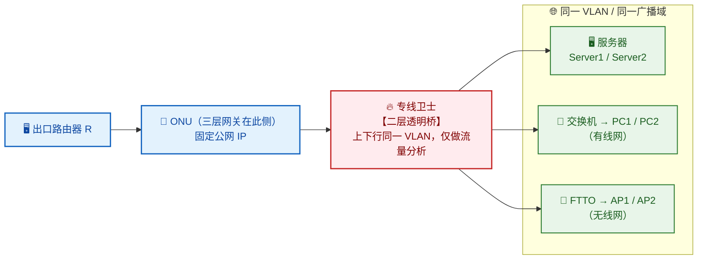
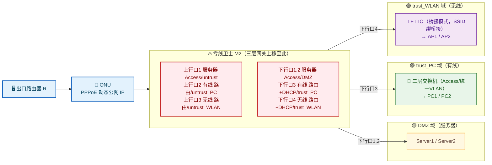

## 项目简介

本项目为某地市级公安机关办公专网的**安全接入与组网整改工程**。该单位原有办公网通过一台安全网关（华为专线卫士 M2）以**二层桥接**方式串接在出口路径上，服务器、有线办公网、无线办公网被放在同一个 VLAN 中，真正的三层网关位于 ONU/光猫侧。这种结构虽然让专线卫士能"旁路"分析流量，却带来三个硬伤：**安全设备无法溯源到具体内网终端**（网关不在它这里，MAC/IP 都被 ONU 统一代理）、**无法实施基于终端的准入认证**、**固定公网 IP 长期暴露在互联网上被频繁扫描与攻击**。

整改方案的核心是把**网关从 ONU 上移到专线卫士**，由它统一承担路由、DHCP、NAT、安全策略与准入控制：按业务把网络拆成**服务器（DMZ）、有线（trust_PC）、无线（trust_WLAN）三套独立安全域**，每套域各自隔离、各自做源 NAT，从而实现终端级溯源与差异化的访问控制；再配套 SD 卡扩展满足 180 天日志留存，上行改为 PPPoE 动态 IP 收敛暴露面。项目还对一例"整改割接后断网"事件做了完整复盘，定位为安全策略误封 DNS。

## 项目背景与需求

### 业务背景
公安单位办公网承载日常办公、对外服务发布与终端接入，既有自建服务器对外提供服务，也有大量有线/无线办公终端，还有访客接入需求。原网出于"先打通、再加安全"的演进，把一台专线卫士以透明桥方式串进了出口链路，但只做流量分析告警，并没有真正承担起网关与准入职责。

### 原网结构与问题
整改前网络逻辑如下：

- 出口路由器 → ONU → **专线卫士（二层桥接，上下行同一 VLAN）** → 服务器 / 有线交换机 / FTTO（无线）。
- 服务器、有线终端、无线终端**同处一个广播域**，公网地址段直接下发到各终端，三层网关在 ONU 侧。
- 专线卫士仅做"透明桥 + 报文分析"，对经过的报文做异常流量告警与拦截，**不参与地址分配、不掌握终端 MAC/IP 映射**。

这种结构导致：终端溯源只能落到出口地址、无法定位到内网主机；想做准入认证没有抓手；固定公网 IP 被持续探测与攻击。

### 核心整改需求
客户针对上述问题提出了四条明确的整改要求：

1. **联网控制**：内部人员的终端凭 MAC 地址清单免认证直接接入；访客需要进行 Web（Portal）认证。
2. **日志留存**：安全与访问日志要求保存 **180 天**，满足合规留存要求。
3. **终端溯源**：专线卫士必须能够溯源到内网中的有线/无线接入终端，便于病毒/失陷事件的追踪定位。
4. **对外 IP 动态化**：上行改为动态 IP，规避固定公网 IP 被频繁攻击的风险。

## 技术栈与设备选型

- **安全网关/集中接入设备**：华为 **专线卫士 M2**，承担路由、安全域隔离、DHCP、源 NAT、准入认证与日志审计。M2 内置存储有限，支持 SD/TF 卡扩展以延长日志留存周期。
- **光接入**：ONU（支持开通 PPPoE 拨号专线），作为上行出口；同时承担光电转换。
- **有线接入**：二层交换机，上下行口配置为 Access，划入统一 VLAN（透明透传到专线卫士）。
- **无线接入**：**FTTO（光纤到办公室）**设备，开启桥接模式，将 SSID 绑定在桥接网络上，由专线卫士做三层网关。
- **上行方式**：PPPoE 拨号动态公网 IP（悦享专线），替代原固定公网 IP。
- **关键能力**：安全域（untrust / trust / DMZ）、源 NAT（easy-ip，转换为出接口地址）、MAC 白名单免认证 + Portal 访客认证、SD 卡日志扩展。

## 整体架构

整改前后的核心差异，是把"二层桥接、单广播域、网关在 ONU"改造为"三层路由、多安全域、网关在专线卫士"。下面用两张简图对比。

### 整改前：二层桥接、单广播域

整改前的关键问题：服务器、有线、无线在**同一 VLAN**，专线卫士是**透明桥**，真正的网关在 ONU，专线卫士拿不到终端 MAC/IP，无法溯源也无法做准入。

### 整改后：网关上移、多安全域

整改后，专线卫士用**三个上行口 + 四个下行口**把三类业务彻底隔离：服务器走 DMZ，有线走 trust_PC，无线走 trust_WLAN，各自的上下行分别落入不同的 untrust_xxx / trust_xxx 安全域，便于精细化下发安全策略与 NAT。

## 核心设计：专线卫士 + FTTO 组网

本项目的关键在于把一台安全网关从"透明桥"改造成"真正的多域网关"，并配套终端溯源、准入认证、日志留存与动态出口。

### 接口与安全域划分
专线卫士的七个物理口被重新定义为按业务隔离的三套域：

| 用途 | 接口 | 模式 | 安全域 | 说明 |
|------|------|------|--------|------|
| 服务器上行 | 上行口1 | Access | untrust | 与服务器下行同 VLAN，桥接透传 |
| 有线上行 | 上行口2 | 路由 | untrust_PC | 配上有线上行 IP |
| 无线上行 | 上行口3 | 路由 | untrust_WLAN | 配无线上行 IP |
| 服务器下行 | 下行口1、2 | Access | DMZ | 与上行口1同 VLAN |
| 有线下行 | 下行口3 | 路由 | trust_PC | DHCP 网关，为有线终端分配地址 |
| 无线下行 | 下行口4 | 路由 | trust_WLAN | DHCP 网关，为无线终端分配地址 |

> 三套业务分属 DMZ / trust_PC / trust_WLAN，互不串扰；上下行又分别对应 untrust_xxx / trust_xxx，安全策略与 NAT 都可以按"业务 + 方向"精细下发。

### 网关上移与终端溯源
网关上移是整个整改的"点睛"：

- **交换机**改为纯二层（上下行 Access、统一 VLAN），只做透明透传；
- **FTTO**开启桥接模式，将 SSID 绑定到桥接网络，无线终端的二层流量也透传到专线卫士；
- 真正的三层网关、DHCP 服务器都落在专线卫士的下行口3、下行口4 上。

这样**每个有线/无线终端的 MAC 与 IP 都由专线卫士直接分配和记录**，专线卫士完整掌握"MAC ↔ IP ↔ 接入位置"的映射，从而具备终端级溯源能力——这是后续做病毒/失陷追踪、准入认证的前提。

### NAT 策略
三类业务各自独立做源 NAT，避免地址混用：
- 有线网：`trust_PC → untrust_PC`，源地址转换为有线上行出接口地址；
- 无线网：`trust_WLAN → untrust_WLAN`，源地址转换为无线上行出接口地址；
- 服务器域（DMZ）按对外发布需求单独处理。

按业务分域做 NAT 的好处是：不同业务的出口地址各自隔离，策略与日志都能按业务维度切分，排障和审计都更清晰。

### 联网控制：MAC 白名单 + Portal 认证
基于上移后的网关能力，落地两套准入：

- **白名单免认证**：把公安内部终端的 MAC 地址配置为地址对象，在认证策略中对白名单用户免认证直接放行；
- **访客 Portal 认证**：非白名单用户触发 Portal 认证，凭账号密码通过后方可上网。

> 注意事项：有线终端的 MAC 为固定 MAC，白名单可直接生效；无线终端若开启了系统级的**随机 MAC（隐私 MAC）**功能，白名单会失效，需在终端侧关闭随机 MAC 后再纳入白名单。

### 日志留存：SD 卡扩展到 180 天
专线卫士 M2 内置存储较小，无法直接满足 180 天留存要求。方案采用 **SD/TF 卡扩展存储**：

- SD 卡在位时，Web 界面可查看流量日志、威胁日志、URL 日志、内容日志、操作日志、系统日志、用户活动日志、策略命中日志、邮件过滤日志、审计日志等；
- 通过 Web 查看的日志最大条数为 1 万条/次导出上限 10 万条；
- 设备提供"业务存储占用比例 / 最大占用空间 / 剩余可用天数"等指标，便于评估留存是否达标。

> 说明：M2 不支持带宽/IP 连接数日志与沙箱检测日志的查看与导出，规划留存策略时需规避这两类。

### 对外动态 IP：PPPoE 替代固定公网 IP
针对固定公网 IP 被频繁攻击的问题，上行 ONU 开通 PPPoE 拨号专线（动态公网 IP）。落地有两种方式：

1. **ONU 桥接 + 专线卫士上行口 PPPoE**：由专线卫士直接发起 PPPoE 拨号，公网 IP 落在专线卫士上；
2. **光猫拨号 + 专线卫士私网接入**：光猫完成 PPPoE 拨号，专线卫士以私网地址接入光猫上行。

两种方式都能让对外 IP 动态化，显著收敛被持续扫描与定向攻击的风险。

## 实施要点

1. **配置预下发，割接窗口最小化**：整改窗口仅 2 小时，涉及多设备联动。实施时先把路由口、NAT、白名单等配置**预下发到专线卫士未启用的端口**，交换机同步完成配置改动，最后仅做"网线割接到新端口 + 全量测试"，把业务中断压到最短。
2. **配置备份先行**：割接前完整备份专线卫士与交换机的配置文件，确保可回滚。
3. **回滚预案**：定义明确回滚判据——业务验证出现问题且无法及时解决即回退；回滚动作为"重载备份配置 + 割接网线回到整改前现场 + 回滚业务测试"。
4. **上行 IP 网段隔离**：更改专线 IP，确保专线卫士多个上行口的 IP 落在不同网段，避免上行侧地址冲突与策略误匹配。
5. **白名单与认证联调**：逐批纳入内部终端 MAC，同步提示无线终端关闭随机 MAC；访客 Portal 流程做端到端验证。
6. **日志留存验证**：插入 SD 卡后，在 Web 界面确认各业务日志的"剩余可用天数"达到 180 天量级，再交付运维。

## 关键问题排查：整改割接后断网（DNS 被误封）

割接后出现了一例典型的"通但是上不了网"故障，记录如下。

### 故障现象
整改割接后的某个时段，用户电脑出现**无法解析域名、无法上网**的现象：`nslookup` 无法解析任何地址，且 `ping` 不通 DNS 服务器地址。

### 排查过程
**第一步：定位故障层级。**
`nslookup` 解析失败、`ping` DNS 不通，但局域网内部可达——典型的"内网通、外网/DNS 不通"。结合专线卫士的安全策略模型，初步判断为**安全策略阻断了 DNS 服务器地址**。

**第二步：设备侧核查。**
登录专线卫士查看，发现两个运营商递归 DNS 地址此前被加入了 **IP 黑名单**（设备侧查看时黑名单已被删除，但历史下发记录可溯）。结合平台侧告警与下发操作排查，定位到：设备此前产生了**失陷主机安全告警**，用户基于告警通过平台**下发了"永久 IP 黑名单"**，把告警中关联的出口地址（实际是运营商 DNS 地址）当作恶意地址封禁，导致所有依赖该 DNS 的终端无法解析。

**第三步：锁定根因。**
根因为**安全告警驱动的误封**：专线卫士监测到的是终端访问的出口/目的地址，失陷告警里的目的 IP 实际上是正常的运营商递归 DNS，被用户当作恶意源封禁，造成全网 DNS 受影响。

### 处置措施与安全建议
- **立即处置**：通过自服务平台对涉及的 DNS 地址添加**全局白名单**，解除误封，恢复解析；后续如确认其他在用 DNS 地址，可一并加入白名单。
- **流程建议**：
  1. 善用自服务平台的**全局白名单**功能，把已知合法的关键基础设施地址（DNS 等）预先加白，避免误封；
  2. 安全事件的查看与封禁动作统一通过自服务平台进行，便于审计与回溯；
  3. 由于设备监测到的是出口地址、暂时溯源不到内网终端，建议**对内网终端全面安装杀毒软件**做端点查杀，从源头收敛失陷风险（这正是本次整改"终端溯源"能力要解决的长期诉求）。

### 技术价值
这例故障的价值在于厘清了一条常见的误判链：**"上不了网"不等于"网络/组网有问题"**。在安全网关承担网关与策略控制的网络里，一条过激的安全封禁策略（误封 DNS）就能让整网"看似瘫痪"。排障时先从 DNS 解析与安全策略/黑名单入手，往往能比在网络层反复排查更快定位。它也反向印证了整改方向——当终端溯源能力补齐后，失陷告警可以精确到内网主机，类似的"出口地址误封"将大幅减少。

## 项目成果

- 用一台专线卫士 M2 完成"安全网关 + 业务网关 + 准入控制 + 日志审计"的四合一重构，把原本透明桥、单广播域的网络改造为**三安全域（DMZ/trust_PC/trust_WLAN）、三层路由、各自 NAT** 的可控架构。
- 通过**网关上移 + 交换机/FTTO 二层透传**，让专线卫士完整掌握终端 MAC/IP 映射，实现**终端级溯源**，补齐了病毒/失陷追踪的关键短板。
- 落地 **MAC 白名单免认证 + 访问 Portal 认证**的差异化准入，满足内部人员与访客的不同接入诉求（并明确无线终端需关闭随机 MAC）。
- 通过 **SD 卡扩展**把日志留存拉到 180 天合规水位；上行改为 **PPPoE 动态 IP** 显著收敛固定公网 IP 的暴露面与被攻击面。
- 沉淀了一套"配置预下发 + 窗口内割接 + 可回滚"的整改交付方法，以及"DNS 异常优先排查安全策略/黑名单"的安全排障思路。
