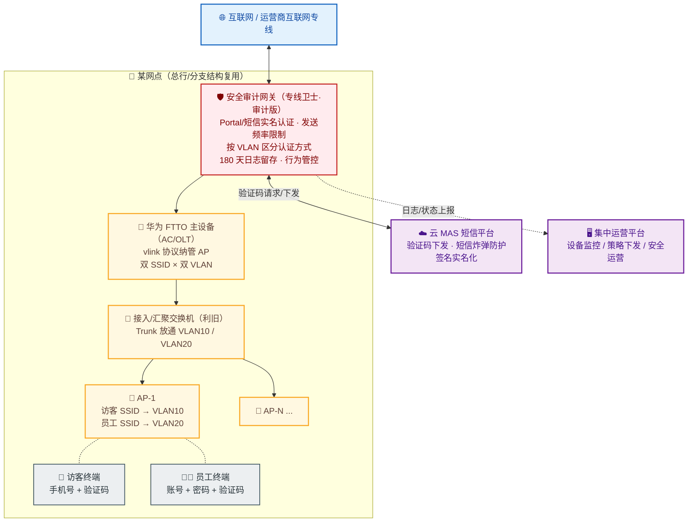

## 项目简介

本项目为某农商行（含总行营业网点与辖内多家分支网点）的**互联网宽带实名认证与安全审计工程**。该行在总部与各分支网点均建设了无线宽带覆盖，既要保障员工日常办公上网，也要向到店客户提供无线网络服务。按照银保监、公安部及《网络安全法》的合规要求，所有金融网点的上网行为必须做到**实名认证**与**日志审计留存（不少于 6 个月）**。

项目落地的核心挑战不在覆盖本身，而在**"一套无线、两类用户、多重合规"**的精细化治理：

- 原认证页面存在**短信炸弹风险**——同一手机号 30 秒内可无限触发下发，甚至可篡改认证报文中的手机号字段绕过限制；
- 认证短信抬头为运营商通用签名，不符合**实名化**要求；
- 两个 SSID（访客/员工）信号在部分网点缺失，且**未做隔离**，存在终端互访与越权接入风险。

最终方案以**华为 FTTO 全光覆盖 + 安全审计网关（专线卫士）**为底座，通过**双 SSID × 双 VLAN 逻辑隔离**叠加**按身份差异化的 Portal/短信实名认证**，并辅以**网关侧 + 云 MAS 侧双层短信炸弹防护**，在每一个网点都把"覆盖、认证、审计、隔离"一次性收敛到位。

## 项目背景与需求

### 业务背景

金融机构对网络的依赖度极高，一次攻击导致业务中断或公民个人信息泄露，影响都远超普通行业。按银保监〔2018〕50 号文件、公安部第 82 号令、第 151 号令及《中华人民共和国网络安全法》的要求，网络运营者必须对所有金融网点的上网行为开展**实名认证**与**日志审计留存**：监测并记录网络运行状态与安全事件，相关网络日志**留存不少于 6 个月**。该行据此提出了"互联网宽带实名认证 + 安全审计"的统一建设诉求。

### 核心需求

1. **整改短信炸弹风险**：原认证页面同一手机号间隔 30 秒即可无限发送短信；且抓包可见认证请求中的手机号字段，篡改后即可不受限下发，存在被恶意消耗短信配额与骚扰用户的风险。
2. **整改认证短信抬头**：原短信签名为运营商通用签名，需更改为本行实名抬头，满足工信部短信签名实名制要求。
3. **整改 SSID，满足多类用户接入**：部分网点仅有访客 SSID，缺少员工 SSID，无法按身份区分接入。
4. **整改双 SSID 未隔离问题**：访客与员工两个信号网络需逻辑（或物理）隔离，禁止互访，并按身份严格绑定可用 SSID：
   - **员工账户**：账户名为员工手机号、密码为"手机号 + 动态验证码"，验证码有效期 1 个月；仅允许员工经员工 SSID 接入，禁止接入访客 SSID；
   - **来宾账户**（临时账户）：沿用手机号 + 验证码方式，验证码有效期 1 日；仅允许经访客 SSID 接入，禁止接入员工 SSID。

## 技术栈与设备选型

- **无线覆盖主设备**：华为 FTTO（Fiber To The Office）全光接入系列产品，承担 AC 与 OLT/ONU 一体化角色，通过 **vlink 协议**作为 AC 与 AP 之间的信令协议纳管 AP，实现网点高速无线全覆盖。
- **安全审计网关**：专线卫士审计版（集中运营平台 + 网点侧安全终端），承担 **Portal/短信实名认证、短信频率限制、上网行为管控、带宽保障、180 天日志留存**与威胁防护。
- **短信通道**：云 MAS 短信平台，负责验证码下发，并作为短信炸弹防护的第二道防线（手机号发送频率限制 + 签名实名化）。
- **利旧交换机**：复用网点既有接入/汇聚交换机，因 FTTO 与认证网关均依赖 VLAN 标签区分业务/认证方式，中间交换机需改为 **Trunk** 放通双 SSID VLAN。
- **关键能力**：
  - Portal 认证（账号密码 + 短信验证码双因子）；
  - 按用户组的 MAC 记忆（免感知认证）；
  - 1:1 全量会话日志（源 IP/MAC、账号、NAT 地址、目标地址/域名/URL、应用协议、地理位置、上下行流量等）。

## 整体架构

- **出口侧**：网点经运营商互联网专线出口，安全审计网关串接在互联网与内网之间，是认证、审计与安全策略的统一执行点。
- **覆盖侧**：华为 FTTO 主设备下联利旧交换机再接 AP；主设备与 AP 之间跑 vlink 信令，每个 AP 同时广播两个 SSID，分别绑定到不同的业务 VLAN。
- **隔离点**：双 SSID 在 FTTO 与交换机上以 VLAN 做 Trunk 二层隔离，两套无线网络之间禁止终端互访；网关再按 VLAN 施加不同的认证策略。
- **认证侧**：网关向云 MAS 发起验证码请求，云 MAS 负责下发短信并执行第二层频率限制；网关同时把会话/事件日志上报至集中运营平台并本地留存 180 天。

## 核心设计：短信实名认证 + 安全审计解决方案

本项目最关键的设计，是把"双 SSID、双身份、双合规"的复杂诉求，收敛为**"VLAN 隔离 + 按身份差异化认证 + 双层防炸 + 全量审计"**的统一模型。

### 双 SSID × 双 VLAN 逻辑隔离

在 FTTO 主设备与各 AP 上同时配置两个 SSID，并各自绑定到独立的 VLAN（下文以 VLAN10=访客、VLAN20=员工为例）。两套 VLAN 在 FTTO、利旧交换机、网关三处均以 **Trunk** 放通，但**不做三层互通**，从而在二层上彻底切断两个无线网络之间的终端互访，满足"禁止两信号网络之间终端互访"的硬性隔离要求。

> 由于认证网关需要用 VLAN 标签来区分不同的认证方式，中间所有经过的接入/汇聚交换机都必须改为 Trunk，否则 VLAN 标签会在某一跳被剥离，导致认证策略匹配不上——这是本项目实施中最容易踩坑的一个细节。

### 按身份差异化的认证策略

在网关上对两个 VLAN 配置不同的认证方式，把"谁能在哪个 SSID 上网"收敛为策略规则：

| 维度 | 访客 SSID（VLAN10） | 员工 SSID（VLAN20） |
| --- | --- | --- |
| 认证方式 | 手机号 + 短信验证码 | 账号 + 密码 + 短信验证码（双因子） |
| 账号来源 | 无需预置，任意手机号 | 仅预置的员工账号 |
| 验证码有效期 | 24 小时 | 30 天 |
| MAC 记忆 | 开启（24h 内免认证） | 开启（30 天内免认证） |
| 互访约束 | 禁止接入员工 SSID | 禁止接入访客 SSID |

两个细节值得单独说明：

- **员工手机号黑名单**：在访客 SSID 上配置员工手机号黑名单，阻止员工用本人手机号在访客 SSID 上获取验证码，从而把员工"挤"回员工 SSID，落实"员工仅经员工 SSID 接入"。
- **"账号=手机号"的产品约束**：客户原本希望员工账户名直接用员工手机号，但所选认证网关产品要求**账号与手机号不能相同**，这一点无法完全满足原始诉求。落地时改为"自定账号 + 密码 + 短信验证码"的双因子方式，既保证实名可溯源，又规避了产品限制——这是真实交付中需要提前与客户对齐预期的典型取舍。

### 双层短信炸弹防护

针对原认证页面的短信炸弹风险，方案在**两条路径**上同时设防，形成纵深：

1. **网关侧（第一层）**：在安全审计网关上对单个号码/单个 IP 的短信发送频率做强限制，保证无法高频触发请求，封堵"同一手机号 30 秒无限下发"的原始漏洞。
2. **云 MAS 侧（第二层）**：在云 MAS 短信平台上对每个手机号的验证码下发频率再加一道限制，专门防御中间人重放、篡改手机号字段以及类 DDoS 的分布式短信轰炸——即便攻击者绕过网关侧直接打短信通道，云 MAS 仍能拦在前面。

两层叠加后，"抓包改号、无限触发"的攻击面被同时从入口侧与通道侧收敛。

### 认证短信抬头实名化

按工信部要求，短信签名必须实名，且只能使用营业执照上的企业全称或其缩写。落地时以企业主体名称下单、提供营业执照等材料，将原运营商通用签名更改为本行实名抬头，使每一条认证短信都成为可溯源的实名凭证。签名主体合规后，其余文案字段可在模板内自由编辑。

### 免感知认证（MAC 记忆）

为兼顾合规与体验，两类用户首次完成 Portal 认证后，网关按用户组开启 **MAC 记忆**：访客 24 小时、员工 30 天内，即使终端关机重启、意外断网或离开网点覆盖区再返回，只要 MAC 未变即可自动完成认证、保持永远在线。在做到"每次上网可溯源"的同时，避免了"每次都要收验证码"的体验损耗。

### 安全审计与日志留存

认证只是入口，**审计与留存**才是合规落地的关键。安全审计网关对所有上网行为做 1:1 全量采集与会话还原，会话日志覆盖源 IP/MAC、账号、NAT 地址、目标地址/域名/URL、应用协议、目标地理位置、上下行流量等要素；设备自带硬盘，**本地留存 180 天**，超过"不少于 6 个月"的合规下限。结合上网行为管控（按五元组、VLAN、应用协议/群组、域名/URL 做转发/阻断/限速/重定向），可对员工带宽做保障、对访客带宽做限速、对高风险应用做封堵，并支持基于威胁情报的入侵防护与 7×24 安全运营闭环。

## 实施要点

1. **VLAN/地址规划先行**：先为访客、员工两套 SSID 分别规划独立 VLAN（如 VLAN10/VLAN20）与地址段，再据此生成 FTTO、交换机、网关三处的 Trunk/策略配置，避免中段某一跳剥离标签导致认证策略失效。
2. **利旧交换机的华为适配**：复用既有接入/汇聚交换机时，因华为 FTTO 使用 vlink 协议作为 AC↔AP 信令、且认证网关依赖 VLAN 标签区分认证方式，中间交换机必须改为 Trunk 并放通两个 SSID VLAN，否则 AP 注册与认证分流都会异常。
3. **频率限制双层下发**：网关侧按号码/IP 限频、云 MAS 侧按号码限频，两处阈值需协同标定，避免误伤正常用户的同时彻底封死轰炸路径。
4. **员工手机号黑名单同步**：员工账号清单需同步导入访客 SSID 的黑名单，防止员工绕过员工 SSID 直接走访客认证。
5. **逐网点标准化复制**：总部与各分支网点按同一套"双 SSID × 双 VLAN + 差异化认证 + 双层防炸 + 审计留存"模板批量落地，配置一致、可复用、可远程下发，显著降低多点交付与后期运维成本。

## 项目成果

- 用"FTTO 全光覆盖 + 安全审计网关"的统一底座，把总行与多家分支网点的无线覆盖、实名认证、安全审计一次性收敛，方案可标准化复制到每一个网点。
- 通过双 SSID × 双 VLAN 二层隔离 + 按身份差异化认证，严格落实"访客/员工各走各的 SSID、互不串访"的隔离与越权管控要求。
- 网关侧 + 云 MAS 侧双层联动，根治了原认证页面的短信炸弹风险，并把认证短信抬头实名化，使每条认证短信都可溯源。
- 设备本地留存 180 天 1:1 全量日志，满足《网络安全法》"日志不少于 6 个月"以及银保监、公安部对金融网点实名审计的合规要求，叠加行为管控与威胁防护形成安全闭环。
