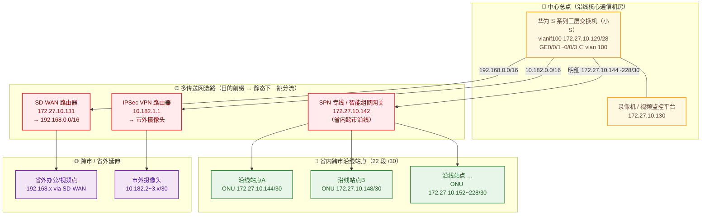

## 项目简介

本项目为某国企（铁路工务通信）牵头的**省内跨市视频监控与办公网络汇聚组网工程**。该客户需要在铁路沿线多个地市散布的站点（沿线通信机房、基站、检修点等）之间打通一张统一的承载网，把各站点既有的摄像头、录像机与办公终端汇聚到中心总点的视频监控平台与录像存储上，实现远程集中巡查与统一管理。

项目最大的工程挑战在于：站点数量多（20 余个）、地理跨度大（省内跨市，并向省外延伸），且不同区段的站点落在不同的运营商传送网上——既有一批通过运营商 **SPN 专线**以 `/30` 点对点链路接入的省内沿线站点，也有需要借助 **SD-WAN / IPSec VPN** 跨市跨省延伸的远端节点。最终方案以**一台华为三层交换机作为中心总点**，在交换机上用一组**目的前缀驱动的静态下一跳分流**，把不同传送网的流量精准导向各自网关，形成一张"单核心、多传送网、统一编址"的星型汇聚网。

## 项目背景与需求

### 业务背景
该国企在铁路沿线维护着大量通信与监控设施，各站点历史已部署摄像头、录像机及少量办公终端，但彼此孤立、无法被中心远程纳管。客户希望在中心总点（沿线核心通信机房）部署统一录像与监控平台，将沿线站点视频资源集中收编，按"地市→站点→设备"的层级编排设备在线状态与视频流。

### 核心需求
1. **大规模沿线站点汇聚**：20 余个跨市沿线站点的摄像头/录像机/终端统一接入中心，单中心纳管数十至上百路视频。
2. **跨网、跨传送网互通**：站点分属不同运营商传送网——省内沿线走 SPN 专线，跨市/省外走 SD-WAN/VPN，中心需在同一台核心交换机上把流量分流到正确的传送网。
3. **地址规整与可定位**：每个站点独占一段 `/30` 点对点地址，互不冲突，故障时可按站点路由快速定位。
4. **中心业务隔离**：录像机、监控平台等关键设备需在中心侧做 VLAN 隔离，避免与上联传送网混在同一广播域。
5. **可批量运维**：站点数量多、ONU 厂商混杂，地址与端口规划需统一规整，便于后续增删与排障。

## 技术栈与设备选型

- **中心总点核心交换机**：华为 S 系列三层交换机（现场称"小 S"），承担中心业务接入、VLAN 隔离与跨传送网静态选路。
- **省内承载网**：运营商 **SPN（Slicing Packet Network，切片分组网）专线**，以 CE/CPE 方式给出 GE 手联口，提供到各沿线站点的 `/30` 点对点私有通道。
- **跨市/省外延伸**：旁挂 **SD-WAN 路由器**（承担 `192.168.0.0/16` 远端办公/视频接入）与 **IPSec VPN 路由器**（承担市外摄像头 `10.182.x/30` 接入）。
- **边缘接入设备**：各沿线站点采用 **ONU** 作为运营商专线落地与业务端口分线设备，现网为多厂商混用（华为 HWTC、中兴 RCOM 等）。
- **中心业务设备**：录像机/NVR、视频监控平台、运维 PC，统一接入核心交换机 `vlan 100`。
- **关键编址与端口**：
  - 中心业务网段 `172.27.10.128/28`（vlanif100 网关 `.129`，录像机 `.130`）；
  - 省内沿线 22 段 `/30`（`172.27.10.144 ~ 172.27.10.228`，每段步长 4）；
  - ONU 业务端口按站点规划 `1 口 / 2 口 / 3 口`，对应不同终端或备用位。

## 整体架构



- **平台侧**：核心交换机作为唯一中心枢纽，下挂录像机/平台（`vlan 100`，网关 `172.27.10.129`）。
- **多传送网上联**：核心交换机通过 `vlan 100` 同一广播域（`172.27.10.128/28`）旁挂/上联三类网关——SPN 专线网关 `.142`、SD-WAN 路由器 `.131`、IPSec VPN 路由器（`10.182.1.x`）。
- **省内沿线**：20 余个站点各占一段 `/30`，经 SPN 专线点对点回到中心，边缘侧由 ONU 完成专线落地与业务端口分线。
- **跨市/省外**：远端办公/视频点经 SD-WAN（`192.168.0.0/16`）回中心；市外摄像头经 IPSec VPN（`10.182.x/30`）回中心。

## 核心设计

本项目最关键的设计，是在**一台三层交换机**上把"多传送网并存、跨网互通、统一编址"三件事收敛为一套**目的前缀驱动的静态选路模型**。

### 1. 多传送网并存的下一跳分流
核心交换机不跑动态路由，而是用一组**明细静态路由**按目的前缀把流量分流到各自传送网网关：

```
# 省内沿线 22 段 /30，统一指向 SPN 专线网关（智能组网）
ip route-static 172.27.10.144 255.255.255.252 172.27.10.142
ip route-static 172.27.10.148 255.255.255.252 172.27.10.142
...（中间省略，步长 4，直至 172.27.10.228）
ip route-static 172.27.10.228 255.255.255.252 172.27.10.142

# 跨市/省外延伸，指向 SD-WAN 路由器
ip route-static 192.168.0.0 255.255.0.0 172.27.10.131
```

- 省内沿线网段（`172.27.10.144~228/30`）→ SPN 专线网关 `172.27.10.142`；
- 跨市/省外网段（`192.168.0.0/16`）→ SD-WAN 路由器 `172.27.10.131`；
- 市外摄像头网段（`10.182.x`）→ IPSec VPN 路由器 `10.182.1.1`。

这种"按目的前缀选下一跳"的方式，本质上是在交换机上做**策略分流**：不同区域的站点自动落到对应的传送网，互不串扰，且哪一段不通一目了然。

### 2. /30 点对点地址规划与明细路由收敛
省内沿线每个站点独占一段 `/30`（可用 2 个主机位，一段给 ONU/设备，一段给互联），从 `172.27.10.144` 起按步长 4 连续编排到 `172.27.10.228`，共 22 段。这种规划的优点：
- **互不冲突、可线性扩展**：新增站点只需续编下一段 `/30`，并在核心交换机上加一条同下一跳的明细路由；
- **故障可按站点定位**：每段路由对应一个站点，`ping`/`tracert` 某段 `/30` 即可判断是哪一站不通，不必整网排查；
- **与 ONU 业务端口对应**：每段 `/30` 落地到站点 ONU 后，按 `1 口/2 口/3 口` 映射到具体终端，端口与地址一一对应。

### 3. 中心业务网段 VLAN 隔离
录像机、监控平台等关键设备统一收编在 `vlan 100`，由 `vlanif100`（`172.27.10.129/28`）做网关；核心交换机下行口（如 `GE0/0/1~0/0/3`）以 `access` 方式加入 `vlan 100`：

```
vlan batch 100
interface Vlanif100
 ip address 172.27.10.129 255.255.255.240
interface GigabitEthernet0/0/1
 port link-type access
 port default vlan 100
```

`/28` 仅容纳中心侧少量关键设备（录像机、平台、运维 PC），既把中心业务与上联传送网在二层隔开，又让网关、录像机、各传送网网关同处一个可控的狭小广播域，便于策略下发与会话管理。

### 4. 边缘 ONU 接入与多厂商混用
沿线站点终端经 ONU 的业务端口（`1 口/2 口/3 口`）接入，现网 ONU 为多厂商混用（华为 HWTC、中兴 RCOM 等）。实施时按统一规约把"站点 → `/30` 网段 → ONU 业务端口 → 终端"四元组固化成表，避免厂商差异带来的错配。

## 实施要点

1. **编址先行，逐站分配 `/30`**：先为每个沿线站点分配唯一的 `/30` 段，再据此生成 ONU 落地配置与核心交换机明细路由表，避免地址撞段。
2. **核心侧静态选路一次性下发**：在核心交换机上把 22 条 `/30` 明细路由（统一下一跳 `.142`）与跨市/省外汇总路由（`.131`、VPN 网关）一次配齐，配合 `vlan 100` 网关，打通"中心↔各传送网↔站点"双向可达。
3. **VLAN 与端口规整**：中心业务统一 `vlan 100`，下行口 access 接入；多传送网网关同段旁挂，便于分流与会话保活。
4. **逐站映射 + 直连自测**：每完成一批 ONU 落地与路由下发，立即在中心侧 `ping` 站点 `/30` 设备地址、并访问设备 Web（`80`）确认可达，网络层无误后再交平台对接。
5. **多厂商 ONU 规约化**：把不同厂商 ONU 的业务端口、落地 VLAN、设备 SN 与站点 `/30` 统一登记，形成可批量维护的台账。

## 运维与排障支撑

本设计在可运维性上有意做了几点强化，便于后续排障：

- **按站点路由快速定位**：22 条 `/30` 明细路由一一对应站点，某站离线时直接 `ping`/`tracert` 该段 `/30` 即可判断是传送网问题还是设备问题，无需整网排查。
- **按区域分流定位传送网**：省内沿线（`.142`）、跨市省外（`.131`）、市外视频（VPN）三条下一跳天然把故障域切成三块，某一片区批量掉线可直接收敛到对应传送网或网关。
- **中心业务隔离防扩散**：`vlan 100` 把录像机/平台与上联隔开，上联侧重放或环路不会直接冲击中心业务二层面。
- **会话路径一致**：中心主动拉流/拉信令时，去包与回包都经同一核心交换机与同一传送网网关，来回路径一致，会话表项可正常建立，避免"通了一半"。

## 项目成果

- 用一台华为三层交换机收敛了 20 余个跨市沿线站点的接入，形成"单核心、多传送网、统一 `/30` 编址"的星型汇聚网；
- 通过目的前缀驱动的静态下一跳分流，让 SPN 专线（省内跨市）、SD-WAN（跨市/省外）、IPSec VPN（市外视频）三类传送网在同一台核心上各司其职、互不串扰；
- 22 段 `/30` 明细路由把故障域细化到单站点，配合 `vlan 100` 中心业务隔离，显著提升整网可运维性与排障效率；
- 沉淀了"编址先行 + 明细路由收敛 + 多厂商 ONU 规约化"的多站点汇聚交付方法，可线性扩展至更多沿线站点。
