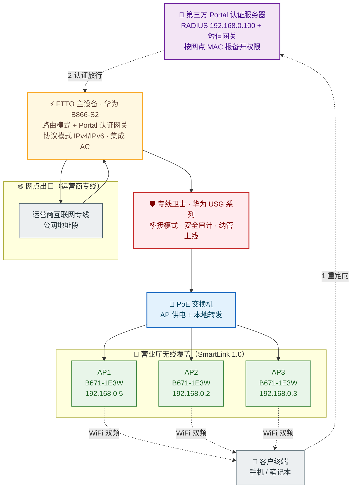

## 项目简介

本项目为某国有大行**营业网点客用 WiFi 覆盖与认证接入整改工程**。该行在全国/区域内拥有大量营业网点，每个网点需向到店客户提供一套统一品牌、可合规审计的公共无线上网服务。方案整体依托**运营商 FTTO（Fiber To The Office，光纤到办公室）专线**作为出口，末端采用**华为 FTTO 主设备（集成 AC + 网关）+ 分布式 AP** 的两级组网，并叠加**第三方 Portal 认证插件**完成实名/短信准入。

项目最大的工程挑战不在"通"，而在"稳得住、认得上线"。在全网铺开过程中，集中爆发了两类典型故障：一是**iOS 及部分终端无法弹出 Portal 认证界面**，二是**个别网点频繁掉线、甚至完全无法上网**。整改团队以抓包与现场日志定位为手段，把问题分别收敛到「第三方认证插件的 IPv6 适配缺陷 + 内存超限」与「双频合一带来的频段漫游震荡」，并联合设备厂商推动**设备硬体替换（B866-S1 → B866-S2）、认证插件版本升级与无线侧参数规范**，最终形成可复制、可批量下发的全网整改方案。

## 项目背景与需求

### 业务背景
国有大行营业网点是高频客流场所，到店客户对公共 WiFi 有强需求；同时，金融行业对**网络准入合规、用户行为可审计**有刚性要求。行方联合运营商制定了统一的网点 WiFi 建设规范：运营商提供出口专线与品牌化 SSID，第三方认证平台提供 Portal/短信准入，工程方负责末端设备落地与长期稳定运行。

### 核心需求
1. **统一品牌与 SSID 规划**：全网 SSID 统一为运营商规范命名（示例形态为 `CMCC-XX` 与 `CMCC-XX-2.4G`），2.4G/5G 频段策略一致，客户到任一网点体验一致。
2. **合规准入**：客户上网前必须经过 Portal 认证（短信验证/实名），认证服务器侧按网点维度开权限、可追溯。
3. **分级清晰、易运维**：网点数量多、分布广，单网点内部需"主设备—安全网关—PoE—AP"四级清晰，故障可快速定位到环节。
4. **高可用、少人工干预**：金融场所对掉线零容忍，要求设备具备定时维护机制，并通过纳管平台集中监控。
5. **与运营商纳管平台打通**：末端安全设备需在运营商纳管平台上线，与认证流程协同，避免"认证一开就纳管不掉"的互斥。

## 技术栈与设备选型

- **FTTO 主设备（兼 AC + 网关）**：华为 **B866-S2**（设备形态 `B866-S2-5E4P5W5`），运行软件版本 `V5R022C00S322`，承担路由转发、Portal 认证网关、AC 三位一体角色。早期点位曾使用 **B866-S1（4E1P3W1）**，因 CPU/内存偏弱、不兼容新认证插件，整改中统一替换为 S2。
- **安全网关（专线卫士）**：华为 **USG 系列**安全设备，部署为**透明桥接模式**，承担安全隔离与运营商纳管探针角色。
- **PoE 接入交换机**：为下挂 AP 提供以太网供电与本地转发，简化点位布线。
- **分布式 AP**：华为 **B671-1E3W**（每个网点 3 台），通过华为 **SmartLink 1.0** 分布式组网协议与 FTTO 主设备组网，提供 2.4G/5G 双频覆盖。
- **认证体系**：第三方 **Portal 认证插件**（西软）+ RADIUS（网点内 `192.168.0.100`）+ 短信网关，完成实名准入与计费/审计上报。
- **承载网络**：运营商互联网专线（公网地址段）+ 网点内 `192.168.0.0/24` 管理地址段。

## 整体架构

- **出口侧**：运营商互联网专线终结于 FTTO 主设备的上联口，公网地址段在主设备上做 NAT 出口。
- **认证网关**：FTTO 主设备（B866-S2）工作在**路由模式**，兼任 Portal 认证网关与 AC，未认证终端的 HTTP/HTTPS 流量被重定向到第三方 Portal 服务器完成短信/实名认证。
- **安全层**：专线卫士（USG）以**桥接模式**串接，对流量做透明安全审计，并在运营商纳管平台上线；其与认证流程的协同是本项目的关键约束之一（详见"核心设计"）。
- **接入层**：PoE 交换机下挂 3 台分布式 AP（B671-1E3W），AP 通过 SmartLink 1.0 自动注册到 FTTO 主设备，管理地址段 `192.168.0.0/24`，业务 SSID 广播为 `CMCC-XX`（5G 优先）与 `CMCC-XX-2.4G`。

## 核心设计：网点 WiFi 整改方案与配置规范

本项目"整改"的核心，是把一波零散的现场故障，收敛为**统一的设备基线、统一的无线条目、统一的认证对接动作**，再批量下发到全部网点。

### 1. 设备硬体基线：B866-S1 → B866-S2
早期点位混用 B866-S1（4E1P3W1）与 B866-S2 两代主设备。S1 内存与 CPU 偏弱，且**不兼容支持 IPv6 的新版认证插件**，在 50 人以上并发时认证插件极易因内存超限卡死。整改明确：

> 全网点 FTTO 主设备统一为 **B866-S2（5E4P5W5）**；存量 S1 设备出入库时必须备注替换原因（"原 S1 不支持 IPv6 及新版认证插件，50 人以上并发西软插件死机，厂家要求更换 S2"），避免翻新回流。

### 2. 协议模式与 IPv6 适配
早期认证插件**不支持 IPv6**，而 iOS 终端会优先走 IPv6 通道，导致 Portal 认证界面根本弹不出来（详见"关键问题排查"）。过渡期的统一配置为：

- FTTO 主设备「协议模式」**选择 IPv4**（关闭 IPv6），保证兼容；
- 待厂商新版插件（已支持 IPv6 + 内存扩容，可承载约 200 并发认证）在生产基地验证通过后，全网 S2 设备**统一升级新版本**，再视情况放开 IPv6。

### 3. SSID 与双频策略规范
- 全网 SSID 统一为 **`CMCC-XX`** 与 **`CMCC-XX-2.4G`**，禁止沿用历史零散命名；
- **明确禁用"双频合一"**（2.4G 与 5G 共用一个 SSID）。双频合一在信号干扰下会让终端在两个频段间频繁切换，反而无法上网。现场二选一：
  - 信号覆盖良好的点位：**关闭 2.4G，仅用 5G**；
  - 需兼顾覆盖的点位：**2.4G 与 5G SSID 分开设置**，由终端自行决策驻留。
- AP 信道按 **2.4G 的 1/6/11、5G 的 40/44/48** 规划，发射功率默认 100%，避免相邻 AP 同频抢占（实测同点位 3 台 AP 的 2.4G 信道应错开，禁止两台以上共用同一信道）。

### 4. Portal 认证对接动作
第三方 Portal 认证（西软插件）的对接有一套严格的开局动作：

1. **报备 MAC 开权限**：FTTO 主设备的 MAC 需提前报送认证平台对接人，由其在认证服务器侧为该网点开放准入权限；未报备的设备即便网络可达也无法完成认证。
2. **插件版本核对**：FTTO 主设备本地选择"第三方插件 = 西软"；若设备内置插件版本缺失或过旧，需联系厂商升级到兼容版本（否则 IPv6/高并发场景必出问题）。
3. **认证与纳管的顺序约束**：专线卫士当前**无法通过 MAC 白名单绕过 FTTO 认证直接纳管**。因此开局必须先**关闭西软认证**，让专线卫士在纳管平台正常上线，而后再**开启 FTTO 侧认证**。待厂商新版本发布、S2 升级后，专线卫士即可通过西软白名单直接纳管，此顺序约束随之解除。

### 5. 无线用户二层隔离
在 FTTO 主设备的「无线高级配置」中，对每个已开启的 SSID 勾选 **SSID 互访隔离**（S1/S2 操作一致），确保不同客户终端之间无法在二层直接互访，满足金融场所的最小互通原则。

## 实施要点

1. **MAC 报备先行**：每个网点开局前，先把 FTTO 主设备 MAC 报送给认证平台对接人开权限，避免"网络通了但认证开不了"的反复。
2. **出入库备注规范化**：替换下来的 S1 设备必须在出入库系统备注真实原因，防止翻新机二次流入新点位，造成同型号故障重演。
3. **专线卫士桥接由专人配置**：桥接模式涉及运营商侧参数，由纳管平台侧专人统一下发，不要在现场单点改。
4. **认证/纳管顺序不能颠倒**：先关认证→纳管上线→再开认证；新版本上线后切换为白名单直纳。
5. **版本升级 + 现场验证闭环**：全网 S2 升级新版本后，每个点位必须现场验证「认证弹出 → 短信下发 → 放行上网 → 多终端并发」全流程完整性，不能只看单机在线。
6. **定期重启写入基线**：即便新版本已扩内存，仍把**每两周一次计划性重启**写入运维基线，让设备长期处于性能峰值，规避长周期下的内存泄漏与插件老化。

## 关键问题排查：认证界面无法弹出 / 无法上网

全网铺设阶段集中爆发的两类故障，是本项目最有沉淀价值的部分。

### 故障一：Portal 认证界面无法弹出

#### 现象
- **现象 A（10 月 16 日，某行营业部）**：iOS 终端连上 WiFi 后**不弹出认证界面**，安卓/PC 多数正常。
- **现象 B（11 月 4 日、7 日、11 月 10 日、11 月 25 日，多个支行）**：全平台终端均无法弹出认证界面，影响面呈多点散发、反复发作。

#### 排查与根因
- **现象 A 根因——IPv6 优先路径**：第三方认证插件**不支持 IPv6**，而 iOS 终端默认优先使用 IPv6 通道发起请求，请求绕过了仅工作在 IPv4 的认证插件，导致 Portal 始终弹不出来。
- **现象 B 根因——认证插件内存超限**：从现场设备日志与内存监控看，第三方认证插件的内存占用随在线用户数累积，**超出插件内存上限后工作异常**，表现为认证界面整体弹不出。多点散发、复位后即好，正是"内存涨满→重启复位→再涨满"的典型曲线。

#### 处置与整改
- **临时处置**：
  - 现象 A——关闭设备 IPv6（协议模式改为 IPv4），并作为后续新点位的默认配置。
  - 现象 B——现场重启设备重置内存；根据故障频率，先把重启周期定为**每两个工作日一次**，11 月 25 日复发后收紧为**每个工作日重启 + 每日监控内存**。
- **彻底整改**（厂商新版本，已于 11 月底在生产基地验证通过）：
  - 新版认证插件**支持 IPv6**；
  - 插件**内存扩容**，保证约 **200 并发认证**不超限；
  - 新版本**仅适配 B866-S2**（S1 需先替换再升级）；
  - 全网点统一升级新版本 + 现场功能验证，并保留**每两周定期重启**的长效策略。

### 故障二：个别网点完全无法上网

#### 现象
11 月 11 日，某支行客户连上 WiFi 后**完全无法上网**，信号强度正常、设备在线。

#### 排查与根因
现场排查确认该点位误配了**双频合一**（2.4G 与 5G 共用一个 SSID）。双频合一虽号称"智能选择频段"，但在营业厅这种多 AP、多邻居干扰的环境下，终端会在两个频段间**频繁切换**，切换瞬间业务中断累积，最终体现为"连得上、用不了"。

#### 整改方案
明确**全网不再使用双频合一**，装维现场若遇网点负责人主动要求开启双频合一须进行劝阻，并按现场条件二选一：
- 信号覆盖良好的区域：**关闭 2.4G，仅保留 5G**；
- 需兼顾老旧终端的区域：**2.4G 与 5G SSID 分开设置**，互不干扰。

### 技术价值
这两例故障的共性在于——**"无线连得上"和"业务跑得通"是两件事**。第一例把问题从"无线问题"精确收敛到"认证插件的协议适配与内存容量"；第二例把"上不了网"从"信号问题"收敛到"双频策略"。两者的整改都不是在单点打补丁，而是**回溯到设备基线、版本基线、无线条目基线**，用全网统一的配置规范一次性消除同类风险。

## 项目成果

- 以**华为 B866-S2 FTTO 主设备 + 专线卫士桥接 + 分布式 AP（B671-1E3W）** 收敛出统一的网点 WiFi 设备基线，全网 SSID、双频策略、管理地址段规整一致。
- 通过**报备 MAC 开权限 + 认证/纳管顺序约束 + 二层用户隔离**，打通了第三方 Portal 认证与运营商纳管平台的协同，满足金融场所合规与审计要求。
- 针对"认证界面无法弹出"，从 IPv6 适配与认证插件内存两条线定位根因，推动厂商交付支持 IPv6、可承载约 200 并发的新版插件，并以 S1→S2 替换 + 全网升级 + 定期重启彻底闭环。
- 针对"双频合一导致无法上网"，沉淀出全网禁用双频合一、按现场二选一的双频配置规范。
- 形成一套可复制的网点 WiFi 整改方法论：**设备基线统一 → 版本基线统一 → 无线条目统一 → 现场验证闭环 → 定期维护写入基线**，显著降低同类故障在新老网点的复发率。
