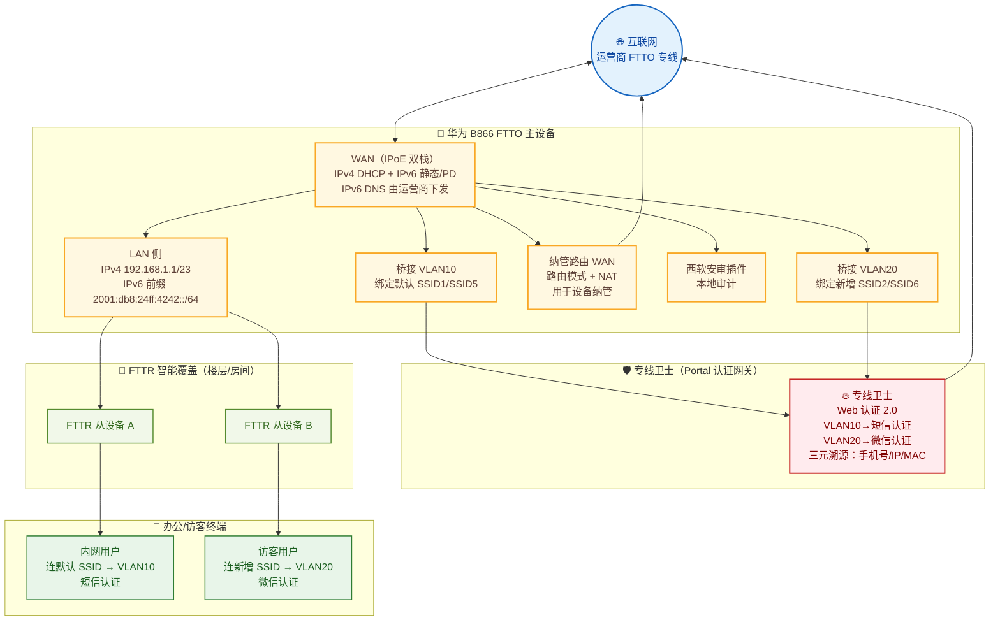

## 项目简介

本项目为**某城商行**下辖总行办公大楼与多个分支网点的**营业/办公上网网络改造工程**。该行原有网点上网方式零散、缺乏统一认证与流量审计，无法满足金融行业"上网可溯源、行为可审计、地址可规划"的合规要求，同时面临 IPv4 地址枯竭、需向 IPv6 演进的压力。

最终方案以**运营商 FTTO（Fiber To The Office，光纤到办公室）专线**为承载底座，采用**华为 B866 系列企业网关作为 FTTO 主设备**、**FTTR 从设备**做楼层与房间级的无线覆盖，构建一张 **IPv4/IPv6 双栈**的办公接入网；在主设备上通过 **VLAN 10 / VLAN 20 桥接透传**将"内网/外网"两类用户流量分别送到上游**"专线卫士"认证网关**，由其按 VLAN/地址段执行 **Portal 短信认证**与**微信认证**，实现"手机号 ↔ IP ↔ MAC"的三元可溯源审计。配套落地了**全局限速 2M**、**认证插件故障升级**、以及一套**取消 VLAN 划分的路由回退上网方案**，保障业务连续性。

项目最大的工程价值在于：把"FTTO 组网 + IPv6 双栈 + 内外网 VLAN 划分 + 多种 Portal 认证 + 限速审计"这一组金融网点典型诉求，收敛为**一套标准化、可批量复制到每个网点**的配置模型，并在方案阶段用三套组网方案的优劣对比，把"分布式互联网出口 vs 汇聚互联网出口"的取舍讲清楚。

## 项目背景与需求

### 业务背景
该城商行下辖总行大楼（多个楼层办公区）与十余个分支网点，既有上网网络存在三类痛点：

1. **上网不可溯源**：原网络直通互联网，无法把上网行为对应到具体手机号/人，不满足金融监管对上网行为审计的要求。
2. **IPv4 地址紧张**：运营商分配的 IPv4 地址有限，难以支撑网点持续扩张，亟需引入 IPv6 分流。
3. **缺乏统一管控**：各网点设备型号不一、配置零散，无线覆盖差、限速缺失，单网点大流量会挤占整楼共享上行带宽。

### 核心需求
1. **统一认证与审计**：所有用户上网前必须经过认证，并在本地形成"手机号 / 微信身份 ↔ IP ↔ MAC"的对应关系，满足合规溯源。
2. **IPv4/IPv6 双栈**：承载网同时支持 IPv4 与 IPv6，终端可获取 IPv6 地址，缓解 IPv4 地址压力。
3. **内外网隔离与差异化认证**：内网用户（如办公/营业）走短信认证，外访/访客用户走微信认证，两套流量逻辑隔离。
4. **带宽公平**：对单用户做限速，避免个别终端抢占整楼上行带宽。
5. **可批量复制**：方案要能标准化下发到十几个网点，配置步骤收敛、可回退、可快速恢复。

## 技术栈与设备选型

- **FTTO 主设备**：华为 B866 系列企业网关（如 `B866-S2-5E4P5W1`、`B866-S1-4E1P3W1` 等），集成路由、AC（无线控制器）、PoE 与 AP，作为各网点/楼层的 FTTO 主网关。
- **FTTR 从设备**：FTTR 光纤到房间子路由，通过"智能覆盖网络"与主设备组网，承担楼层/房间级无线扩展，单从 FTTR 可接入 64 个无线用户。
- **认证网关（"专线卫士"）**：上游 Portal 认证与安全网关，运行 Web 认证 2.0，按 VLAN/地址段下发不同认证策略，并完成 NAT 出网。
- **承载网络**：某运营商 FTTO 专线（PON 上行），分配 IPv4 公网地址与 IPv6 前缀。
- **本地审计**：FTTO 主设备上加载**西软第三方安审插件**，配合专线卫士完成本地审计与溯源。
- **关键协议与特性**：
  - `IPv4 & IPv6` 双栈、`IPoE` 接入；
  - VLAN 桥接（`VLAN 10` / `VLAN 20`）+ Trunk 透传；
  - IPv6 前缀代理（PD）、SLAAC（无状态）+ DHCPv6（有状态其它信息）；
  - Portal 短信认证 / 微信认证；
  - 全局限速（QoS，2M）。

## 整体架构

- **承载层**：运营商 FTTO 专线经 PON 光猫接入 FTTO 主设备 WAN 口，同时分配 IPv4 与 IPv6 公网前缀。
- **FTTO 主设备**：华为 B866 企业网关是网点/楼层的核心，横跨"运营商专线侧"与"用户侧"。对上做双栈 WAN，对下既做桥接（透传用户 VLAN 给专线卫士），也做路由（纳管、本地 LAN 分配）。
- **FTTR 从设备**：通过光电复合缆/网线下挂，与主设备组成"智能覆盖网络"，把无线信号延伸到每个房间。
- **认证层**：用户流量经主设备 Trunk 透传到专线卫士，由专线卫士按 VLAN 完成差异化 Portal 认证后再 NAT 出网。
- **审计层**：FTTO 主设备本地加载西软安审插件，与专线卫士共同落地三元（手机号/IP/MAC）溯源。

## 核心设计

### 一、FTTO 主从组网与智能覆盖

每个网点/楼层以一台华为 B866 企业网关作为 **FTTO 主设备**，下挂若干 **FTTR 从设备**做房间级覆盖。

- **主设备职责**：WAN 侧双栈上行、VLAN 桥接/路由、无线 AC 管理、本地审计插件。
- **从设备组网**：在主设备上启用"Wi-Fi 覆盖业务"，把扫描到的外置 FTTR 加入**智能覆盖网络**，主从之间构成一张统一的无感漫游无线网；每个从 FTTR 默认可接入 64 个无线终端。
- **SSID 规划**：主设备开启两个 SSID——**SSID1（2.4G）/ SSID5（5G）为默认 WiFi**，**SSID2 / SSID6 为新增 WiFi**，分别对应两套业务/认证域。

实施时遵循"先预配置主设备并开通安审，再逐台把从设备连入智能覆盖；测通后若有问题可整网回滚到旧设备，单次割接总时长约 20 分钟"的灰度节奏。

### 二、内外网划分：VLAN 10 / VLAN 20 桥接透传

本项目把"内网/外网（访客）"的隔离，收敛为**两条桥接 VLAN**：

| 业务域 | VLAN | 绑定 SSID | 认证方式 |
| --- | --- | --- | --- |
| 内网/办公 | VLAN 10 | 默认 SSID1 / SSID5 | 短信认证 |
| 外网/访客 | VLAN 20 | 新增 SSID2 / SSID6 | 微信认证 |

具体在 FTTO 主设备上：

1. **新建两条桥接 VLAN**（`WAN-vlan10`、`WAN-vlan20`），模式为 **桥接（Bridge）**、IPoE、协议 `IPv4&IPv6`、`Vlan ID = 10 / 20`，并把对应 SSID 绑定到各自 VLAN。
2. **从 FTTR 侧**做 VLAN 绑定与端口绑定，把 VLAN 10/20 标签一路透传到边缘。
3. **上行以 Trunk 口**把 VLAN 10/20 透传给**专线卫士**；专线卫士以 Trunk 接收标签后，**根据 VLAN/地址段配置不同认证方式**——VLAN 10 的地址段走短信认证，VLAN 20 的地址段走微信认证。
4. 另建一条**纳管路由 WAN**（路由模式、使能 NAT、DHCP 取地址），用于主设备自身的远程纳管，要求"该 VLAN 获取的 IP 可上外网"。

> 设计要点：用户数据面走 **L2 桥接透传**（认证由专线卫士统一做），管理面走 **L3 路由**——两平面解耦，既保证认证策略集中可控，又让设备本身可被远程运维。

### 三、IPv6 双栈：WAN 静态前缀 + LAN 前缀代理下发

承载网为 IPv4/IPv6 双栈。IPv6 是本项目的技术重点，配置分 WAN 侧与 LAN 侧两层。

**WAN 侧（IPv4 & IPv6）**：
- 连接模式 `IPoE`、协议模式 `IPv4&IPv6`、MTU `1500`。
- IPv4：地址由运营商分配（DHCP/静态），并下发运营商 DNS。
- IPv6（静态，地址为示意值）：
  - 获取地址方式 / 获取前缀方式：`Static`；
  - IPv6 地址前缀：`2001:db8:24ff:4242::/64`，本机地址如 `2001:db8:24ff::364`；
  - 默认 IPv6 网关：`2001:db8:24ff::1`；
  - IPv6 DNS：由运营商下发（如 `2001:db8:2000::1111` / `::2222`）。

**LAN 侧（IPv6 前缀代理下发）**：
- IPv6 LAN 地址：`2001:db8:24ff:4242::1`，**获取前缀方式选 `WAN(代理)`**，父前缀来源选对应 WAN 连接（如 `2_INTERNET_R_VID`），子前缀掩码 `2001:db8:24ff:4242::/64`，MTU `1500`。
- **资源分配**（关键）：
  - 使能路由通告（RADVD）；
  - 使能 DHCPv6 Server；
  - 地址/前缀分配方式（M 位）：**无状态（SLAAC）**；
  - 其它信息分配方式（O 位）：**有状态（DHCPv6）**——即用 SLAAC 下发地址、用 DHCPv6 下发 DNS 等其它信息；
  - DHCPv6 地址池：`2001:db8:24ff:4242::` ~ `2001:db8:24ff:4242::01`；
  - RA 报文最大/最小自动发送时间：`600s` / `200s`；
  - LAN 侧 DNS 来源：`HGWProxy`。

> 设计要点：通过 **WAN(代理) + PD 前缀代理**，主设备把从运营商拿到的一级前缀切成 `/64` 子网下发给 LAN，网点内终端即可"自动获得可溯源的 IPv6 地址"，无需人工逐台配置；M=0/O=1 的组合兼顾了 SLAAC 的简洁与 DHCPv6 对 DNS 的统一管控。

配套的 IPv4 LAN 侧：网关 `192.168.1.1/23`（掩码 `255.255.254.0`），DHCP 池 `192.168.0.1 ~ 192.168.1.254`，租期 3 天。

地址规划层面，运营商为每个网点/计费号分别分配了 IPv4、IPv6 互联地址（`/128`）与 IPv6 终端网段（`/64`），十余个网点各自独立编址，便于按网点溯源与流量统计。

### 四、认证设计：专线卫士 Portal + 西软安审

认证是金融网点上网的"合规命门"。本项目采用**集中式 Portal 认证 + 本地安审**双管齐下：

- **FTTO 主设备**开启**第三方安审插件（西软）**，选定对应地市，使能安审，承担本地审计。
- **专线卫士**运行 **Web 认证 2.0**，在"认证策略"里**按地址段区分**：VLAN 10 地址段 → 短信认证，VLAN 20 地址段 → 微信认证。
- 认证通过后，**本地可同时溯源手机号、IP、MAC 三元信息**，满足金融行业"上网行为可对应到人"的要求。

### 五、组网方案选型：分布式出口 vs 汇聚出口

方案阶段对三种组网做了系统优劣对比，最终据此定稿：

| 维度 | 分布式出口·组网一 | 分布式出口·组网二 | 汇聚出口 |
| --- | --- | --- | --- |
| 短信认证位置 | AC 上（免费） | 专线卫士上（收费） | 专线卫士上（收费） |
| 布线改造 | 中间光电复合缆需重新改网线 | **无需布线改造** | 每层楼新增跨楼层网线 |
| 新增设备 | 每层加专线卫士，共 4 台 300M | 每层加专线卫士，共 4 台 300M | 新增 1 台 500M 专线卫士 |
| 互联网出口 | 分布式（每层各自） | 分布式（每层各自） | **统一一个出口** |
| 本地溯源 | 仅 IP/MAC，无法对应手机号 | 可溯源手机号 | 可溯源手机号/IP/MAC |

取舍逻辑：组网一虽省短信费用，但要把光电复合缆全部改网线、且认证在 AC 上无法对应手机号，合规性不达标；组网二无需改布线、可溯源手机号，是**改造成本与合规性的最佳平衡**；汇聚出口则适合需要统一出口与集中审计的场景。最终网点落地以"组网二"为主。

### 六、全局限速 2M

针对"单终端大流量挤占整楼共享上行"的问题（后台流量监测显示，单楼峰值下行曾达 70~118 Mbit/s，个别终端单机就占到 28~49 Mbit/s），在 **FTTO 中做全局限速到 2M**。割接后验证三项业务表现：

- 认证**前**无法上网；
- 认证**后**可以上网；
- 单终端网速稳定在 **2M 左右**，不再出现个别用户抢占带宽。

### 七、回退上网方案（业务兜底）

为应对认证/桥接链路异常，预设了一套**路由回退上网方案**，确保网点不掉线：

1. 删除除 SSID1、SSID5 外的所有 SSID，并把 SSID1/SSID5 改为客户要求的名称；
2. 删除主设备上两条桥接 VLAN（VLAN10、VLAN20）及从 FTTR 的 VLAN/端口绑定；
3. 改为**路由网络配置**——主设备以路由模式直接对接上网，对下做 DHCP 下发；
4. 打开西软插件开关、使能短信认证功能；
5. 将上行口网线插入光猫，验证"认证前不能上、认证后能上、网速正常"。

该方案把"复杂的 VLAN 桥接认证"临时退化为"简单的路由 + 本地认证"，是排障与应急时的有效兜底。

## 实施要点

1. **灰度割接**：每网点按"主设备预配置 + 安审开通 → 从设备逐台入网 → 业务验证 → 必要时回滚"的四步走，单网点中断控制在 20 分钟内。
2. **VLAN 与 SSID 严格对应**：VLAN10/20 必须与默认/新增 SSID、端口绑定一一对应，错配会导致认证策略串域（如访客走了短信认证）。
3. **IPv6 前缀代理验证**：LAN 侧务必选"WAN(代理)"并指定正确父前缀，否则终端拿不到 `/64` 子网；同时核对 M/O 位与 RA 发送间隔。
4. **纳管路由独立**：纳管路由 WAN 单独使能 NAT，确保设备远程可达，且不与用户桥接 VLAN 串扰。
5. **限速与认证联调**：限速在 FTTO 全局生效，验证时重点确认"认证前后上网状态切换"与"2M 上限"两项。
6. **数据驱动的容量评估**：割接前先用楼内流量监测（按日/按时段、按用户 MAC 列出峰值速率）评估上行压力，据此设定限速阈值。

## 关键问题排查：认证插件内存溢出导致接入被拒

本项目上线初期出现了一个典型的"认证侧"故障，值得单独记录。

### 故障现象
网点用户连接 WiFi 后，Portal 认证流程异常、**大量后续接入请求被直接丢弃**，新终端无法完成认证上网，但已在线用户短期未受影响。

### 根因
经定位，**FTTO 主设备上的西软认证插件内存达到了设备分配的上限**，插件无法再处理新的接入请求，导致后续认证报文被丢弃——表现为"接入被拒/认证无响应"。

### 解决方案与回滚
- **解决**：通过远程管理平台**下发正式版本**的认证插件，修复内存占用问题，下发后新终端认证恢复正常。
- **回滚**：若正式版本异常，远程平台**直接下发老版本**，由现场同事保障；若老版本也无法远程下发，则**手动本地灌入版本**兜底。
- **预防**：将"插件版本与内存占用"纳入网点例行巡检，避免再次涨满。

> 这例故障的价值在于排障方向：面对"认证失败"，在网络与认证策略均无误时，应果断把怀疑点收敛到**认证插件自身的资源占用与版本**，而不是在 VLAN/NAT 上反复折腾。

## 项目成果

- 用"华为 B866 FTTO 主设备 + FTTR 从设备"的标准化组合，为该行多个网点构建了一张 **IPv4/IPv6 双栈、无线全覆盖**的办公接入网，配置模型可批量复制。
- 通过 **VLAN 10/20 桥接透传 + 专线卫士差异化 Portal 认证**，实现了"内网短信认证、访客微信认证"的内外网隔离与**手机号/IP/MAC 三元可溯源**，满足金融合规。
- 基于 **WAN 前缀代理（PD）+ SLAAC/DHCPv6** 让网点终端自动获取可溯源 IPv6 地址，缓解了 IPv4 地址压力。
- 落地**全局限速 2M**，消除单用户抢占整楼带宽的隐患；并交付了一套可快速切换的**路由回退上网方案**作为业务兜底。
- 沉淀了"组网方案优劣对比（分布式 vs 汇聚出口）+ 认证插件资源排障"的方法论，为后续网点批量改造提供了可直接复用的范本。
