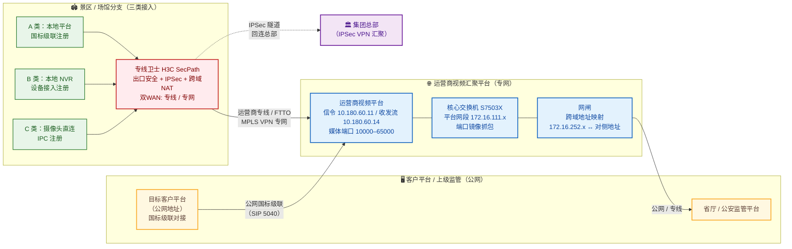

## 项目简介

本项目为某文旅/会展集团牵头的大型**景区视频监控汇聚平台级联工程**。集团下属约千个景区、场馆与分支机构（含剧院、展馆、商业体、演艺团体等），需要把各点位已建与新建的视频监控统一汇聚到一套目标客户平台（上级监管/主管部门平台），实现远程集中巡查、跨域调阅与告警联动。

工程的复杂性集中在三点：一是**接入形态极度碎片化**——约 10 个点位本地已有视频平台需要做平台间级联，约 300 个点位本地仅有 NVR 需要接入平台，其余大量点位是裸摄像头直连；二是**网络隔离刚性约束**——5A 级景区按规定不得直接接入互联网，但目标客户平台恰恰部署在公网上、且没有面向私网的出口；三是**规模与安全的双重压力**——数百近千个分支出口需要统一的安全防护与统一运维。

最终方案以**两段式级联**破局：各景区先经运营商专线/专网汇入运营商的视频汇聚平台，再由该运营商平台经公网以国标级联对接到客户平台；分支侧统一部署**专线卫士（H3C SecPath 安全网关，由运营商集成提供）**，一台设备同时承担出口安全防护、IPSec 回连集团总部、跨域 NAT 级联网关三重职责。项目还定位解决了一例非常典型的"信令注册正常、但平台取流缓慢"的网闸跨域媒体链路故障。

## 项目背景与需求

### 业务背景

集团旗下景区、场馆众多且分散，各点位早已分别建设了安防监控，但彼此孤立、品牌不一、版本各异，主管部门无法远程巡查和统一调阅。为此，集团推动建设一套**统一的视频汇聚与级联体系**，要求把所有点位的视频资源按"集团 → 片区 → 点位 → 设备"的层级纳管，并向上对接主管部门的监管平台。

### 核心需求

1. **异构接入归一化**：约千个点位按三种既有形态接入——
   - 本地已有视频平台（约 10 个）：做平台到平台的**级联**（GB/T 28181 国标级联）；
   - 本地仅有 NVR（约 300 个）：NVR 作为设备**注册接入**上级平台；
   - 仅裸摄像头（其余）：摄像头**直连**注册接入。
   三种形态要收敛到一套统一的接入与编址模型里。
2. **互联网隔离下的跨域可达**：5A 景区禁止直连互联网，但目标客户平台运行在公网、无私网出口，必须找到一条"不违反景区隔离要求、又能触达公网平台"的路径。
3. **统一出口安全防护**：数百个分支出口都要具备基础安全防护（入侵防御、URL 过滤、反病毒、高危端口封堵），且可被集中云管、统一策略下发。
4. **回总部互联**：各分支需经加密隧道回连集团总部，访问文件系统、财务系统等内部业务（IPSec VPN）。
5. **可规模化运维**：点位多、地域分散，必须有标准化的装维手册、SN 台账与分级培训，保证"可批量上站、可批量开通、可批量排障"。

## 技术栈与设备选型

- **分支接入与安全网关**：**专线卫士**——运营商集成的 H3C SecPath 系列安全网关（Comware V7 平台），承担出口 NAT、安全策略、IPSec VPN 与跨域级联 NAT 网关，并纳管到专线卫士云管平台做集中策略与日志审计。
- **承载网络**：运营商**专线 / 专网（FTTO 接入 + MPLS VPN）**，提供景区到运营商视频平台的私有通道；运营商平台到客户平台之间走公网级联。
- **视频平台体系**（自下而上）：
  - 分支侧：各点位既有的本地视频平台、NVR 或 IPC；
  - 汇聚侧：运营商**视频汇聚平台**（信令服务器与收/发流服务器分离部署）；
  - 客户侧：目标客户平台（位于公网）、以及更上级的省厅/公安监管平台。
- **跨安全域隔离**：**网闸**——在文旅专网与公安/监管专网之间做跨域地址映射与数据摆渡。
- **核心交换**：H3C S7503X 数据中心核心交换机（带端口镜像与 QoS 计量能力，用于排障抓包）。
- **关键协议与端口**（GB/T 28181 国标体系）：
  - `5040/tcp、udp` —— 国标平台级联信令端口；
  - `5060、5061/tcp、udp` —— SIP 信令（注册、INVITE、级联握手）；
  - `10000–65000/udp` —— RTP 媒体流端口范围（收流/发流分段）。

## 整体架构



- **分支侧**：每个景区/场馆部署一台专线卫士，下联本地平台、NVR 或摄像头；三类设备统一经专线卫士上联运营商专线。
- **运营商侧**：各分支经专线/FTTO 接入运营商 MPLS VPN，汇入运营商视频汇聚平台（信令与媒体服务器分离）；核心交换机 S7503X 串接在平台网段，提供端口镜像与 QoS 计量；网闸负责运营商平台与上级监管平台之间的跨安全域映射。
- **客户平台侧**：目标客户平台位于公网，通过公网国标级联（SIP/GB28181）从运营商平台拉取视频；上级省厅/公安监管平台再经网闸按需取流。
- **回总部**：分支专线卫士与集团总部建立 IPSec VPN，访问文件系统、财务系统等内部业务。

## 核心设计

### 一、三类接入的归一化模型

约千个点位的既有形态被收敛为统一的**国标注册/级联模型**，避免为每类形态各搞一套网络：

- **A 类（本地有平台，约 10 个）**：本地平台作为下级，经专线卫士上联，以 GB/T 28181 国标级联向上级运营商平台注册，平台编码逐级向上对接；
- **B 类（本地仅 NVR，约 300 个）**：NVR 作为单个设备直接注册到运营商平台；
- **C 类（裸摄像头，其余）**：IPC 直连注册到运营商平台。

三种形态在分支侧共用同一条专线卫士出口与同一条运营商专线，差别只在"注册到平台的层级"不同，极大简化了承载网络的复杂度。

### 二、两段式级联：破解"景区禁网 + 平台在公网"的死结

这是本项目最关键的设计决策。5A 景区禁止直连互联网，但目标客户平台偏偏在公网、且没有面向私网的出口——直接拉专线到客户平台既不经济也不合规。解法是**把"接入"和"级联"拆成两段**：

1. **第一段（私网接入）**：景区经运营商专线/专网，汇入运营商的视频汇聚平台。这段全程走运营商私有网络，不触达公网，满足景区的互联网隔离要求。
2. **第二段（公网级联）**：运营商平台作为"中转汇聚点"，经公网以国标级联把视频对接到客户平台。

这样做的好处是：景区侧永远不暴露在公网，合规风险归零；客户平台只需面对运营商平台一个对端，对接关系从"千对一"收敛为"一对一"；运营商平台天然具备公网出口与带宽，省去了客户平台另开私网出口的改造。

### 三、专线卫士"一机三职"：跨域级联的 NAT 网关

专线卫士在本项目中远不止是一个安全盒子。以集团某栋建筑（总部某栋）的对接为典型——该点位内部并存两套下级平台，需要同时与公网上的客户平台完成级联：

- **出口安全防护**：默认阻断高危端口（20-23、69、135、137-139、445、3389 等），开启 IPS / 反病毒 / URL 过滤（云查询），并通过对象组 `HYSP` 把所有平台网段（信令、媒体、管理地址）之间的互通统一放行；
- **IPSec 回总部**：分支与集团总部建立 IPSec 隧道（预共享密钥认证、目的网段指向总部 `10.109.68.0/24`），承载文件系统、财务系统等内部业务的加密回访；对拨号上网的分支则本端地址留空、待加密数据源填 `any`，兼容动态地址场景；
- **跨域级联 NAT 网关**：专线卫士横跨两条上行链路，用 **NAT server（easy-ip PAT）** 把内网下级平台的信令端口映射到上行口公私网地址上，供上级客户平台回连：

```
# 双 WAN：专线口与专网口各承担一条上行
interface GE1/0/3   # 专线侧 10.19.5.242
  nat server protocol tcp global 10.19.5.242 5040 inside <下级平台A> 5040
  nat server protocol udp global 10.19.5.242 5040 inside <下级平台A> 5040

interface GE1/0/5   # 专网侧 28.3.2.42
  nat server protocol tcp global 28.3.2.42 5061 inside <下级平台B> 5061
  nat server protocol udp global 28.3.2.42 5061 inside <下级平台B> 5061
```

其中 `5040` 是国标级联信令端口、`5061` 是 SIP 信令端口。借助 NAT server，上级平台只需感知映射后的地址即可完成 SIP/GB28181 握手，**内网多套异构下级平台被专线卫士"合并"成统一的对外信令出口**。

### 四、网闸跨域映射

在运营商平台与上级监管平台之间，用**网闸**做跨安全域隔离：把一侧的内网地址（如 `172.16.252.x`）映射为对侧可识别的地址（如 `10.55.205.x`），视频信令与媒体流经映射后单向/可控摆渡。这使得文旅专网与公安监管专网在不直通的前提下仍能完成级联取流。

## 实施要点

1. **SN 台账先行**：所有专线卫士设备序列号统一登记（总部总点一台高带宽设备汇聚，各分支按批次登记 SN 与带宽），形成"公司 → 地址 → 联系人 → SN → 进度"的可筛选台账，便于分批开通与售后定位。
2. **双 WAN 与端口规划**：分支普遍配置双上行链路（专线 + 专网），国标信令端口 `5040`、SIP 端口 `5060/5061` 与 RTP 媒体端口段 `10000–65000` 在 NAT 规则中预先规划，避免端口冲突。
3. **安全策略标准化**：全局策略统一为"高危端口阻断 + 平台对象组互通放行 + 其余流量经 IPS/AV/URL 检测后放行"，并通过专线卫士云管平台集中下发，保证数百台设备策略一致。
4. **端口镜像预留排障位**：核心交换机（S7503X）预先在平台网段端口配置本地镜像组（监控口接分析终端），并用 ACL 精确匹配视频平台地址（如 `172.16.111.205`）做镜像，出现取流问题时可一键抓包。
5. **装维手册与分级培训**：售中阶段记录精细化操作、生成针对该业务的装维手册；分售前/售中/售后三阶段对网络部与装维师傅培训，确保一线具备初步判断与问题升级到技术专家的能力。

## 关键问题排查：信令可达，但取流缓慢

平台级联接入阶段，出现了一例非常典型、也最容易被误判为"网络慢"的故障，值得单独记录。

### 故障现象

经运营商平台推送到客户平台的部分景区视频，**取流时间过长**：某街区类景区平均取流 15–30 秒，某片区景区取流普遍在 30 秒以上、个别镜头接近 1 分钟；而走老平台的同路视频取流明显更快。此外上级省厅平台反馈，部分推送上来的视频需要本地先播放一次，地方侧才能预览；现场还偶发"串流"（看到的不是所请求的画面）。

### 排查过程

**第一步：在核心交换机做端口镜像，定位"慢"发生在哪一段。**

在运营商平台核心交换机（S7503X）上，用 ACL 精确匹配涉事视频平台地址并镜像到分析端口：

```
acl advanced 3001
 rule 0 permit ip source 172.16.111.205 0
 rule 5 permit ip destination 172.16.111.205 0
# 镜像到分析口 G3/0/19 / G3/0/20
```

同时在网闸两侧分别抓包（网闸内 / 网闸外各一份），逐段对比信令与媒体流的建立过程。

**第二步：发现"信令通了、媒体流没起来或起得慢"。**

抓包显示：SIP/GB28181 信令（`5040`/`5061`）的注册与 INVITE 能正常完成，但随后 **RTP 媒体流（`10000–65000` 端口段）迟迟建立不起来**，表现为信令已 200 OK、媒体端口却长时间收不到包，或收到的包严重抖动——这正是"取流要等十几秒甚至一分钟"的直接原因。

对应的 60 分钟出口流量趋势也印证了这一点：峰值仅约 6 Mbps 上下、且波动剧烈，对于多路视频而言明显偏低，说明媒体流并没有稳定建立，而不是带宽被吃满。

**第三步：锁定根因——网闸跨域 + 平台侧串流配置。**

综合网闸内外两侧的抓包对比，根因定位到两处：

- **网闸对媒体会话的处理瓶颈**：网闸在跨域摆渡时，需要对范围极大的 RTP 动态端口（数万个端口）逐一建立映射与会话表项；在并发取流较多时，表项建立与刷新跟不上，导致媒体端口"信令邀请已到、数据通道滞后打通"，取流表现为长时间等待。
- **平台侧串流/级联配置问题**：上级平台反馈的"本地播放一次才能预览"、偶发串流，本质是平台间级联的媒体流目的地址/端口协商不一致，需要平台侧核对级联编码与收发流参数（收流 `10000–50000`、发流 `50001–65000`）。

### 解决方案与结论

- 该故障**不属于"网络带宽不足"**，承载网带宽与连通性均正常，信令链路完全可达；
- 推动网闸侧重审大端口段媒体会话的转发策略，并对高频取流场景做表项优化；
- 推动平台侧核对并修正级联的媒体流收发参数与串流配置，使 RTP 媒体通道随信令及时建立；
- 修正后取流时间由"数十秒到分钟级"回落到与老平台相当的正常水平，串流与"需先本地播放"的现象消除。

### 技术价值

这例故障最大的价值在于排障方法论：面对"取流慢"，先用**端口镜像 + 网闸内外双段抓包**把"慢"精确到"信令阶段还是媒体阶段"——在本例中是"信令秒通、媒体滞后"，从而果断把问题收敛到"网闸对 RTP 大端口段的处理"与"平台级联媒体协商"两层，避免盲目去扩带宽或改路由。这也是视频级联项目里最常被误判的一类问题——**"信令通了"和"画面出来了"是两件事**。

## 项目成果

- 用"运营商专网汇聚 + 公网国标级联"的两段式架构，化解了"5A 景区禁网、客户平台在公网"的刚性矛盾，景区侧全程不暴露公网；
- 把约千个点位的三类异构接入（平台级联 / NVR / 摄像头直连）收敛到统一的国标注册模型，分支侧共用一条专线卫士出口，承载网复杂度大幅下降；
- 专线卫士"一机三职"（出口安全 + IPSec 回总部 + 跨域级联 NAT 网关），用 NAT server 把内网多套下级平台合并成统一对外信令出口，对接关系由"千对一"收敛为"一对一"；
- 沉淀了"端口镜像 + 网闸内外双段抓包"的视频级联排障方法论，将取流缓慢类问题的定位从"猜带宽"推进到"分层看信令与媒体"，显著提升新点位接入的一次成功率。
