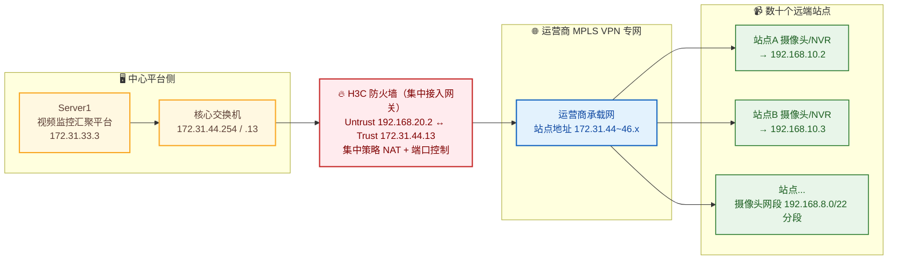

## 项目简介

本项目为某机关单位（消防主管部门）牵头的**"社会面"远程视频监控汇聚接入工程**。该单位需要把辖区内数十个远端站点（涵盖住宅小区、写字楼、产业园、学校、医院、酒店等）已建的消防与安防摄像头/录像机，统一汇聚到一套中心视频监控平台上，实现远程集中巡查与告警联动。

项目最大的工程挑战在于：远端站点数量多、地址碎片化，且分布在运营商的物联网专网上；中心平台与各站点之间隔着一张运营商承载网。最终方案以**一台 H3C 防火墙作为集中接入网关**，横跨"平台侧"与"运营商专网侧"，通过**按站点粒度的集中策略 NAT（源/目双向 NAT）+ 端口级访问控制**，把数十个站点稳定、可控地接入平台；并定位解决了"映射完成后、网络可达但平台仍拒绝接入"的一例典型应用层协商故障。

## 项目背景与需求

### 业务背景
机关单位辖区内大量社会单位（小区、楼宇、学校等）已自建消防/安防监控，但各自孤立、无法被主管部门远程巡查。主管部门建设了一套统一的**视频监控汇聚平台**，要求把各站点设备集中纳管，按"组织→街道→单位"的层级编排设备在线状态与视频资源。

### 核心需求
1. **大规模站点汇聚**：数十个远端站点的摄像头/NVR 统一接入中心平台，单平台纳管设备规模达数十至百路量级。
2. **跨网互通**：中心平台与远端站点分属不同网络。站点侧地址处于运营商物联网专网地址段，平台侧为内部地址，二者间需做可控的地址转换。
3. **会话保活与回包一致**：平台主动拉流/拉信令时，上下行路径必须一致，避免来回路径不一致导致会话表项建不起来。
4. **最小化暴露面**：仅放行视频监控真正需要的端口，其余一律拒绝；按站点隔离，互不串扰。
5. **可批量运维**：站点数量多，地址映射需要可批量下发、可规整管理，避免逐条手配带来的错配。

## 技术栈与设备选型

- **集中接入网关**：H3C 防火墙（Comware V7 平台），承担路由、安全域隔离与集中策略 NAT。
- **承载网络**：运营商 MPLS VPN / 物联网专网，提供平台到各站点的私有广域通道。
- **中心平台**：视频监控汇聚平台（Server1，作为视频管理与设备注册中心）。
- **远端设备**：各站点既有的网络摄像机（IPC）与录像机（NVR/DVR）。
- **关键协议与端口**：
  - `554/tcp、udp` —— RTSP 实时视频流拉取；
  - `8000/tcp、udp` —— 监控设备注册与平台信令交互；
  - `80/tcp` —— 设备 Web 管理（运维自测用）。

## 整体架构



- **平台侧**：Server1（视频监控汇聚平台）经核心交换机上联到防火墙的 Untrust 接口。
- **接入网关**：防火墙横跨两侧——Untrust 侧接平台，Trust 侧接运营商专网（默认路由指向专网网关）。
- **专网侧**：数十个站点散布在运营商物联网专网地址段（172.31.44~46.x），每个站点占用其中一个主机地址。
- **站点设备**：各站点的摄像头/录像机本地处于 192.168.8.0/22 网段（按站点切分子段），经站点网关上联专网。

## 核心设计：按站点粒度的集中策略 NAT

本项目最关键的设计，是用一台防火墙把"数十个站点、跨两套地址"的接入问题，收敛为**统一的、可批量管理的策略 NAT 模型**。

### 双向 NAT 模型
对每一个站点，在防火墙上配置一条策略 NAT 规则，匹配"平台侧源 + 站点侧目的"，同时执行：
- **目的 NAT（DNAT）**：把平台访问的站点地址（专网侧 172.31.4x.x）翻译为平台内部为该站点分配的固定地址（192.168.10.x）。这样平台侧每个站点都有一个**稳定、连续的内部地址**，便于平台纳管与地址规划。
- **源 NAT（SNAT，easy-ip）**：把报文源地址翻译为防火墙出接口地址，确保站点侧回包一定回到防火墙，再由防火墙反向还原——**强制来回路径一致**，会话表项可正常建立，避免来回路径不一致导致的"通了一半"。

> 例如某站点规则：平台源（172.31.33.0/24）→ 站点目的 172.31.44.14，执行 SNAT easy-ip + DNAT 到 192.168.10.2。数十个站点各占一条 192.168.10.x，互不冲突。

### 为什么是双向 NAT，而不是单向
- 只做 DNAT：站点回包源是设备真实地址，平台侧路由未必能精准回到防火墙，会话表项建不起来。
- 只做 SNAT：平台无法用固定地址标识每个站点，纳管混乱。
- **双向 NAT 同时满足了"平台侧地址规整"和"来回路径一致"两个诉求**，是本方案的点睛之处。

### 端口级访问控制
配套定义服务对象组，仅放行监控必需端口：
```
object-group service monitor-8000-554
 0  service tcp destination eq 8000      # 平台注册/信令
 10 service tcp destination eq 554       # RTSP 拉流
 20 service udp destination eq 554
 30 service udp destination eq 8000
```
结合安全域（Trust / Untrust）与安全策略，实现"非监控流量一律拒绝"的最小暴露面。

### 批量规整运维
站点数量多，原始映射存在拼音命名、重复、错配等问题。实施时把全部站点映射**统一规整为同一套命名与地址规律**（站点名 → 固定 192.168.10.x），便于后续批量增删改与排障定位。

## 实施要点

1. **地址规划先行**：先为每个站点分配唯一的 192.168.10.x 内部地址，再据此生成 NAT 规则表，避免地址撞。
2. **路由打通两侧**：防火墙上同时配置指向专网的默认路由，以及指向平台 192.168.10.0/24 的明细路由，保证双向可达。
3. **安全域与策略**：Trust（专网侧）与 Untrust（平台侧）隔离，安全策略仅放行监控端口与必要管理流量（如 ping）。
4. **逐站映射 + 自测**：每完成一批映射，立即在防火墙侧用 PC 直连测试设备 Web（80）可达性，确认网络层无误后再交平台对接。
5. **映射规整**：将历史遗留的零散命名统一为规范命名，为后续运维和故障定位打好基础。

## 关键问题排查：映射完成后，平台仍拒绝接入

本项目接入阶段出现了一个非常典型、也容易误判的故障，值得单独记录。

### 故障现象
站点 NAT 映射配置完成、网络已打通后，中心平台上**绝大多数站点设备仍显示"离线"**，仅个别测试设备在线。平台侧表现为"接入被拒"。

### 排查过程

**第一步：抓包定位"被拒"发生在哪一层。**

在防火墙侧抓包观察平台访问站点的流量，发现平台（172.31.33.4）向站点（172.31.44.14）的 `8000` 端口发起 TCP SYN 后，对端**立即回 `RST, ACK`**：

```
172.31.33.4  → 172.31.44.14  TCP  54762 → 8000  [SYN]      # 平台发起注册/信令
172.31.44.14 → 172.31.33.4   TCP  8000  → 54762 [RST, ACK] # 站点侧直接拒绝
```

`8000` 是监控设备向平台注册、平台与设备交互信令的端口。SYN 被立即 RST，意味着**连接在传输层就被拒掉了**。

**第二步：用"直连"证明网络层是通的。**

为排除"是不是 NAT/路由/防火墙把流量挡了"，在防火墙侧用 PC 直接访问该站点摄像头：抓包显示 TCP 三次握手正常完成，`GET /` 收到 `HTTP/1.1 304 Not Modified`，设备 Web 页面（含静态资源）正常加载。

```
192.168.20.2 → 192.168.10.2  TCP  [SYN]
192.168.10.2 → 192.168.20.2  TCP  [SYN, ACK]
192.168.20.2 → 192.168.10.2  TCP  [ACK]
192.168.20.2 → 192.168.10.2  HTTP GET /
192.168.10.2 → 192.168.20.2  HTTP HTTP/1.1 304 Not Modified   ✅ 设备 Web 正常
```

这证明：**网络可达、NAT 正常、设备本身也在线**，问题不在网络侧。

**第三步：锁定根因——平台侧应用层协商失败。**

综合两点：网络层完全可达，但 `8000` 注册端口被 RST、设备在平台上仍是"离线"。根因定位在**平台侧的设备注册配置**：平台与设备之间的应用层注册/协商参数（设备注册协议、信令端口、设备对接参数等）配置不符，导致设备不在 `8000` 上接受平台的注册握手，平台侧体现为"接入被拒"、设备"离线"。

### 解决方案与结论
- 该故障**不属于网络/NAT 问题**，网络与映射均已正常工作；
- 推动平台侧核对并修正设备的注册/接入配置，使应用层协商正常完成；
- 修正后设备由"离线"转为"在线"，平台可正常拉取视频与信令。

### 技术价值
这例故障最大的价值在于**排障思路**：面对"接入被拒"，先用抓包把"被拒"精确到具体端口和报文（SYN→RST），再用一次"直连自测"把网络层快速排除，从而把问题果断收敛到应用层，避免在网络侧反复折腾 NAT 和路由。这也是大型汇聚接入项目里最常被误判的一类故障——**"通"和"注册成功"是两件事**。

## 项目成果

- 用一台防火墙收敛了数十个跨网站点的接入，形成统一、可批量运维的集中策略 NAT 模型；
- 通过双向 NAT 同时解决了"平台侧地址规整"与"来回路径一致"两个核心诉求，平台纳管地址稳定连续；
- 端口级访问控制实现最小暴露面，仅放行 554/8000 等监控必需端口；
- 沉淀了一套"抓包定位 + 直连自测 + 应用层收敛"的接入排障方法论，显著提升后续新站点接入的效率与一次成功率。
