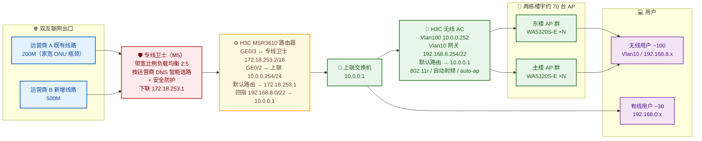
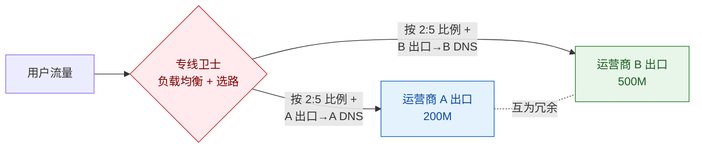

## 项目简介

本项目为某消防单位（消防大队）因新大楼投用、互联网扩容而引发的**出口网络重构与无线统一覆盖工程**。该单位原仅有 1 条运营商 A 的 200M 互联网专线，因入户设备老化、带宽无法保障，约 30 名有线、100 名无线用户的日常办公与联网明显卡顿；新大楼启用后需新增 1 条运营商 B 的 500M 互联网专线，并要求两条出口协同工作、互为冗余。

项目的主要工程挑战在于：既有出口路由器（H3C MSR3610）**已超出维保、登录口令遗忘、原集成商未做双线负载均衡**，且入户侧为家宽级 ONU，存在性能瓶颈。最终方案以**运营商提供的专线卫士安全网关**为统一出口枢纽，将两条不同运营商、不同带宽的线路做**按带宽比例的负载均衡 + 按运营商 DNS 的智能选路 + 安全防护**；同时对路由器经 Console 口重置口令、重新规划接口与默认路由，以"先配置、后接线"的方式完成**零感平滑割接**；无线侧由一台 H3C 无线 AC（Comware V7 平台）统一纳管两栋楼宇约 70 台双频 AP，开启自动射频校准与 802.11r 快速漫游。

## 项目背景与需求

### 业务背景
该消防单位原办公网络由 1 条运营商 A 的 200M 互联网专线承担，末端为家宽级 ONU，约 20~30 人日常使用即出现明显卡顿，无线测速仅约 10M 量级。新大楼建成后，单位计划新增 1 条运营商 B 的 500M 互联网专线，并希望新老两条出口既能扩容提速，又能互为灾备。

### 现状问题（现场摸排定位）
1. **入户设备瓶颈**：既有线路使用家宽级 ONU，设备老化、性能不佳，是带宽不达标的直接原因。
2. **出口设备失管**：出口为 H3C MSR3610 路由器，已超出维保期；Web 配置界面口令遗忘，且原集成商未在该路由器上完成双线负载均衡配置。
3. **双线协同缺失**：新增 500M 线路后，若不做负载均衡与智能选路，可能出现单线过载、跨运营商解析导致访问绕远等问题。
4. **无线需统一纳管**：新老大楼合计约 70 台 AP，需由集中式 AC 统一下发策略，避免逐台管理。

### 核心需求
1. **双出口负载均衡**：两条带宽不同的互联网出口按带宽比例分担流量（200M : 500M ≈ 2 : 5）。
2. **智能选路 / 防跨运营商访问**：走某运营商出口的流量必须使用该运营商的 DNS，避免跨运营商解析与绕行。
3. **安全防护与冗余**：出口侧具备基础安全防护；双线互为冗余，单线中断业务不停。
4. **平滑割接、零中断**：在不改动原配置、不影响在用业务的前提下完成新老网络切换。
5. **统一无线覆盖**：两栋楼宇约 70 台 AP 统一纳管，支持终端在 AP 间无缝漫游。

## 技术栈与设备选型

- **出口安全网关**：运营商提供的**专线卫士（M5 规格）**——一款集成多链路负载均衡、智能选路与安全防护的政企接入安全网关，由运营商政企服务团队统一配置与维护。
- **出口路由器**：H3C MSR3610（Comware V7），承担 LAN 互联、默认路由与 NAT。
- **无线控制器**：H3C 无线 AC（Comware V7，Release 5625），集中管理 AP、下发无线策略。
- **无线 AP**：H3C WA5320S-E 双频 AP（802.11ac），约 70 台，覆盖两栋楼宇。
- **上联/承载**：既有运营商 A 公网 /30 互联；新增运营商 B 500M 专线经专线卫士接入。
- **关键特性**：基于带宽比例的多链路负载均衡、按运营商 DNS 的策略选路、802.11r（FT）快速漫游、自动射频校准（信道/功率/带宽自整定）、AP 自动上线（auto-ap）。

## 整体架构



- **出口侧**：运营商 A 既有 200M 与运营商 B 新增 500M 两条线路**统一汇入专线卫士**，由专线卫士完成负载均衡、智能选路与安全防护后，以下联私网地址 172.18.253.1 对接路由器。
- **路由器侧**：H3C MSR3610 经 GE0/3（172.18.253.2/16）上联专线卫士，默认路由指向 172.18.253.1；GE0/2（10.0.0.254/24）经上联交换机（10.0.0.1）下接 AC 与有线 LAN，并回指无线网段 192.168.8.0/22 → 10.0.0.1，保证双向可达。
- **无线侧**：AC 的 Vlan10（192.168.8.254/22）作为无线终端网关，Vlan100（10.0.0.252）作为上联互联，默认路由指向上联交换机 10.0.0.1；两栋楼宇约 70 台 WA5320S-E 经 auto-ap 自动注册到 AC。

## 核心设计

### 一、专线卫士：按带宽比例的负载均衡 + 智能 DNS 选路

专线卫士是本方案的出口枢纽，承担三条职责：

1. **按带宽比例的多链路负载均衡**：两条出口带宽为 200M : 500M ≈ 2 : 5，专线卫士按该比例在两条物理出口间分流转发，避免单线过载、充分利用新增带宽。
2. **按运营商 DNS 的智能选路**：为避免"从运营商 A 出去的流量却用了运营商 B 的 DNS 解析"导致跨运营商绕行，专线卫士按出口做策略绑定——**走 A 出口的流量匹配 A 的 DNS，走 B 出口的流量匹配 B 的 DNS**，从解析阶段就保证出口与访问目标同运营商。
3. **安全防护 + 冗余灾备**：内置安全防护抵御异常流量；双线互为冗余，单线中断时业务自动由另一线承载，并在过渡期保留旧线、后续可按需退订以降低出口成本。



### 二、互联网出口与路由设计：双出口协同与平滑割接

路由器（MSR3610）在割接阶段的接口与路由规划是实施的关键。现场将其原有"直连运营商 A 公网 /30"的单出口结构，调整为"经专线卫士统一出口"：

```
interface GigabitEthernet0/3            # 新增：上联专线卫士
 port link-mode route
 ip address 172.18.253.2 255.255.0.0
#
ip route-static 0.0.0.0 0 172.18.253.1  # 默认路由切换至专线卫士
ip route-static 192.168.8.0 22 10.0.0.1 # 回指无线网段，经上联交换机回 AC
```

- **GE0/3 ↔ 专线卫士**：新增私网互联 172.18.253.0/16（路由器 .2，专线卫士 .1），默认路由统一指向专线卫士，所有出向流量交给专线卫士做负载均衡与选路。
- **GE0/2 ↔ 上联交换机**：保留既有 10.0.0.0/24 互联（路由器 10.0.0.254，上联交换机 10.0.0.1），并以明细路由回指无线网段 192.168.8.0/22，保证无线终端的上下行路径一致。
- **冗余与成本控制**：割接期保留运营商 A 旧线，实现双线冗余；后续若不再需要灾备与均衡，可在旧线到期后退订，降低出口成本。

### 三、无线 AC/AP：统一切换、自动射频与快速漫游

无线侧由一台 H3C 无线 AC 统一纳管两栋楼宇约 70 台 WA5320S-E 双频 AP，核心配置要点如下。

**业务 SSID 模板（绑定 Vlan10，承载无线终端）：**
```
wlan service-template 1
 ssid <业务 SSID，名称已脱敏>
 vlan 10
 client max-count 512
 quick-association enable            # 快速关联，降低高密并发下的接入时延
 akm mode psk
 cipher-suite ccmp
 security-ie rsn
 ft enable                           # 802.11r 快速漫游，终端跨 AP 切换更平滑
 multicast-optimization enable       # 组播优化，降低视频/广播类组播对空口占用
 service-template enable
```

**AP 自动上线与射频自整定：**
```
wlan auto-ap enable                  # AP 按序列号自动注册，免逐台预配置
wlan auto-persistent enable          # 自动固化，重启不丢配置
wlan tcp mss 1360                    # 适配跨网段/VPN 的 TCP 分片，避免 PMTU 黑洞
wlan global-configuration
 calibrate-channel self-decisive enable all   # 信道自整定
 calibrate-power self-decisive enable all     # 功率自整定
 calibrate-bandwidth self-decisive enable     # 带宽自整定
```

**AC 上联与路由：**
```
interface Vlan-interface10
 ip address 192.168.8.254 255.255.252.0   # 无线终端网关，/22 容纳 ~1000 地址
interface Vlan-interface100
 ip address 10.0.0.252 255.255.255.0      # 上联互联
ip route-static 0.0.0.0 0 10.0.0.1        # 默认路由指向上联交换机
```

设计要点：
- **auto-ap + 按网段分组**：约 70 台 AP 通过 `wlan auto-ap` 按序列号自动注册进 ap-group，AP 主机名按"楼宇-楼层-编号"规则命名，便于按物理位置定位；新增/更换 AP 即插即用。
- **802.11r + 自动射频**：在两栋楼宇多 AP 高密覆盖下，FT 漫游让终端跨 AP 切换更平滑；信道/功率/带宽三项自整定降低同频干扰，减少人工逐台调优。
- **TCP MSS 1360**：统一调整 TCP 最大分段，避免跨网段/带 VPN 开销链路上的 PMTU 黑洞导致的"小包通、大包卡"。

## 实施要点

1. **现场测速定位瓶颈**：先对既有 200M 专线做无线测速，确认实测仅约 10M 量级，结合入户家宽级 ONU 老化，定位带宽不达标根因为入户设备，而非单纯的线路带宽。
2. **路由器口令找回（Console 重置）**：路由器 Web 口令遗忘且超维保，设备日志显示 admin 因连续失败被加入登录黑名单：
   ```
   %router PWDCTL/6/PWDCTL_ADD_BLACKLIST: admin was added to the blacklist for failed login attempts.
   ```
   通过 Console 口进入 `Line con0`，利用 `password-recovery enable` 机制重置管理员口令、重新取得设备管理权，再以命令行完成接口与路由配置。
3. **先配置、后接线的零感割接**：在专线卫士与路由器上**预先完成全部配置**（GE0/3 互联地址、默认路由切换、回指路由），最后才物理接线、切换上联。割接验证在路由器侧完成：
   - 拔除既有运营商 A 的 WAN（GE0/1 物理down），流量改由专线卫士出口：
     ```
     %router IFNET/3/PHY_UPDOWN: Physical state on interface GigabitEthernet0/1 changed to down.
     ```
   - 路由器直连公网自测，PING 公共 DNS 全通：
     ```
     PING 8.8.8.8: 5 transmitted, 5 received, 0.0% loss, avg 37 ms
     ```
   - 补配 DNS 后域名解析与访问恢复：
     ```
     DNS server 8.8.8.8
     PING WWW.BAIDU.COM (36.152.44.132): 5 transmitted, 5 received, 0.0% loss, avg 17 ms
     ```
   上述自测证明默认路由切换至专线卫士后互联网访问完全正常，割接对用户无感。
4. **无线零改动接管**：AC 与 AP 配置不变，仅随上联链路切换而平滑过渡到新出口，避免对约 100 名无线用户造成任何中断。
5. **安全防护与外部尝试处置**：割接期间设备日志记录到来自公网的管理尝试（`LOGIN_FAILED from <公网地址>`），借由专线卫士的安全防护与设备自身的登录黑名单双重收敛暴露面。

## 项目成果

- **带宽从实测 ~10M 量级跃升到双线 700M 按比例聚合**，办公联网与无线体验显著改善。
- **专线卫士统一出口**，实现按带宽比例（2:5）的负载均衡 + 按运营商 DNS 的智能选路，从根上规避跨运营商解析绕行，并具备安全防护与单线冗余能力。
- **路由器在超维保、口令遗忘的约束下完成应急处置**：经 Console 重置口令、重规划接口与默认路由，以"先配置后接线"实现**零感平滑割接**，并以 PING/DNS 自测闭环验证。
- **一台 AC 统一纳管两栋楼宇约 70 台双频 AP**，结合 auto-ap 自动上线、802.11r 快速漫游与信道/功率/带宽自整定，无线侧实现即插即用与低人工运维。
- 沉淀了一套面向"设备失管 + 出口扩容"的**现场摸排 → 口令找回 → 预配置零感割接 → 自测验证**方法论，可直接复用于同类政企单位出口重构场景。
