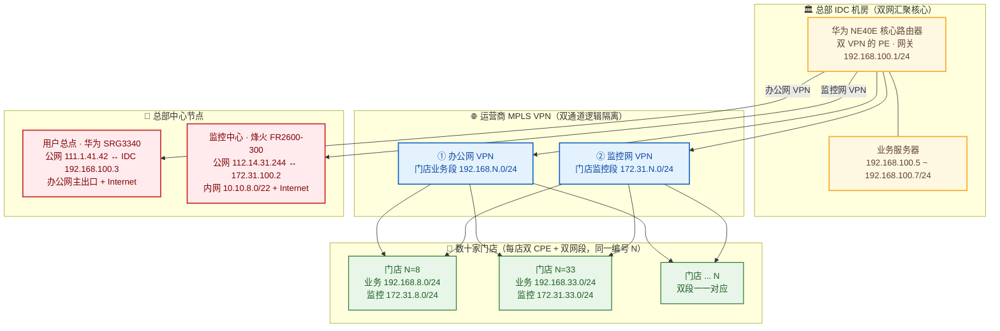

## 项目简介

本项目为某烘焙连锁品牌的**多门店广域组网工程**。该品牌旗下数十家直营门店遍布多地，每家门店既要运行收银/订货等业务系统，又要回传店内视频监控；总部既要集中部署业务服务器，又要在一个监控中心统一巡查全部门店的摄像头。门店数量多、开闭与搬迁频繁，且业务流量与监控流量对网络的要求截然不同。

最终方案以**总部 IDC 机房的华为 NE40E 作为双网汇聚核心**，借助运营商 MPLS VPN 拉出**"办公网"与"监控网"两张逻辑隔离的专网**：每家门店同时获得一段业务地址（`192.168.N.0/24`）和一段监控地址（`172.31.N.0/24`），两段共用同一个第三位 `N` 作为门店编号；门店侧 CPE（华为 SRG3340 / H3C ICG3000 / 烽火 FR2600-300）由运营商统一下发，实现"开店即组网"的快速复制。整套设计把"多门店、双业务、强隔离、可复制"四个诉求收敛为一张清晰、可线性扩展的广域网。

## 项目背景与需求

### 业务背景
该烘焙连锁处于快速扩张期，门店规模从早期的十余家增长到近百家，覆盖多个地市。门店业态决定了它对网络有两条彼此独立的主线：

- **业务线**：门店的收银终端、订货 Pad、后台报表都要回连总部 IDC 的业务服务器，对延迟敏感、对带宽要求不高，但**必须与监控流量隔离**，避免视频回传把业务通道挤爆。
- **监控线**：每家门店数路摄像头需要回传到总部监控中心，流量大、持续性强，且**只能进监控中心、不能混入业务网**。

### 核心需求
1. **双业务物理/逻辑隔离**：办公（业务）流量与视频监控流量全程分离，互不抢占、互不串扰。
2. **总部集中汇聚**：业务服务器集中部署在总部 IDC，所有门店的业务终端都回连 IDC；视频统一汇聚到独立的监控中心。
3. **门店快速复制**：门店开闭、搬迁频繁，每开一家店都要能在短时间内完成标准化布点，地址与配置可批量生成。
4. **地址可规划、可追溯**：近百家门店 × 两张网，地址规模近两百段，必须有清晰的编码规律，避免地址冲突与运维黑洞。
5. **运营商承载、统一交付**：跨地市的广域链路由运营商提供，门店 CPE 与链路最好由运营商一体化交付，降低自运维成本。

## 技术栈与设备选型

- **核心路由器**：华为 NE40E，部署于总部 IDC，作为两张 MPLS VPN 的汇聚 PE，承担双网核心。
- **业务服务器区**：IDC 内服务器，地址 `192.168.100.5~7/24`，经 IDC 交换机（`192.168.100.1/24` 网关）上联 NE40E。
- **总部节点（用户总点）网关**：华为 SRG3340，公网出口 `111.1.41.42`，与 IDC 交换机互联 `192.168.100.3/24`，作为办公网的主出口与 Internet 出口。
- **监控中心网关**：烽火 FR2600-300，公网出口 `112.14.31.244`，与 SR 互联 `172.31.100.2`，下联交换机 `10.10.8.253/22`，承载监控中心内网 `10.10.8.0/22`。
- **门店 CPE（运营商提供）**：华为 SRG3340 / H3C ICG3000 / 烽火 FR2600-300 三类，按门店所在区域的运营商资源就近指配。
- **门店接入交换机（运营商提供）**：瑞斯康达 3024G、TP-LINK 交换机等，承担门店本地接入。
- **承载网络**：运营商 MPLS VPN，双通道（办公网 VPN / 监控网 VPN）逻辑隔离。

## 整体架构

- **汇聚核心**：总部 IDC 的 NE40E 同时是办公网 VPN 与监控网 VPN 的 PE，两张专网在此终结并互通到各自的中心节点。
- **两张专网并行隔离**：办公网承载业务系统（门店→IDC 服务器），监控网承载视频回传（门店→监控中心），从接入到核心全程走不同的 VPN 实例与地址空间。
- **两个中心节点各管一摊**：用户总点（SRG3340）是办公网的主出口并提供业务侧 Internet；监控中心（FR2600-300）独立接收全网视频回传，并自带 Internet 出口，避免监控流量与业务流量抢同一出口。
- **门店统一形态**：每家门店拿到的都是"一段业务 + 一段监控"成对地址，由运营商 CPE 接入两张 VPN。

## 核心设计：双网隔离 + 总部汇聚 + 门店地址编码

本项目最关键的设计，是用"两张 MPLS VPN + 一套门店地址编码规律"把近百家的多业务接入问题，收敛成可线性扩展、可批量复制的标准模型。

### ① 办公网 / 监控网 双网隔离
在运营商的 MPLS VPN 上划分两个独立的 VPN 实例：
- **办公网 VPN**：承载收银、订货、报表等业务流量，门店侧使用 `192.168.N.0/24`，核心侧使用 `192.168.100.0/24`（服务器区）与 `192.168.49.0/24`（与总点互联）。
- **监控网 VPN**：承载摄像头视频回传，门店侧使用 `172.31.N.0/24`，监控中心侧使用 `172.31.100.0/24`（与 SR 互联）与 `10.10.8.0/22`（监控中心内网）。

两网从地址段、VPN 实例到中心出口完全分离，视频回传再大也不会冲垮业务通道，业务侧故障也不会波及监控巡查。

### ② 总部 IDC 作为双网汇聚核心
NE40E 作为两张 VPN 的 PE，是整网的"汇合点"：
- **业务侧**：所有门店的业务终端经办公网 VPN 回到 IDC，访问 `192.168.100.5~7` 的业务服务器；用户总点（SRG3340）提供办公网的 Internet 出口。
- **监控侧**：所有门店的摄像头经监控网 VPN 回到监控中心（FR2600-300），监控中心独立承载视频墙与上网。

这样把"业务集中、视频集中"两个不同的集中诉求分别落到 IDC 与监控中心，各自有独立的带宽与出口，互不争用。

### ③ 门店地址编码规律（点睛设计）
近百家门店、每家两段地址，本是最容易乱的地方。本项目用了一条极其规整的编码规律：

> **每家门店分配一个唯一编号 N，业务网段 `192.168.N.0/24`、监控网段 `172.31.N.0/24`，两段共用同一个第三位 N。**

例如编号 8 的门店：业务 `192.168.8.0/24`、监控 `172.31.8.0/24`；编号 33 的门店：业务 `192.168.33.0/24`、监控 `172.31.33.0/24`。编号即门店，一段对一段，业务网与监控网的第三位永远一致。这样做的好处：
- **可读**：看到一个 `172.31.38.x` 的监控地址，立刻知道对应门店的业务段是 `192.168.38.0/24`，排障与定位无需查表。
- **可扩展**：新开店只需分配下一个空闲的 N，两张网段的地址同步生成，几乎零冲突风险。
- **可批量**：地址规划、CPE 预配置、监控平台纳管都可以按 N 批量模板化。

### ④ 运营商一体化交付 CPE
门店 CPE（华为 SRG3340 / H3C ICG3000 / 烽火 FR2600-300）与接入交换机（瑞斯康达 3024G、TP-LINK）均由运营商按门店所在区域就近指配并交付。标准化门店形态后，"开店即组网"成为可能：运营商按模板预配 CPE 上两张 VPN 的接入参数，到店安装即上线，极大缩短了新店的网络开通周期。

## 实施要点（含 IP 规划）

### IP 规划节选
下表摘录典型节点，展示"门店编号 N 一一对应"的地址规律（业务/监控第三位相同）：

| 角色 | 业务网（办公） | 监控网 | 备注 |
| --- | --- | --- | --- |
| 总部 IDC | `192.168.100.X` | — | 服务器 `192.168.100.5~7`，网关 `.1` |
| 监控中心 | — | `172.31.22.X` | 内网 `10.10.8.0/22`，公网出口 `112.14.31.244` |
| 中央工厂/总仓 | `192.168.0.X`（互联 `192.168.10.X`） | `172.31.0.X` | 厂仓类节点，编号 0 |
| 门店 N=8 | `192.168.8.X` | `172.31.8.X` | 某门店 |
| 门店 N=33 | `192.168.33.X` | `172.31.33.X` | 某门店 |
| 门店 N=45 | `192.168.45.X` | `172.31.45.X` | 某门店 |
| 门店 N=58 | `192.168.58.X` | `172.31.58.X` | 异地门店，10M 专线 |
| 总部办公点 | `192.168.49.X`（与 SR 互联） | `172.31.100.X` | 用户总点 `192.168.49.2` |

> 规律：门店编号 N 同时决定业务段 `192.168.N.0/24` 与监控段 `172.31.N.0/24` 的第三位；编号 100 段（`192.168.100.0/24`、`172.31.100.0/24`）保留给总部/中心节点。

### 实施步骤
1. **编号先行**：先为每家门店分配唯一编号 N，再据此同步生成业务/监控两段地址，从源头杜绝冲突。
2. **双 VPN 接入模板**：在运营商侧为两类 CPE 各定义一套"办公网 VPN + 监控网 VPN"接入模板，门店开通时按型号套用。
3. **中心节点分流**：NE40E 上分别配置办公网 VPN 与监控网 VPN 的路由实例，确保业务流量只去 IDC、视频流量只去监控中心。
4. **带宽分级**：核心 NE40E 上联按 G 级别保障，门店侧按规模给 100M/200M，异地远端门店按 10M 专线收敛成本。
5. **搬迁与回收**：门店搬迁时，旧编号 N 整体回收或随迁，两段地址同步处理，避免遗留地址黑洞。

## 项目成果

- 用一张运营商 MPLS VPN 同时承载了**两张逻辑隔离的专网**（办公/监控），业务与视频全程互不干扰。
- 以 NE40E 为双网 PE，把"业务集中到 IDC、视频集中到监控中心"两个不同的汇聚诉求分别落地，各自独立出口、互不争用。
- 沉淀出**"门店编号 N → 业务 192.168.N.0/24 + 监控 172.31.N.0/24"**的地址编码规律，使近百家门店、近两百段地址的规模依然可读、可扩、可批量运维。
- 借助运营商一体化交付 CPE，实现门店"开店即组网"的标准化复制，显著缩短新店网络开通周期，支撑了品牌的快速扩张。
