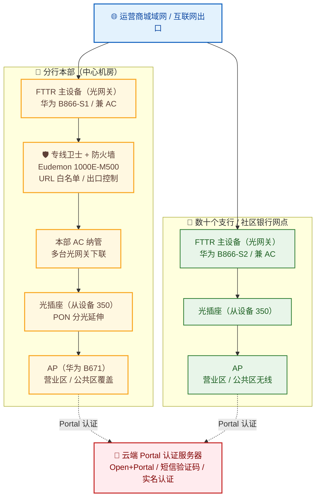

## 项目简介

本项目为**某股份制银行（分行）营业网点无线网络的 FTTR 定制化安全整改工程**。该行在同城设有一家分行本部、多家支行与若干社区银行网点，营业区与公共区的访客/客户无线覆盖由某运营商统一建设，采用**企业级 FTTR（光纤到房间／光纤到办公室，FTTO）全光组网**：以华为 B866 系列光网关作为主设备并兼作无线控制器（AC），下连光插座（从设备）与 AP，经运营商城域网出口访问互联网，并由云端 Portal 服务器完成短信验证码实名认证。

项目最核心的工程挑战来自一例典型的合规性隐患——**部分网点的 WiFi 用户偶发可以"绕过 Portal 认证直接上网"**。最终方案以"根因驱动的定制化整改"为主线：通过**主从设备版本升级 + 去除多 VLAN 临时方案 + 启用厂商新增的 WiFi 侧管理隔离特性 + 重新启用第三方 Portal 认证**，从根因上消除认证插件挂起；并配套落地了涵盖 SSID 规划、钓鱼 AP 反制、用户隔离、访问控制、日志审计等十余项的《无线网安全防护任务清单》，最终以全量逐点复测与一轮漏洞扫描完成闭环，扫描任务评级为"无风险"。

## 项目背景与需求

### 业务背景
该行营业网点众多、分布同城各处，客户在办理业务时需连接营业场所 WiFi，员工与部分自助机具也需无线接入。出于金融行业的合规要求，所有无线上网必须经过**实名认证**（访客与网银体验机采用 Open + Portal 短信验证码，员工与行内机具应基于 802.1X），且无线网络不得暴露行方网络属性、不得泄露接入口令。

早期建设为满足"WiFi 用户不得登录设备管理界面"这一要求，在厂商尚无原生特性的阶段，采用了**在 FTTR 设备上划分多个 VLAN 来"隐藏"网关地址**的临时方案。该方案在试点网点埋下了认证可靠性的隐患，最终触发本次全网整改。

### 核心需求
1. **认证必须可达、不可绕过**：任何终端接入 WiFi 后，必须稳定弹出 Portal 认证页面，完成短信验证码实名认证后方可上网，杜绝偶发性"直连上网"。
2. **管理面隔离**：WiFi 用户即使能拿到网关地址，也不得打开设备 Web 配置界面；管理仅限 AC 与运维终端访问。
3. **统一 SSID 与命名规范**：访客 SSID 统一广播、其余用途 SSID 隐藏；SSID 与 Portal 页面不得包含行名、缩写、"bank"等网络属性信息。
4. **最小暴露面与安全监测**：开启钓鱼 AP 检测与反制、用户隔离、上网行为/URL 白名单；AC 强口令、AP 白名单纳管。
5. **可批量、可留痕的闭环运维**：数十个网点需统一整改标准、逐点留证（正确配置截图、现场配置截图、现场业务验证照片），并形成可复核的整改台账与漏扫报告。

## 技术栈与设备选型

- **组网形态**：企业级 FTTR／FTTO 全光组网，主设备（光网关）通过 PON 分光经光插座（从设备）延伸至各 AP。
- **主设备 / AC**：华为 B866 系列（B866-S1 / B866-S2，型号如 B866-S1-4E1P3W1），既是 FTTR 光网关又兼作 AC，统一纳管下属 AP。**主设备软件版本要求尾数为 360T（定制化文档要求 330T 及以上），从设备升级至 350 版本**。
- **AP**：华为 B671（新建 FTTR 网点）；存量 WLAN 网点沿用 H3C WA2620E-D（AP）+ H3C WX6112E（AC）+ H3C S3100-PWR（PoE 交换机）。
- **出口安全**：华为 Eudemon 1000E-M500 防火墙 + 专线卫士（承担 URL 白名单与出口访问控制）。
- **认证体系**：云端 Portal 认证服务器（第三方认证中间件，提供短信验证码 / Open+Portal），员工侧规划 802.1X；认证日志可对外输出用于审计。
- **运维监测**：FTTR 配套手机 App（可查看 AP 运行状态并接收异常告警）。
- **关键定制化项**：第三方 Portal 认证对接、WiFi 侧禁止访问配置界面、SSID 隔离、钓鱼 AP 扫描与反制。

## 整体架构

- **本部侧**：FTTR 主设备（光网关）经专线卫士与防火墙上联城域网，主设备兼 AC 纳管本部多台光插座与 AP，覆盖多层办公区。
- **网点侧**：每个支行 / 社区银行各部署一台 FTTR 主设备（兼 AC），下连光插座与 AP，经城域网出口上网，认证统一回指云端 Portal 服务器。
- **认证路径**：终端关联 WiFi → 重定向至云端 Portal → 短信验证码实名认证 → 授权上网；认证日志集中留存可审计。

## 核心设计：FTTR 定制化整改 + 无线安全防护落地

本项目最关键的设计，是把"一个偶发性认证故障"的根因，转化为**一套可批量下发的定制化配置标准**，并把它与行方的《无线网安全防护任务清单》逐项对齐。

### 一、根因驱动的整改主线：去 VLAN + 版本升级 + 管理隔离

早期为"隐藏网关、禁止 WiFi 侧登录管理"，在 FTTR 主设备上额外划分了 VLAN。这一临时方案与第三方 Portal 认证插件存在兼容性问题：**当设备上存在多个 VLAN 时，Portal 认证插件会出现偶发性挂起，表现为用户关联 WiFi 后未弹出认证页、却可直接上网**——这对金融合规是不可接受的风险。

整改主线据此展开，三步治本：

1. **版本对齐先行**：主设备升级至尾数 360T 的软件版本（定制化基线为 330T），从设备统一升级至 350 版本。新版本正是厂商"补齐"原生管理隔离特性的版本，是去除 VLAN 前提。
2. **去除多 VLAN 临时方案**：在确认新版本特性可用后，删除为"隐藏网关"而额外划分的 VLAN，从结构上消除认证插件挂起诱因——**删 VLAN 后认证功能恢复正常**。
3. **启用原生"WiFi 侧禁止访问配置界面"特性**：用厂商原生能力替代 VLAN 隐藏方案，既满足"WiFi 用户不得登录管理"的合规要求，又不再依赖会触发故障的多 VLAN 结构。

> 这条主线的价值在于：**用厂商原生特性替换"打补丁式"的 VLAN 隐藏方案**，让"管理面隔离"与"认证可靠性"两个诉求不再互相打架。

### 二、逐点定制的配置项与现场验证

每个网点在版本升级、去除 VLAN 后，按下表逐项配置并**当场留证**（正确配置截图、现场实际配置截图、现场业务验证照片各一张，入整改台账）：

| 配置项 | 要求 | 现场验证方法 |
| --- | --- | --- |
| SSID 可见性 | 访客 SSID 广播，其余隐藏 | 手机扫描确认访客 SSID 可被搜到 |
| Portal 认证 | 启用第三方 Portal 认证 | 手机关联 WiFi，确认能正常弹出认证页面 |
| 管理面隔离 | WiFi 侧访问网关不得打开配置界面 | 手机连 WiFi，浏览器访问网关地址，确认不弹出配置界面 |
| SSID 改名 | 访客 SSID 统一更名（不含行名等属性） | 现场核对 SSID 命名 |
| SSID 隔离（用户隔离） | 开启同 SSID 下终端互访隔离 | 手机连 WiFi 取 IP，电脑 ping 该 IP 应不通 |
| 钓鱼 AP 扫描 | 开启非法 AP 检测与反制 | 后台查看反制记录 / App 告警 |

### 三、无线网安全防护任务清单（节选落地）

围绕行方《无线网安全防护任务清单》，将十余项要求收敛为可执行、可截图复核的整改动作：

- **SSID 规划**：按场景拆分 SSID，访客广播、其余隐藏；SSID 与 Portal 页面严禁包含行名、缩写、"bank"等网络属性。
- **AP 信号范围**：按"最小必要"原则调整发送功率，避免信号辐射到不必要区域、减少串扰。
- **AP 物理安全**：设备表面不得粘贴含 IP／名称的敏感标签；AC 全量改用强口令（出厂随机口令不符合要求，已统一整改）。
- **AC / AP 访问控制**：以"发现新 AP 不同步配置"的方式实现 AP 准入控制（非法 AP 即便接入也无法上线）；运维终端经 LAN 侧独立 VLAN 绑定 MAC 白名单，且不绑定至 WiFi VLAN、不影响认证；AP 管理界面仅限 AC 与运维终端访问。
- **安全监测**：通过 FTTR 手机 App 监控 AP 运行状态与告警；后台可查看非法 AP 检测与反制记录。
- **联网访问白名单**：在出口的专线卫士上配置 URL 白名单，FTTR 主设备亦可配置 URL 白名单，避免访问非法站点。
- **用户隔离**：在 AC 上开启用户隔离，限制无线终端互访。
- **用户接入安全**：访客统一 Open + Portal（短信验证码），同一账号不可并发上网、单账号可认证终端数受限，终端 24 小时未接入自动下线、再次入网重新认证；员工侧规划 802.1X 实名认证。
- **日志审计**：记录认证时间、方式、结果、终端 IP/MAC、设备类型等字段，访问日志按制度留存并可通过接口对外输出审计。

## 实施要点

1. **版本基线统一**：先在试点网点把主设备刷至 360T、从设备刷至 350，验证 Portal 认证与管理隔离均正常后，再批量推广，避免低版本缺特性导致返工。
2. **主从设备升级顺序**：先升级主设备（S1），再升级所有下挂从设备；升级后逐台勾选确认，防止个别从设备漏升导致分光侧异常。
3. **逐点"四验证"**：每完成一个网点，现场必须完成"SSID 可见 / Portal 可弹 / 管理面不可达 / SSID 隔离生效"四项自测，四项全过方可记为整改完成。
4. **台账三截图闭环**：每个点位在整改台账中保留"正确配置界面、现场实际配置、现场业务确认"三类照片，做到一网点一台账、可追溯复核。
5. **变更留痕**：后续任何网点配置变更均追加记录台账，保证全网状态始终可查。

## 关键问题排查：WiFi 用户偶发"绕过认证直连上网"

整改的直接动因，是一例非常典型、也极容易被误判为"用户端问题"的故障。

### 故障现象
某网点（分行本部试点）营业期间，部分客户手机连上 WiFi 后**未弹出 Portal 认证页面，却可以直接访问互联网**。故障偶发、非必现，且在支行网点未复现，仅在分行本部试点出现，初期容易被归因为"个别终端兼容性"或"认证服务器波动"。

### 排查过程

**第一步：从"偶发"反推，锁定可疑变量。**
支行网点认证稳定、分行本部偶发挂起，两边差异在于**分行本部为"隐藏网关"额外划分了多个 VLAN，而支行未划分**。这一结构差异成为首要怀疑对象。

**第二步：厂商研发抓日志，定位到认证插件层。**
经设备厂商研发抓取设备运行日志，确认：**当 FTTR 设备上存在多个 VLAN 时，第三方 Portal 认证插件存在偶发性挂起**——插件挂起后不再向新关联终端推送/校验 Portal，终端便在未认证状态下被放行上网。删除额外 VLAN 后，认证功能立即恢复正常。

**第三步：还原"为什么会有多 VLAN"，找到根因闭环。**
多 VLAN 并非误配，而是早期为满足"WiFi 侧不得登录设备管理界面"的合规要求、在厂商尚无原生特性时采取的**临时隐藏方案**。换言之——**为解决"管理面暴露"而引入的 VLAN，恰恰破坏了"认证必达"**，两个合规诉求在同一个临时方案上互相冲突。

### 解决方案与结论
- 升级主从设备至支持原生管理隔离的新版本（主设备 360T / 从设备 350）；
- 删除用于隐藏网关的多 VLAN，从结构上消除认证插件挂起诱因；
- 启用厂商原生"WiFi 侧禁止访问配置界面"特性，替代 VLAN 隐藏方案；
- 重新启用并验证第三方 Portal 认证、SSID 隔离、钓鱼 AP 反制等定制化项。

整改后，原故障网点认证稳定不再绕过，全网逐点复测通过。

### 技术价值
这例故障最大的价值在于两点排障思路：其一，**善用"故障网点 vs 正常网点"的配置差异做对照**，把"偶发"快速收敛到一个具体变量（多 VLAN）；其二，**追问临时方案的历史来由**，避免"删掉它会不会破坏合规"的反复拉扯——只有用原生特性同时满足两个冲突诉求，整改才是治本而非治标。这也是企业无线整改里最常被忽略的一类问题：**"打补丁"的合规方案，本身可能就是下一个故障的根因**。

## 项目成果

- 用"版本升级 + 去 VLAN + 原生管理隔离 + Portal 认证"四步，从根因上消除了"WiFi 偶发绕过认证直连上网"的合规隐患，认证可靠性与管理面隔离两个诉求不再冲突。
- 将行方十余项《无线网安全防护任务清单》收敛为可逐点配置、可截图复核的标准动作，形成"一网点一台账、三截图留证"的闭环运维范式。
- 全量网点完成定制化整改与现场四项自测，配置变更全程留痕、可追溯复核。
- 整改后开展一轮漏洞扫描：对 7 台存活主机（各网点光网关公网地址）的基础服务扫描，任务风险等级评为**"无风险"**，未发现未修复的高/中危漏洞，项目顺利闭环。
