## 项目简介

某航运公司（外企，总部位于新加坡）中国总部位于上海市，在宁波，深圳，武汉等全国14个城市有分部。公司内部服务器位于上海和新加坡，并且有访问外网的需求。老系统通过互联网建立ipsec隧道组网，因使用国外设备维保过期，寻求更低成本的组网产品和维护，总预算在7位数。

本项目采用运营商级SD-WAN解决方案，通过省级POP骨干节点、双CPE高可用架构、智能流量分流和DNS智能解析等技术，为企业构建了一个安全、可靠、高效的跨省广域网络，实现了总部与14个分支点点的统一组网和集中管理。

## 技术栈

### 核心设备选型
- **SD-WAN CPE设备**：中兴皖通（ZTE）系列
- **企业防火墙**：华为USG6000系列
- **仿真环境**：华为AR路由器（模拟SDWAN-CPE）+ 华为AR路由器（模拟防火墙）+ 华为三层交换机（模拟内网接入）

### 网络架构技术
- **承载架构**：三运营商互联网接入 + 省级POP骨干快速通道
- **隧道技术**：VXLAN Overlay + IPSec ESP全程加密
- **路由控制**：BGP EVPN实现VPN标签隔离、动态路由自动学习
- **高可用技术**：双CPE + VRRP统一下行逻辑网关
- **流量分流**：策略路由PBR + 地址对象组统一管理
- **DNS智能解析**：本地DNS代理服务器精准分流

### 运维管理体系
- **地址对象化管理**：14个分支点位统一平台CLI批量下发
- **差异化流量策略**：标准分支精细化分流 + 小型分支全流量总部托管
- **分级故障处理**：实验室仿真复现 + 生产环境快速响应

## 详细需求

### 核心组网需求
1. **分层网络架构**：
   - 用户接入互联网层：支持电信/联通/移动三运营商多链路接入
   - 省级POP节点层：各城市分支接入省级运营商POP节点
   - POP骨干快速通道层：省级POP节点间独立高速通道，隔离公网流量

2. **安全隧道架构**：
   - Underlay承载层：基于公网/运营商骨干网
   - Overlay业务层：VXLAN隧道封装 + IPSec ESP全程加密
   - 路由控制：BGP EVPN实现带VPN标签的动态路由发布与隔离

3. **分支高可用架构**：
   - 宁波分支部署双CPE设备，下行通过VRRP实现单逻辑网关IP
   - 主备自动切换，无感知故障冗余，秒级切换速度

### 智能流量分流需求
4. **策略路由PBR分流**：
   - 企业内网业务网段走SD-WAN加密隧道到上海总部
   - 普通上网流量走分支本地互联网出口
   - 通过华为设备（路由器模拟防火墙）实现流量策略控制

5. **地址对象化统一管理**：
   - 全网14个分支点位统一运维
   - 所有SD-WAN专属引流地址采用地址对象批量管理
   - 支持批量增删改，适配平台CLI批量下发

6. **差异化分支策略**：
   - 标准分支：精细化分流模式，按需拆分转发
   - 小型分支：全流量总部托管模式，统一安全策略审计

### DNS智能分流需求
7. **域名解析智能分流**：
   - 企业内网业务域名、总部私有域名 → 交由上海总部DNS服务器解析
   - 公网通用域名 → 交由本地运营商DNS解析
   - 规避透明代理失效问题，采用本地DNS代理服务器精准分流

## 规划思路

### 架构设计原则
1. **运营商级SD-WAN模型**：严格贴合现网政企SD-WAN落地逻辑，采用三层架构（用户接入-POP节点-骨干通道）
2. **实验室先行验证**：所有核心功能先在ENSP环境仿真验证，确保技术方案可行性
3. **运维友好设计**：采用地址对象化管理，支持14个分支点位统一批量运维
4. **差异化策略支持**：兼顾标准分支和小型分支的不同上网诉求

### 实施策略
1. **实验室仿真阶段**：构建完整ENSP测试环境，验证VXLAN+IPSec隧道、VRRP高可用、策略路由分流等核心技术
2. **生产环境部署**：基于实验室验证结果，逐步推进各分支点位设备上线
3. **监控与优化**：实时监控网络性能，根据实际运行情况调优配置
4. **故障响应机制**：建立快速故障响应流程，实验室复现生产问题，确保问题彻底解决

### 项目成果
- 成功构建覆盖上海总部及14个分支点点的SD-WAN广域网络
- 实现双CPE高可用架构，设备故障秒级切换，业务无感知
- 建立智能流量分流体系，优化带宽利用率，降低总部出口压力
- 完善DNS智能解析机制，解决域名分流技术难题
- 建立标准化的运维管理体系，提升运维效率，降低维护成本

## ENSP模拟

```mermaid
	flowchart LR
	    %% ================= 样式定义 =================
	    classDef terminal fill:#e3f2fd,stroke:#1565c0,stroke-width:1.5px,color:#0d47a1,font-size:11px
	    classDef l2switch fill:#e8f5e9,stroke:#2e7d32,stroke-width:1.5px,color:#1b5e20,font-size:11px
	    classDef firewall fill:#ffebee,stroke:#b71c1c,stroke-width:2px,color:#7f0000,font-size:11px
	    classDef cpe fill:#fff3e0,stroke:#ef6c00,stroke-width:2px,color:#e65100,font-size:11px
	    classDef noteStyle fill:#fafafa,stroke:#9e9e9e,stroke-width:1px,color:#616161,stroke-dasharray: 4 4,font-size:10px
	    classDef pop fill:#ede7f6,stroke:#5e35b1,stroke-width:2px,color:#311b92,font-size:11px
	    classDef server fill:#fce4ec,stroke:#c62828,stroke-width:1.5px,color:#880e4f,font-size:11px
	
	    %% ================= 宁波分支 =================
	    subgraph 宁波分支["🏠 宁波分支"]
	        direction TB
	        PC1["PC1 172.31.10.10"]
	        PC2["PC2 172.31.10.11"]
	        LSW2["二层交换机 LSW2"]
	        FW-R7["R7 防火墙<br>172.31.10.1 | 192.168.99.10"]
	        NB-CPE1["CPE1 主<br>192.168.99.1 | 100.1.0.21"]
	        NB-CPE2["CPE2 备<br>192.168.99.2 | 100.1.0.22"]
	        noteVRRP["VRRP 192.168.99.254"]
	    end
	
	    %% ================= 骨干POP层 =================
	    subgraph 骨干POP层["🌐 骨干POP层"]
	        direction TB
	        ZJ-POP["浙江POP<br>100.1.0.2 | 10.0.0.21"]
	        SH-POP["上海POP<br>10.0.0.11 | 200.1.0.1"]
	    end
	
	    %% ================= 上海总部 =================
	    subgraph 上海总部["🏢 上海总部"]
	        direction TB
	        R5["CPE-R5<br>200.1.0.11 | 192.168.88.1"]
	        R6["CPE-R6<br>200.1.0.12 | 192.168.88.2"]
	        R8["R8 防火墙<br>192.168.88.10 | 172.16.10.1"]
	        LSW1["交换机 LSW1"]
	        PC3["PC3 172.16.10.10"]
	        DNS-SRV["DNS-Server<br>172.16.10.20"]
	    end
	
	    %% ================= 连线 =================
	    PC1 --> LSW2
	    PC2 --> LSW2
	    LSW2 --> FW-R7
	    FW-R7 --> NB-CPE1
	    FW-R7 --> NB-CPE2
	    NB-CPE1 --> ZJ-POP
	    NB-CPE2 --> ZJ-POP
	
	    ZJ-POP -- "10.0.0.0/24" --> SH-POP
	
	    SH-POP --> R5
	    SH-POP --> R6
	    R5 --> R8
	    R6 --> R8
	    R8 --> LSW1
	    LSW1 --> PC3
	    LSW1 --> DNS-SRV
	
	    %% ================= 样式应用 =================
	    class PC1,PC2,PC3 terminal
	    class LSW1,LSW2 l2switch
	    class FW-R7,R8 firewall
	    class NB-CPE1,NB-CPE2,R5,R6 cpe
	    class noteVRRP noteStyle
	    class ZJ-POP,SH-POP pop
	    class DNS-SRV server
	
	    %% Subgraph 背景
	    style 宁波分支 fill:#e0f2f1,stroke:#00695c,stroke-width:1.5px
	    style 骨干POP层 fill:#f3e5f5,stroke:#7b1fa2,stroke-width:2px
	    style 上海总部 fill:#fff3e0,stroke:#ef6c00,stroke-width:1.5px
	
	    %% 链路样式
	    linkStyle 0,1 stroke:#42a5f5,stroke-width:1.5px
	    linkStyle 2 stroke:#66bb6a,stroke-width:1.5px
	    linkStyle 3,4 stroke:#ef5350,stroke-width:2px
	    linkStyle 5,6 stroke:#ffa726,stroke-width:1.5px
	    linkStyle 7 stroke:#ab47bc,stroke-width:2.5px
	    linkStyle 8,9 stroke:#ffa726,stroke-width:1.5px
	    linkStyle 10,11 stroke:#ef5350,stroke-width:2px
	    linkStyle 12 stroke:#66bb6a,stroke-width:1.5px
	    linkStyle 13,14 stroke:#42a5f5,stroke-width:1.5px
```

## 维护问题及解决方式

### 问题一：DNS透明代理失效问题
**问题现象**：
初期采用DNS透明代理方案，试图实现域名分流，但发现透明代理无法满足业务需求，分流策略不生效。

**问题分析**：
经过深入分析，发现DNS透明代理存在技术原理上的固有缺陷：
1. **无法精准区分域名**：透明代理只能拦截所有53端口流量统一转发，无法实现域名粒度的差异化分流
2. **不感知应用层域名**：透明代理工作在网络层/传输层，只能匹配端口、IP，无法解析DNS报文内部的域名字段
3. **多站点兼容性差**：在跨隧道域名解析、私网域名递归解析场景下，透明代理无路由隔离能力，容易出现解析环路

**解决方案**：
放弃DNS透明代理方案，改用**本地DNS代理服务器方案**：
- 在分支防火墙配置DNS代理功能，工作在应用层，可解析DNS报文域名
- 配置域名对象组，区分企业私有域名列表
- 匹配私有域名 → 递归转发至上海总部DNS（走SD-WAN隧道）
- 其余所有公网域名 → 转发至本地运营商DNS（走本地公网出口）

**解决效果**：
完全适配SD-WAN分流架构，和地址对象管理逻辑一致，支持批量配置、统一运维，成为政企SD-WAN标准DNS解决方案。

---

### 问题二：IPSec乱序导致BGP邻居震荡
**问题现象**：
9月18日-23日期间，在实验室尝试复现生产环境故障时，发现流量达到80M时BGP邻居发生震荡现象，严重影响网络稳定性。

**排查过程**：
1. **故障复现**：在实验室环境逐步增加流量负载，观察到在80M左右时BGP邻居关系出现反复建立和断开的现象
2. **协议分析**：通过抓包分析和日志追踪，发现BGP报文传输出现丢失和乱序现象
3. **根因定位**：经过深入排查，确认故障本质是由于IPSec报文乱序导致的：
   - 在高流量场景下，IPSec加密隧道中的报文出现乱序
   - 报文乱序导致BGP Keepalive报文丢失或延迟到达
   - BGP邻居因超时而中断连接，触发邻居震荡

**解决方案**：
1. **临时措施**：调整BGP Keepalive计时器和Hold时间参数，提升容错能力
2. **根本解决**：经过评估需要开发新命令添加新参数来解决IPSec乱序问题：
   - 在IPSec配置中增加抗乱序机制参数
   - 优化报文重组和排序算法
   - 增强高负载场景下的协议稳定性

**技术价值**：
通过实验室仿真复现，深入理解了IPSec在高速流量场景下的行为特征，为后续优化提供了技术依据，也验证了实验室环境对生产问题排查的重要性。

---

### 问题三：广州点位VRRP路由跟随问题
**问题现象**：
广州点位CPE配置的网点静态路由没有跟随VRRP状态切换，导致业务切换时上下行路径不一致，引起业务中断。

**问题分析**：
1. **配置缺陷**：CPE设备配置了静态路由，但这些路由没有绑定VRRP状态
2. **路径不一致**：当VRRP主备切换时，下行流量通过新的主CPE转发，但上行流量仍然按照原静态路由走旧的主CPE
3. **业务中断**：上下行路径不一致导致流量不通，业务中断

**解决方案**：
1. **路由绑定VRRP**：将静态路由与VRRP状态绑定，只有当VRRP状态为主时才激活相应路由
2. **配置优化**：确保路由策略与VRRP状态机同步切换，保证上下行路径一致性
3. **全面排查**：对全网14个分支点点的VRRP配置进行全面检查，确保没有类似隐患

---

### 问题四：福建点位工单派发错误导致业务中断
**问题背景**：
福建之前无备用CPE设备，后续增加备用CPE后需要配置VRRP实现高可用。

**故障过程**：
1. **工单错误**：5月8日开通时因工单派发错误，本应派发VRRP工单却派发了普通工单
2. **配置缺失**：导致VRRP配置需手工增加，后台人员在配置时出现失误
3. **业务中断**：配置失误导致业务中断，客户报障后需要回退配置

**解决措施**：
1. **紧急回退**：客户报障后立即回退错误配置，业务恢复正常
2. **流程优化**：完善工单派发流程，增加工单类型校验机制
3. **配置规范**：制定标准化的VRRP配置流程和检查清单
4. **人员培训**：加强后台人员配置技能培训，提升操作规范性

**经验教训**：
此次故障暴露了在运维流程管理和人员操作规范方面存在的不足，通过建立完善的工单管理流程和配置审核机制，有效降低了人为操作失误的风险。

---

### 问题五：思科三层交换机与华为防火墙ARP老化导致业务中断

**故障现象**：
思科三层交换机与华为防火墙直连组网场景：ARP条目老化删除后，业务直接中断；必须手动ping两端互联直连IP，重建ARP表项，跨网段路由转发才能恢复。业务常态化稳定运行后，该故障不再容易复现。

**核心协议原理分析**：
1. **路由与ARP的关系**：
   - 路由表是预先配置好的，始终有效；三层转发必须依靠ARP提供IP-MAC二层封装信息
   - 即使路由表完整，缺少ARP条目仍会导致转发失败

2. **ARP请求的特殊性**：
   - 跨网段的业务转发流量能够触发设备向外发送ARP请求
   - 但这条ARP请求是为转发下一跳寻址产生的，华为防火墙与思科交换机不会对此类ARP进行应答
   - 导致ARP条目无法自动重建，链路卡死

3. **动态ARP老化机制**：
   - 动态ARP条目只能被特定流量刷新：单纯的业务报文源地址为业务网段IP，无法重置互联直连ARP的老化计时器
   - 空闲一段时间后条目必然老化被删除
   - 只有持续收到对端互联MAC发出的二层帧，才能不断刷新ARP缓存，防止条目过期

**现象变化原因**：
- **项目初期**：业务断断续续，长时间无双向报文交互，ARP顺利老化，故障反复出现
- **常态化运行**：业务常态化满载运行后，两端持续互发回程报文，不断刷新ARP老化时间，ARP条目长期保留，问题随之消失
- **业务中断风险**：一旦业务长时间中断，ARP再次老化失效，故障依旧会重现

**根本症结**：
转发流量可以发出ARP请求，却得不到对端应答；仅本机主动访问对端直连IP（ping）才会触发正常的ARP应答交互。缺少持续的双向二层报文保活时，互联ARP条目到期删除后无法自动自愈。

**根治思路**：
开启接口周期性ARP探测、免费ARP功能，避免动态ARP老化失效：
1. 在直连接口启用周期性ARP探测，主动维护ARP表项
2. 配置免费ARP定时发送，确保对端持续刷新ARP缓存
3. 建立双向二层报文保活机制，防止互联链路ARP条目老化

**技术价值**：
通过深入分析ARP协议在直连组网场景下的老化行为，揭示了"路由存在但ARP缺失导致转发失败"的典型故障模式，为多厂商异构设备互联提供了重要的故障排查思路和预防措施。

