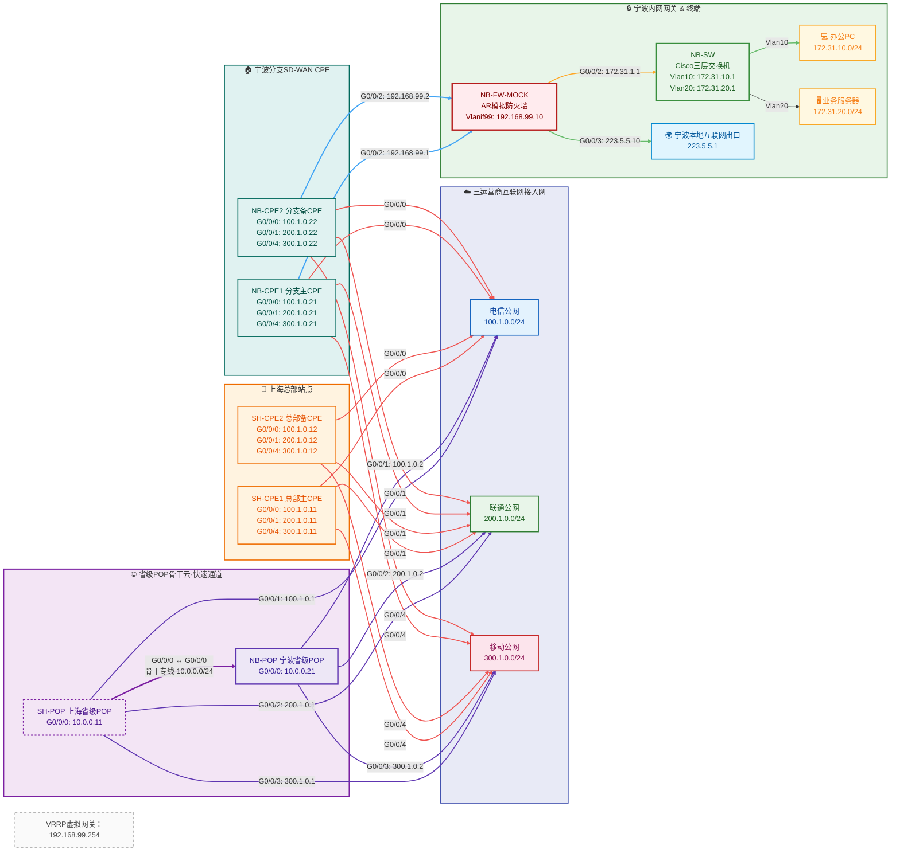

## 项目简介

某航运公司（外企，总部位于新加坡）中国总部位于上海市，在宁波，深圳，武汉等全国14个城市有分部。公司内部服务器位于上海和新加坡，并且有访问外网的需求。老系统通过互联网建立ipsec隧道组网，因使用国外设备维保过期，寻求更低成本的组网产品和维护，总预算在7位数。

## 技术栈

- 技术1
- 技术2
- 技术3

## 详细需求

1. 
- 功能2
- 功能3

## 规划思路

项目成果和数据...

## ENSP模拟

## 维护问题及解决方式

