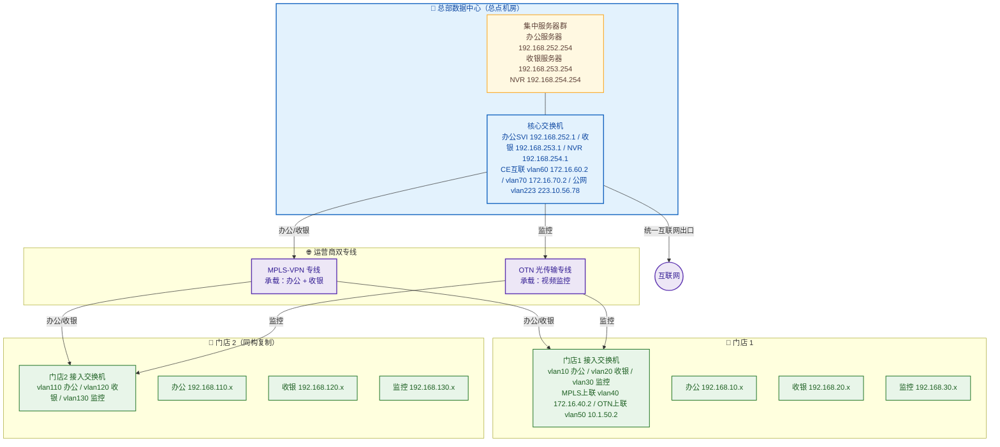

## 项目简介

本项目为**某连锁商超**的"总部数据中心 + 多门店"融合网络建设。该商超在总部设有中心机房，集中部署办公服务器、收银（POS）服务器与网络视频录像机（NVR），下辖多家门店，每家门店有办公电脑、收银机、监控摄像头三类终端。各类业务对网络的诉求并不相同：办公与收银要求稳定、低延时、可加密；视频监控则要求大带宽、持续上行回传。

项目最终采用**双运营商专线融合组网**方案：总部同时上联 **MPLS-VPN** 与 **OTN（光传输网）** 两类专线，门店侧也同时双线上联；在路由策略上**按业务类型分流**——办公、收银流量承载于 MPLS-VPN，视频监控流量承载于 OTN；门店内部以**三套业务 VLAN（办公/收银/监控）+ 端口级 ACL** 实现终端隔离，其中监控网段被严格收敛为"仅可回传至总部 NVR"的单向通道，既满足集中存储，又阻断其横向访问办公/收银网络。

## 项目背景与需求

### 业务背景
该连锁商超在经营过程中，门店会持续产生三类关键数据：收银交易需实时回传总部对账、办公终端需访问总部 OA 与文件服务、监控视频需集中存储到总部机房以备查证。三类业务的流量模型与可靠性要求差异明显，早期门店"一线上网、混跑所有业务"的模式既无法保证收银交易的稳定性，也让监控视频的大流量挤占关键业务带宽。

### 核心需求
1. **总部集中化**：办公、收银、监控三类服务器/NVR 统一部署在总部机房，所有门店回传汇聚至此。
2. **按业务分流的双专线承载**：办公+收银走 MPLS-VPN（重稳定、可保障 QoS），监控走 OTN（重大带宽、低延时），互不抢占。
3. **门店内部业务隔离**：办公、收银、监控三类终端同处一门店但必须隔离，尤其监控网段不得横向访问其他业务网段，仅允许回传总部 NVR。
4. **收银网段最小授权**：收银机只允许访问总部收银服务器，以及必要的办公网段，其余一律拒绝，降低被横向渗透的风险。
5. **统一互联网出口**：互联网访问统一由总部出口，门店不再各自出公网，便于集中管控与审计。
6. **可复制、可批量交付**：门店数量多，单店网络方案需标准化，便于快速复制部署与后期运维。

## 技术栈与设备选型

- **总部核心**：华为 S5700 系列三层交换机作为总点机房核心交换机，承担服务器接入、VLAN 间路由、到广域网 CE 的上联与默认互联网出口。
- **总部广域网 CE**：总点 MPLS-VPN 路由器、总点 OTN 路由器各一台，分别终结两类运营商专线，下联核心交换机。
- **运营商承载**：MPLS-VPN 专线（承载办公/收银）、OTN 光传输专线（承载视频监控），由运营商提供端到端私有通道。
- **互联网出口**：经核心交换机上行公网（出口地址段 223.10.56.0/24），作为统一上网与远程管理通道。
- **门店接入**：每家门店部署一台华为 S5700 接入交换机，承担终端接入、VLAN 划分、ACL 访问控制与到广域网 CE 的双线上联。
- **终端**：办公电脑、收银机、监控摄像头（以仿真终端/IPC 形式接入）。
- **关键技术**：基于 VLAN 的业务隔离、基于策略路由/静态路由的业务分流、ACL 端口级访问控制、集中式服务器群与统一互联网出口。

## 整体架构



- **总部侧**：核心交换机横跨"服务器区—广域网 CE—互联网出口"三块，是全网的中枢；三类服务器各自独占一个业务 VLAN，在核心交换机上完成 VLAN 间路由。
- **广域网侧**：MPLS-VPN 与 OTN 两类专线并行，分别承载不同业务，物理与逻辑双重隔离。
- **门店侧**：每家门店结构同构——一台接入交换机下挂三类终端，同时双线上联 MPLS-VPN 与 OTN，按业务类型选择上行通道。
- **互联网**：统一从总部出口，门店不经公网直连。

## 核心设计：多门店融合组网

本项目最核心的设计，是用"**双专线按业务分流 + 门店三 VLAN 隔离 + 收敛式监控通道**"这一套可复制的单店模型，把"多门店、多业务、多类型流量"的复杂问题收敛为标准化方案。

### 1. 业务类型分流：办公/收银走 MPLS-VPN，监控走 OTN

门店接入交换机上，每一类业务被划入独立 VLAN，并指向不同的上行通道。以**门店 1** 接入交换机的静态路由为例：

```
# 默认路由及关键业务指向 MPLS-VPN 上行（172.16.40.1）
ip route-static 0.0.0.0 0.0.0.0 172.16.40.1
ip route-static 192.168.252.0 255.255.255.0 172.16.40.1   # 办公服务器 → MPLS
ip route-static 192.168.253.0 255.255.255.0 172.16.40.1   # 收银服务器 → MPLS
# 监控回传指向 OTN 上行（10.1.50.1）
ip route-static 192.168.254.0 255.255.255.0 10.1.50.1     # NVR → OTN
```

可以看到：**办公（192.168.252.0/24）、收银（192.168.253.0/24）的服务器往返流量被显式指向 MPLS-VPN 网关（172.16.40.1），而监控回传到 NVR（192.168.254.0/24）的流量被单独指向 OTN 网关（10.1.50.1）**。监控的大流量因此被隔离在 OTN 专线上，不会与收银交易争抢 MPLS 带宽。

### 2. 门店三 VLAN 业务隔离

每家门店内部把终端按业务划入三个独立 VLAN，各 VLAN 对应独立的 /24 网段与 SVI 网关：

| 业务 | 门店 1 网段 | 门店 2 网段 | 用途 |
|------|------------|------------|------|
| 办公 | VLAN10 / 192.168.10.0/24 | VLAN110 / 192.168.110.0/24 | 办公电脑、OA |
| 收银 | VLAN20 / 192.168.20.0/24 | VLAN120 / 192.168.120.0/24 | 收银机、POS |
| 监控 | VLAN30 / 192.168.30.0/24 | VLAN130 / 192.168.130.0/24 | 摄像头、IPC |

接入交换机的端口按 access 模式一一对应终端类型：

```
interface GigabitEthernet0/0/1        # 办公电脑
 port link-type access
 port default vlan 10
interface GigabitEthernet0/0/2        # 收银机
 port link-type access
 port default vlan 20
 traffic-filter inbound acl 3001      # 收银网段入向应用 ACL 3001
interface GigabitEthernet0/0/3        # 监控
 port link-type access
 port default vlan 30
 traffic-filter inbound acl 3000      # 监控网段入向应用 ACL 3000
```

### 3. 收敛式监控通道与收银最小授权

单纯的 VLAN 隔离并不足以约束跨网段访问——只要有三层路由，VLAN 间仍可互通。本项目在接入交换机上用**两条 ACL** 把跨网段访问收敛到业务必需的最小集合。

**ACL 3000（应用于监控 VLAN30 入向）——把监控收敛为"仅可回传 NVR"的单向通道：**

```
acl number 3000
 rule 5  deny ip source 192.168.10.0 0.0.0.255 destination 192.168.30.0 0.0.0.255  # 办公 ✗ 监控
 rule 10 deny ip source 192.168.20.0 0.0.0.255 destination 192.168.30.0 0.0.0.255  # 收银 ✗ 监控
 rule 15 deny ip source 192.168.30.0 0.0.0.255 destination 192.168.10.0 0.0.0.255  # 监控 ✗ 办公
 rule 20 deny ip source 192.168.30.0 0.0.0.255 destination 192.168.20.0 0.0.0.255  # 监控 ✗ 收银
 rule 25 permit ip source 192.168.30.0 0.0.0.255 destination 192.168.254.0 0.0.0.255  # 监控 → NVR ✓
 rule 30 deny ip source 192.168.30.0 0.0.0.255                                    # 监控 → 其它一切 ✗
 rule 35 permit ip                                                                 # 其余放行（非监控源）
```

效果上，**监控网段被双向隔离于办公/收银之外，仅允许向总部 NVR（192.168.254.0/24）回传视频流**。结合前面的业务分流，监控视频沿 OTN 专线直达 NVR，既满足集中存储，又从接入层就阻断了"摄像头网段被当作跳板横向渗透"的常见风险路径。

**ACL 3001（应用于收银 VLAN20 入向）——收银网段最小授权：**

```
acl number 3001
 rule 5  permit ip source 192.168.20.0 0.0.0.255 destination 192.168.10.0 0.0.0.255  # 收银 → 办公 ✓
 rule 10 permit ip source 192.168.20.0 0.0.0.255 destination 192.168.253.0 0.0.0.255 # 收银 → 收银服务器 ✓
 rule 15 deny ip source 192.168.20.0 0.0.0.255                                    # 收银 → 其它一切 ✗
 rule 20 permit ip                                                                 # 其余放行（非收银源）
```

收银机只能访问办公网段与总部收银服务器，其余一律拒绝，把交易网段的暴露面压到最小。

### 4. 总部集中服务器群

总部机房三类服务器各自独占一个 VLAN，在核心交换机上完成接入与三层终结：

```
interface Vlanif252
 ip address 192.168.252.1 255.255.255.0    # 办公服务器网段网关
interface Vlanif253
 ip address 192.168.253.1 255.255.255.0    # 收银服务器网段网关
interface Vlanif254
 ip address 192.168.254.1 255.255.255.0    # NVR 网段网关
```

核心交换机再通过 VLAN60（172.16.60.0/24）上联 MPLS-VPN CE、VLAN70（172.16.70.0/24）上联 OTN CE、VLAN223（223.10.56.78）上联互联网，并配置回程明细路由把门店网段指向对应的 CE：

```
ip route-static 0.0.0.0 0.0.0.0 223.10.56.1                 # 默认走互联网出口
ip route-static 192.168.10.0 255.255.255.0 172.16.60.1       # 门店1办公 → MPLS-VPN CE
ip route-static 192.168.20.0 255.255.255.0 172.16.60.1       # 门店1收银 → MPLS-VPN CE
```

这样从总部侧看，**办公/收银的往返流量经 MPLS-VPN CE，监控回传经 OTN CE，互联网访问经公网出口**，三条通道各司其职。

## 实施要点

1. **单店模板先行**：先把"三 VLAN + 双上联 + 两段 ACL"在首店打磨成标准模板，再批量复制到其余门店；新增门店只需替换网段（如门店 1 用 192.168.10/20/30，门店 2 用 192.168.110/120/130）即可，交付效率高、错配率低。
2. **网段规划规律化**：门店业务网段按"门店号 + 业务位"的规律编排（办公第三段 10/110、收银 20/120、监控 30/130），便于总部核心交换机汇总回程路由与后期排障。
3. **业务分流落到静态路由**：在接入交换机上用明细静态路由把"服务器网段"分别指向 MPLS 与 OTN 网关，配置直观、排障路径清晰，避免了在多设备间部署复杂策略路由的运维负担。
4. **ACL 在接入层就地收敛**：监控与收银的访问控制直接挂在接入交换机的业务端口入向，把越权访问堵在离终端最近的位置，不依赖上层设备。
5. **逐店联调**：每完成一家门店，分别验证办公终端能否访问办公服务器、收银机能否对账、监控能否回传 NVR，以及监控网段是否被成功隔离，四项全绿再交割。
6. **统一出口与回程路由**：总部核心交换机配置互联网默认出口与到各门店网段的明细回程路由，确保门店到服务器、到互联网的路径都收敛到总部，避免门店各自出公网带来的安全与审计盲区。

## 项目成果

- 用"**总部核心 + 双类运营商专线 + 同构门店**"的融合组网模型，统一承载了某连锁商超办公、收银、监控三类业务，门店方案可标准化批量复制。
- 通过**按业务类型分流（办公/收银走 MPLS-VPN、监控走 OTN）**，把视频监控的大带宽流量隔离在独立专线，避免其挤占收银交易等关键业务。
- 在门店接入层用**三 VLAN + 两段 ACL** 实现业务隔离与最小授权，监控网段被收敛为"仅可回传总部 NVR"的单向通道，显著降低了被横向渗透的风险。
- 服务器、NVR、互联网出口集中到总部，全网具备统一的数据汇聚点与安全管控边界，为后续的经营数据集中分析、视频集中调阅打下了网络基础。
